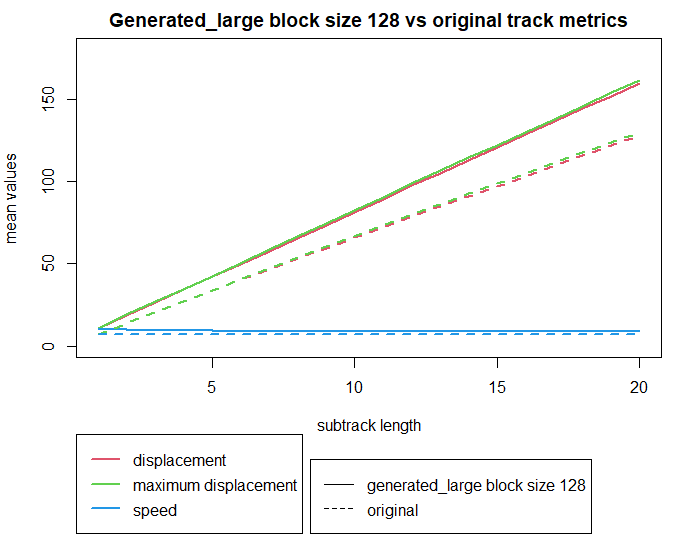
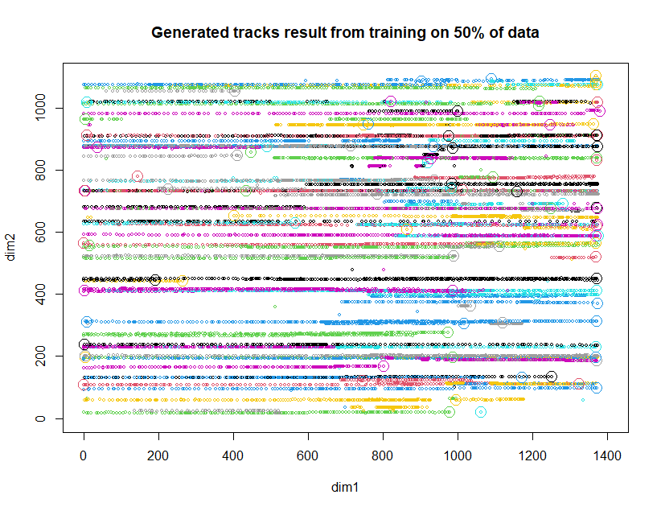
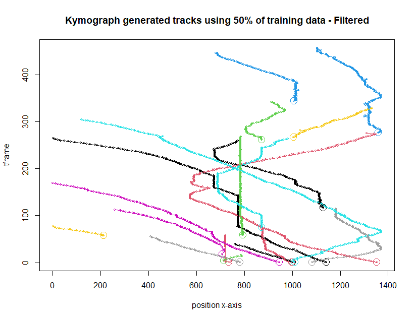
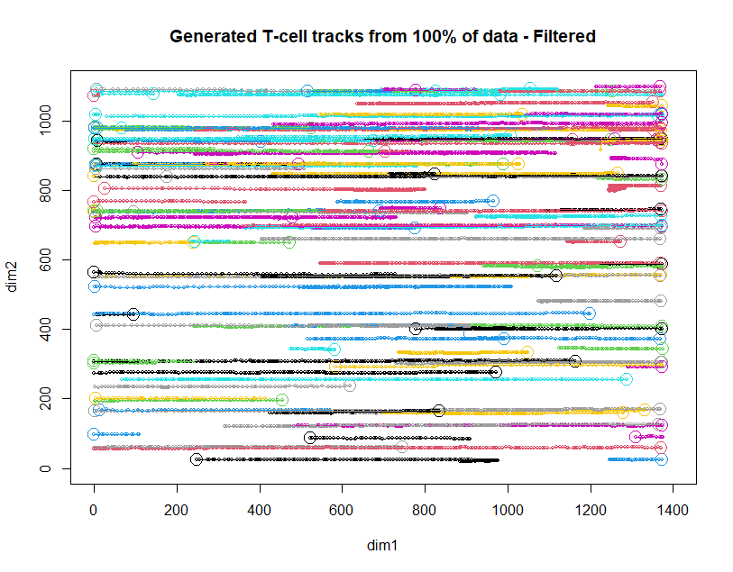
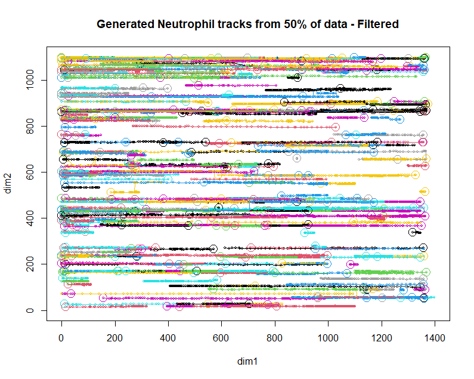
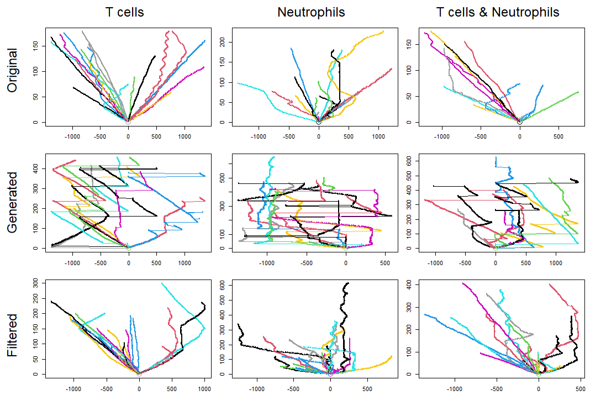

# Lab journal - Training a transformer model on cell tracking data

Sara Ben-Hammou (s1130776),  22/04/25 – 07/10/25

------------

## Playing around with nanoGPT

To get acquainted with training a transformer model, I will use the boilerplate NanoGPT code by Andrej Karpathy (https://github.com/karpathy/nanoGPT). First I will use the example shakespeare dataset that this code came with, then I will attempt to train it with another dataset.

## Running on CPU

```         
pip install torch numpy transformers datasets tiktoken wandb tqdm  
```

``` sh
python data/shakespeare_char/prepare.py
```

``` sh
python train.py config/train_shakespeare_char.py --device=cpu --compile=False --eval_iters=20 --log_interval=1 --block_size=64 --batch_size=12 --n_layer=4 --n_head=4 --n_embd=128 --max_iters=2000 --lr_decay_iters=2000 --dropout=0.0
```

Here, since we are running on CPU instead of GPU we must set both `--device=cpu` and also turn off PyTorch 2.0 compile with `--compile=False`. Then when we evaluate we get a bit more noisy but faster estimate (`--eval_iters=20`, down from 200), our context size is only 64 characters instead of 256, and the batch size only 12 examples per iteration, not 64. We'll also use a much smaller Transformer (4 layers, 4 heads, 128 embedding size), and decrease the number of iterations to 2000 (and correspondingly usually decay the learning rate to around max_iters with `--lr_decay_iters`). Because our network is so small we also ease down on regularization (`--dropout=0.0`).

result: iter 2000: loss 1.6958, time 433.64ms, mfu 0.03%

``` sh
python sample.py --out_dir=out-shakespeare-char --device=cpu
```

This resulted in the following output:

```         
I by done what leave death,
And aproposely beef the are and sors blate though wat our fort
Thine the aftior than whating bods farse dowed
And nears and thou stand murs's consel.

MEOF:
Sir, should and then thee.

GRICHARD one, enceling:
Or house
Your to do the all in despery I parve porge,
And shall not aple bralance the my plife friend.
Why should not seed liSian be me,
A light strought weart a king here shall
And so arttion I breatio:
Trale time him the witHer's bout thing thy a moy
A to therr
```

This output doesn't make much sense. But it's not bad for how fast it ran.

## Running on GPU

First, I used the boilerplate code to run it on my GPU. This did not work, as I came across an error requiring me to download Triton. I was working in Windows, and Triton is not compatible with Windows. Then, I had to use WSL to use a virtual machine running Ubuntu. Within that virtual machine, I repeated all the steps that I did before in Windows (clone repo, install anaconda, make new environment, install required packages). Then, running VSCode in Ubuntu, the code finally worked and I was able to run it on my GPU.

The following code was used:

```         
pip install torch numpy transformers datasets tiktoken wandb tqdm  
```

``` sh
python data/shakespeare_char/prepare.py # preparation of the initial dataset, splitting it into train.bin for and val.bin 
```

``` sh
python train.py config/train_shakespeare_char.py # training of the model. this may take a while
```

It ran much faster and the loss was much lower than when it ran on my CPU.

```         
iter 5000: loss 0.8243, time 8237.48ms, mfu 44.77%
```

``` sh
python sample.py --out_dir=out-shakespeare-char # the model will generate a sample based on the training data.
```

It generated the following output (this is a short part):

```         
KING RICHARD II:
Say thou stir a set boy, and all ready thee,
And beat thy purpose to be tetle of enemies,
And for a wizard with thee of thy common wind;
Which misery bloody ladies in thy soul.

WARWICK:
And all pelting for me; he must have proved it.

WARWICK:
But I can petition with this demand.

KING EDWARD IV:
Say, what says how canst thou love me?

TYRREL:
Now thrust I say; I know not when I come,
That I had robed the house of York
Hath did curse me to his blood and tears these hands;
And,
```

This output makes a lot more sense than the previous result with the CPU. That is to be expected since the loss rate is also much lower. The model is also larger and it took a longer time to run.

## Using another dataset

Now, I want to train the model on another dataset. I downloaded a dataset with dad jokes from https://www.kaggle.com/datasets/usamabuttar/dad-jokes. I made a new folder called 'jokes'. I copied the prepare.py file from the 'shakespeare' folder, and modified it to open the dad_jokes.csv file and only take note of the 'joke' column. Then, in the folder 'config', I copied the 'train_shakespeare_char.py' file into a new train_jokes.py file, and modified it slightly.

``` sh
python data/jokes/prepare.py # preparation of the initial dataset, splitting it into train.bin for and val.bin 
```

``` sh
python train.py config/train_jokes.py
```

After a couple of minutes, this was the result:

```         
iter 5000: loss 0.4985, time 18312.55ms, mfu 123.11%
```

``` sh
python sample.py --out_dir=out-jokes
```

Output:

```         
What do you call a cow with no legs? Ground beef!
What happens when a frogs car dies? He needs a jump. If that doesn't work he has to get it toad.
When the grocery store checker asks me if I want my milk in a bag, I say no, I’d rather keep it in the carton.
Why can’t you eat Wookie meat? Because it’s too chewy…
I have a joke about being a rejected organ donor, but I just don't have the guts.
What kind of shoes does a lazy person wear? Loafers.
What’s an astronaut’s favorite part of a computer? The space bar.
Every time I take my dog to the park, the ducks try to bite him. That’s what I get for buying a pure bread dog.
I have a joke about hunting for fossils, but you probably wouldn’t dig it.
I have a joke about inferiority complexes, but it’s not very good.
I'm reading an anti-gravity book, and I just can't put it down!
I have a joke about trickle-down economics, but 99% of you will never get it.
I have a joke about pizza, but it’s too cheesy.
To the person who stole my case of energy drinks: I bet you can't sleep at night.
I have a joke about immortality, and it never gets old.
What do you call a bear with no teeth? A gummy bear.
I have a joke about trickle-down economics, but 99% of you will never get it.
```

I see that some jokes are repeated multiple times in this example (line 144 and line 149 for example). Taking a look at the original training dataset, it also contains repeated jokes.

## Using the track dataset

I will use the first track dataset 'tracks-1' available on https://computational-immunology.org/hfsp/. This csv file contains 4 columns: time, x, y, and track_no. Since track_no and tframe are not very relevant right now, I will leave them out. This can be seen in the prepare.py file in the tracks1 folder.

```         
pip install torch numpy transformers datasets tiktoken wandb tqdm  
```

``` sh
python data/tracks1/prepare.py # preparation of the initial dataset, splitting it into train.bin for and val.bin (first 500 lines of the dataset only)
```

```         
train has 1,878 tokens
val has 200 tokens
```

``` sh
python train.py config/train_tracks1.py --block_size=50 # changed block size to accomodate for smaller dataset. 
```

```         
iter 5000: loss 0.0733, time 4227.97ms, mfu 24.00%
```

``` sh
python sample.py --out_dir=out-tracks1
```

Output:

```         
990 1010
990 1016
990 1022
989 1034
990 1042
990 1050
992 1060
990 1054
992 1066
992 1066
992 1062
992 1068
992 1070
992 1068
992 1068
990 1050
```

Now, I need to add in the tframe and track_no columns again and save it as a csv file. In order to do this, I modified the sample.py file. The output is saved in the output folder under generated_tracks1.csv. Now, the output matches the original dataset. The only difference is that tframe starts at 0 at the beginning of every new track. I have made a visual (seen below) that describes this process.


Here is the code from the modified sample.py file:

``` python
# set output filename based on dataset name
dataset_name = checkpoint['config']['dataset'] if (init_from == 'resume' and 'config' in checkpoint and 'dataset' in checkpoint['config']) else 'output' 
output_path = os.path.join("output", f"generated_{dataset_name}.csv") #

# run generation
with torch.no_grad():
    with ctx, open(output_path, "w", encoding="utf-8") as f:
        f.write("tframe,y,x,track_no\n")
        track_no = 1  # start track number from 1
        for k in range(num_samples):
            y_sample = model.generate(x, max_new_tokens, temperature=temperature, top_k=top_k) # generate token output from model
            sample = decode(y_sample[0].tolist())   # decode the generated tokens to string data
            print(sample)                           # print the generated sample
            tracks = sample.strip().split('\n\n')   # split sample into tracks based on double newlines
            for track in tracks:
                for tframe, line in enumerate(track.strip().splitlines()): # for each line in the track, increase tframe by 1 until the end of the track.
                    parts = line.strip().split()
                    if len(parts) == 2:
                       ## print(f"{tframe},{parts[0]},{parts[1]},{track_no}")    # if i want to print the output, but I left it out since it will be too long and it can be seen in the csv file.
                        f.write(f"{tframe},{parts[0]},{parts[1]},{track_no}\n")  
                track_no += 1  # increase by 1 after each track
```

Now that this process is streamlined, I will train the model on the whole dataset rather than the first 500 lines for 2000 iterations.

``` sh
python data/tracks1/prepare.py
```

```         
train has 25,632 tokens
val has 2,579 tokens
```

``` sh
python train.py config/train_tracks1.py
```

```         
iter 2000: loss 0.0476, time 19092.83ms, mfu 126.14%
```

``` sh
python sample.py --out_dir=out-tracks1
```

See generated_tracks1.csv in the output folder. The output is similar to the previous one, but now it is much longer. The first 10 lines of the output are:

```         
tframe,y,x,track_no
0,990,1004,1
1,990,992,1
2,990,992,1
3,990,992,1
4,990,974,1
5,990,964,1
6,990,966,1
7,990,948,1
8,990,946,1
```

## Visualization of the generated output

Now, I will visualize the generated output using the celltrackR package in R.

``` r
devtools::install_github( "ingewortel/celltrackR" )
library(celltrackR)
library(ggplot2)

# loading data
generated_data.raw <- read.csv("C:\\Users\\sara-\\Desktop\\Stage 2025\\generated_tracks1.csv", sep = ",")

# convert into tracks objects
generated_tracks <- as.tracks(generated_data.raw,
                    id.column = "track_no",
                    time.column = "tframe",
                    pos.columns = c("x", "y"))

# Plot tracks
plot(generated_tracks, xlim = c(0, 1400), ylim = c(0, 1300))
```


It looks a little bit wonky, which is to be expected since the model was trained on a small dataset. The tracks seem to have outliers in their y coordinates, switching lanes and going back and forth.

Here is the visualization of the original dataset for comparison:

``` r
library(celltrackR)
library(ggplot2)

# loading data
data.raw <- read.csv("C:\\Users\\sara-\\Desktop\\Stage 2025\\tracks-1.csv", sep = ",")

# convert into tracks objects
tracks <- as.tracks(data.raw,
                    id.column = "track_no",
                    time.column = "tframe",
                    pos.columns = c("x", "y"))

# Plot tracks
plot(tracks, xlim = c(0, 1400), ylim = c(0, 1300))
```


The original dataset does not have any outliers, and the tracks are much smoother. The model is not able to replicate this yet, but it is a good start.

## Finding the best metrics

In order to quantitatively evaluate the model, I compare the following metrics between the original dataset and the generated dataset:

1\. **Average Displacement**: The average displacement of the tracks, calculated as the Euclidean distance between consecutive points in the tracks.

2\. **Average Maximum Displacement**: The average maximum displacement of the tracks, calculated as the maximum Euclidean distance between consecutive points in the tracks.

3\. **Average Speed**: The average speed of the tracks, calculated as the Euclidean distance between consecutive points divided by the time difference between consecutive points.

``` r
mean_disp <- aggregate(  #aggregate to calculate the mean displacement for each subtrack length
  x = tracks,
  measure = displacement,
  by = "subtracks",
  FUN = mean,
  subtrack.length = 1:20) #subtrack length from 1 to 20
print(mean_disp)

mean_maxdisp <- aggregate(
  x = tracks,
  measure = maxDisplacement,
  by = "subtracks",
  FUN = mean,
  subtrack.length = 1:20)
print(mean_maxdisp)

mean_speed <- aggregate(
  x = tracks,
  measure = speed,
  by = "subtracks",
  FUN = mean,
  subtrack.length = 1:20)
print(mean_speed)


# combine all into a single data frame by column
combined_metrics <- data.frame(
  subtrack_length = mean_disp$i,  # 'i' is the subtrack length
  mean_displacement = mean_disp$value,
  mean_maxdisplacement = mean_maxdisp$value,
  mean_speed = mean_speed$value
)

# print to check
print(combined_metrics)

write.csv(combined_metrics, "track1_summary_metrics.csv", row.names = FALSE) # turn into csv file
```

Now I will do the same for the generated dataset.

``` r
generated_mean_disp <- aggregate(  # aggregate to calculate the mean displacement for each subtrack length
  x = generated_tracks,
  measure = displacement,
  by = "subtracks",
  FUN = mean,
  subtrack.length = 1:20) # subtrack length from 1 to 20
print(mean_disp)

generated_mean_maxdisp <- aggregate(
  x = generated_tracks,
  measure = maxDisplacement,
  by = "subtracks",
  FUN = mean,
  subtrack.length = 1:20)
print(mean_maxdisp)

generated_mean_speed <- aggregate(
  x = generated_tracks,
  measure = speed,
  by = "subtracks",
  FUN = mean,
  subtrack.length = 1:20)
print(mean_speed)


# combine all into a single data frame by column
gen_combined_metrics <- data.frame(
  subtrack_length = generated_mean_disp$i,  # 'i' is the subtrack length
  mean_displacement = generated_mean_disp$value,
  mean_maxdisplacement = generated_mean_maxdisp$value,
  mean_speed = generated_mean_speed$value
)

# print to check
print(gen_combined_metrics)

write.csv(gen_combined_metrics, "generated_track1_summary_metrics.csv", row.names = FALSE) # turn into csv file
```

When comparing these two datasets (see output/celltrackR folder), I see that all metrics are higher in the generated dataset than in the original dataset. This is to be expected, since the tracks in the generated dataset are more erratic and have more outliers than the original dataset (this can be seen from the plots shown earlier as well). This results in a higher average displacement, average maximum displacement, and average speed.

Now, I will try to make a version of the model output that is worse than the previously generated dataset to see whether the displacement will be even higher. I will do this by changing the number of layers and heads in the model to 2, and the embedding size to 64 (see train_tracks1_worse.py). This will make the model smaller and less capable of learning the patterns in the data. Since we already have a train.bin and val.bin file, we can just run the training script again with the new configuration. So no need to run the prepare.py file again.

``` sh
python train.py config/train_tracks1_worse.py 
```

```         
iter 2000: loss 0.9814, time 4410.29ms, mfu 21.63%
```

``` sh
python sample.py --out_dir=out-tracks1-worse
```

See generated_tracks1_worse.csv in the output folder. The first 10 lines of the output are:

```         
tframe,y,x,track_no
0,990,1002,1
1,990,928,1
2,992,964,1
3,990,938,1
4,990,974,1
6,990,938,1
7,530,944,1
9,990,960,1
11,990,938,1
```

First, I will visualize this output in R, just like before.

``` r
devtools::install_github( "ingewortel/celltrackR" )
library(celltrackR)
library(ggplot2)

# loading data
generated_worse_data.raw <- read.csv("C:\\Users\\sara-\\Desktop\\Stage 2025\\generated_tracks1_worse.csv", sep = ",")

# convert into tracks objects
generated_worse_tracks <- as.tracks(generated_worse_data.raw,
                    id.column = "track_no",
                    time.column = "tframe",
                    pos.columns = c("x", "y"))

# Plot tracks
plot(generated_tracks, xlim = c(0, 1400), ylim = c(0, 1300))
```


The tracks in the second generated dataset are even more erratic and have even more outliers than the first generated dataset. Now, I will calculate the metrics for this generated dataset as well.

``` r
generated_worse_mean_disp <- aggregate(  # aggregate to calculate the mean displacement for each subtrack length
  x = generated_worse_tracks,
  measure = displacement,
  by = "subtracks",
  FUN = mean,
  subtrack.length = 1:20) # subtrack length from 1 to 20
print(mean_disp)

generated_worse_mean_maxdisp <- aggregate(
  x = generated_worse_tracks,
  measure = maxDisplacement,
  by = "subtracks",
  FUN = mean,
  subtrack.length = 1:20)
print(mean_maxdisp)

generated_worse_mean_speed <- aggregate(
  x = generated_worse_tracks,
  measure = speed,
  by = "subtracks",
  FUN = mean,
  subtrack.length = 1:20)
print(mean_speed)


# combine all into a single data frame by column
gen_worse_combined_metrics <- data.frame(
  subtrack_length = generated_worse_mean_disp$i,  # 'i' is the subtrack length
  mean_displacement = generated_worse_mean_disp$value,
  mean_maxdisplacement = generated_worse_mean_maxdisp$value,
  mean_speed = generated_worse_mean_speed$value
)

# print to check
print(gen_worse_combined_metrics)

write.csv(gen_worse_combined_metrics, "generated_worse_track1_summary_metrics.csv", row.names = FALSE) # turn into csv file
```

Comparing the metrics from the original dataset, the first generated dataset, and the second generated dataset, I see that all the metrics for the second "worse" generated dataset have higher values than those of the first generated dataset. This is to be expected, since the model is smaller and less capable of learning the patterns in the data. This results in outliers, which cause a higher average displacement, average maximum displacement, and average speed.

## Plotting the metrics

Now, I will plot the metrics of the original dataset, the first generated dataset, and the second generated dataset each in a separate plot using R.

``` r
gen_worse_combined_metrics <- read.csv("C:/Users/sara-/Downloads/generated_worse_track1_summary_metrics.csv")
gen_combined_metrics <- read.csv("C:/Users/sara-/Downloads/generated_track1_summary_metrics.csv")
combined_metrics <- read.csv("C:/Users/sara-/Downloads/track1_summary_metrics.csv")

## Plotting the original dataset metrics
matplot(combined_metrics$subtrack_length, combined_metrics[, c("mean_displacement", "mean_maxdisplacement", "mean_speed")],
        type = "l",            
        col = 2:5,  
        lty = 1,        
        lwd = 2,
        xlab = "subtrack length",
        ylab = "mean values",
        main = "Original track metrics") # title
legend("topleft",                     
       legend = c("displacement", "maximum displacement", "speed"), 
       col = 2:5, 
       lwd = 2,
       lty = 1) 


## Plotting the first generated dataset metrics
matplot(gen_combined_metrics$subtrack_length, gen_combined_metrics[, c("mean_displacement", "mean_maxdisplacement", "mean_speed")],
        type = "l",            # lines; use "b" for lines+points
        col = 2:5,             # color for each line
        lty = 1,               # line types
        lwd = 2,               # line width
        xlab = "subtrack length",
        ylab = "mean values",
        main = "Generated track metrics") # title
legend("topleft",                     
       legend = c("displacement", "maximum displacement", "speed"), 
       col = 2:5, 
       lwd = 2,
       lty = 1) 


## Plotting the second generated dataset metrics (smaller model, worse performance)
matplot(gen_worse_combined_metrics$subtrack_length, gen_worse_combined_metrics[, c("mean_displacement", "mean_maxdisplacement", "mean_speed")],
        type = "l",            
        col = 2:5,             # color for each line
        lty = 1,               # line types
        lwd = 2,               # line width
        xlab = "subtrack length",  
        ylab = "mean values",
        main = "Generated_worse metrics") # title
legend("topleft",                     
       legend = c("displacement", "maximum displacement", "speed"), 
       col = 2:5, 
       lwd = 2,
       lty = 1)  
```

  

These plots show the average displacement, average maximum displacement, and average speed for each subtrack length from 1 to 20. The original dataset has the lowest values for all metrics, while the first generated dataset has higher values, and the second generated dataset has the highest values (see y-axis range). Interestingly, the generated datasets show a bigger difference in the average displacement and average maximum displacement compared to the original dataset. This is due to the fact that the generated datasets have more erratic tracks, resulting in a large maximum displacement. In the original dataset, the maximum displacement is similar to the displacement because the cells do not change direction very much.

Now, I will plot all three datasets in one plot to compare them.

``` r
par(mar = c(10, 4, 2, 2))  # bottom, left, top, right margins. increase bottom margins.
matplot(gen_worse_combined_metrics$subtrack_length, gen_worse_combined_metrics[, c("mean_displacement", "mean_maxdisplacement", "mean_speed")],
        type = "l",            
        col = 2:5,             # color for each line
        lty = 1,               # line types
        lwd = 2,               # line width
        xlab = "subtrack length",  
        ylab = "mean values",
        #ylim = c(0, 5000),
        main = "Original vs generated vs generated_worse track metrics") # title

                 
matlines(gen_combined_metrics$subtrack_length, gen_combined_metrics[, c("mean_displacement", "mean_maxdisplacement", "mean_speed")],
        type = "l",            
        col = 2:5,             
        lty = 2,               
        lwd = 2)

matlines(combined_metrics$subtrack_length, combined_metrics[, c("mean_displacement", "mean_maxdisplacement", "mean_speed")],
        type = "l",            
        col = 2:5,  
        lty = 4,        
        lwd = 2)
      
legend("bottomleft", inset = c(0, -0.55), 
       xpd = TRUE, # to place legend outside plotting region                  
       legend = c("displacement", "maximum displacement", "speed"), 
       col = 2:5, 
       lwd = 2,
       lty = 1) 
legend("bottomleft", inset = c(0.4, -0.55), xpd = TRUE,  
       legend = c("original", "generated", "generated_worse"),
       lty = c(4, 2, 1))
```


Here, we can clearly see that the original dataset has very low values for all metrics. The lines are hard to distinguish from each other (the displacement and maximum displacement lines overlap a lot). We also see a clear increase in the maximum displacement when comparing the generated dataset to the generated_worse dataset. I will make another plot that leaves out the original dataset to make it easier to see the differences between the two generated datasets.

``` r
par(mar = c(10, 4, 2, 2))  # bottom, left, top, right margins. increase bottom margins.
matplot(gen_worse_combined_metrics$subtrack_length, gen_worse_combined_metrics[, c("mean_displacement", "mean_maxdisplacement", "mean_speed")],
        type = "l",            
        col = 2:5,             # color for each line
        lty = 1,               # line types
        lwd = 2,               # line width
        xlab = "subtrack length",  
        ylab = "mean values",
        #ylim = c(0, 5000),
        main = "Generated vs generated_worse track metrics") # title

                 
matlines(gen_combined_metrics$subtrack_length, gen_combined_metrics[, c("mean_displacement", "mean_maxdisplacement", "mean_speed")],
        type = "l",            
        col = 2:5,             
        lty = 2,               
        lwd = 2)
      
legend("bottomleft", inset = c(0, -0.55), 
       xpd = TRUE, # to place legend outside plotting region                  
       legend = c("displacement", "maximum displacement", "speed"), 
       col = 2:5, 
       lwd = 2,
       lty = 1) 
legend("bottomleft", inset = c(0.4, -0.55), xpd = TRUE,  
       legend = c("generated", "generated_worse"),
       lty = c(2, 1))
```


Here, we can more clearly see the large increase in the maximum displacement. The displacement also increases, but not as much as the maximum displacement. The difference in speed is not very large in comparison to the other two metrics. Based on these plots, I determined that the average maximum displacement and the average displacement are the best metrics for evaluating the model performance.

## Fine-tuning the post-processing

The current pre- and post-processing steps are visualized in the following diagram: 

However, the generated output sometimes has missing values, which may result in outliers in the metrics. I will attempt to fix this by adding a post-processing step to the sample.py file that removes any rows that do not have exactly two values.

``` python
# run generation
with torch.no_grad():
    with ctx, open(output_path, "w", encoding="utf-8") as f:
        f.write("tframe,y,x,track_no\n")
        track_no = 1  # start track number from 1
        bad_count = 0  # start count of bad lines from 0
        for k in range(num_samples):
            y_sample = model.generate(x, max_new_tokens, temperature=temperature, top_k=top_k) # generate token output from model
            sample = decode(y_sample[0].tolist())   # decode the generated tokens to string data
            print(sample)                           # print the generated sample
            tracks = sample.strip().split('\n\n')   # split sample into tracks based on double newlines

            for track in tracks:       
                for tframe, line in enumerate(track.strip().splitlines()): # for each line in the track, increase tframe by 1 until the end of the track.
                    parts = line.strip().split()
                    if len(parts) != 2:            # check if the line has exactly two values. if not, skip it.
                        print(f"Skipping: {line} (not two values)")     # prints which lines are skipped for each track.
                        bad_count += 1  
                        continue         # continue to the next line
                    f.write(f"{tframe},{parts[0]},{parts[1]},{track_no}\n")
                track_no += 1

    print(f"\nSkipped {bad_count} bad lines.")
```

Here is the code after modifying it to skip the lines with more than two values. It also prints the number of skipped lines at the end. Here is an example of the sample output:

```         
812  936  912  962
812  826
812  956
812  862
812  918
812  874
812  870
812  866
812  828
812  814  848  876
812  854
848  876
848  850
848  838  830
812  858
848  888  892  826
848  874
846
848  862
848  850
848  814

Skipping: 812  936  912  962 (not two values)
Skipping: 812  814  848  876 (not two values)
Skipping: 848  838  830 (not two values)
Skipping: 848  888  892  826 (not two values)
Skipping: 846 (not two values)
```

At the very end, it prints the total number of skipped lines:

```         
Skipped 98 bad lines.
```

The cleaned output is saved in the output folder under generated_tracks1_cleaned.csv.

Now, I will visualize the cleaned output in R, just like before.

``` r
devtools::install_github( "ingewortel/celltrackR" )
library(celltrackR)
library(ggplot2)

# loading data
generated_clean_data.raw <- read.csv("C:\\Users\\sara-\\Desktop\\Stage 2025\\generated_tracks1_cleaned.csv", sep = ",")

# convert into tracks objects
generated_clean_tracks <- as.tracks(generated_clean_data.raw,
                    id.column = "track_no",
                    time.column = "tframe",
                    pos.columns = c("x", "y"))

# Plot tracks
plot(generated_clean_tracks, xlim = c(0, 1400), ylim = c(0, 1300))
```


For comparison, here is the plot of the generated tracks before cleaning:


I do not see much improvement in the plots. The cleaned csv file still has outliers and the tracks are still erratic.

I will calculate the metrics for the cleaned dataset as well, and compare them to the metrics of the original dataset and the first generated dataset.

``` r
generated_clean_mean_disp <- aggregate(  # aggregate to calculate the mean displacement for each subtrack length
  x = generated_clean_tracks,
  measure = displacement,
  by = "subtracks",
  FUN = mean,
  subtrack.length = 1:20) # subtrack length from 1 to 20
print(mean_disp)

generated_clean_mean_maxdisp <- aggregate(
  x = generated_clean_tracks,
  measure = maxDisplacement,
  by = "subtracks",
  FUN = mean,
  subtrack.length = 1:20)
print(mean_maxdisp)

generated_clean_mean_speed <- aggregate(
  x = generated_clean_tracks,
  measure = speed,
  by = "subtracks",
  FUN = mean,
  subtrack.length = 1:20)
print(mean_speed)


# combine all into a single data frame by column
gen_clean_combined_metrics <- data.frame(
  subtrack_length = generated_clean_mean_disp$i,  # 'i' is the subtrack length
  mean_displacement = generated_clean_mean_disp$value,
  mean_maxdisplacement = generated_clean_mean_maxdisp$value,
  mean_speed = generated_clean_mean_speed$value
)

# print to check
print(gen_clean_combined_metrics)

write.csv(gen_clean_combined_metrics, "generated_clean_track1_summary_metrics.csv", row.names = FALSE) # turn into csv file
```

The values of the metrics of the generated_cleaned file are much lower than those in the generated file. First, I will visualize the generated_clean values in a separate plot, and then I will visualize them together with the generated values to see the difference.

``` r
gen_clean_combined_metrics <- read.csv("C:/Users/sara-/Downloads/generated_clean_track1_summary_metrics.csv")
gen_combined_metrics <- read.csv("C:/Users/sara-/Downloads/generated_track1_summary_metrics.csv")

# separate plot for generated_clean metrics
matplot(gen_clean_combined_metrics$subtrack_length, gen_clean_combined_metrics[, c("mean_displacement", "mean_maxdisplacement", "mean_speed")],
        type = "l",            
        col = 2:5,             # color for each line
        lty = 1,               # line types
        lwd = 2,               # line width
        xlab = "subtrack length",  
        ylab = "mean values",
        main = "Generated_clean track metrics") # title

legend("topleft",                     
       legend = c("displacement", "maximum displacement", "speed"), 
       col = 2:5,
       lwd = 2,
       lty = 1) 

# combined plot comparing generated and generated_clean metrics
par(mar = c(10, 4, 2, 2))  # bottom, left, top, right margins. increase bottom margins.
matplot(gen_clean_combined_metrics$subtrack_length, gen_clean_combined_metrics[, c("mean_displacement", "mean_maxdisplacement", "mean_speed")],
        type = "l",            
        col = 2:5,             # color for each line
        lty = 1,               # line types
        lwd = 2,               # line width
        xlab = "subtrack length",  
        ylab = "mean values",
        ylim = c(0, 7000),
        main = "Generated vs generated_clean metrics") # title

                 
matlines(gen_combined_metrics$subtrack_length, gen_combined_metrics[, c("mean_displacement", "mean_maxdisplacement", "mean_speed")],
        type = "l",            
        col = 2:5,             
        lty = 2,               
        lwd = 2)

      
legend("bottomleft", inset = c(0, -0.55), 
       xpd = TRUE, # to place legend outside plotting region                  
       legend = c("displacement", "maximum displacement", "speed"), 
       col = 2:5, 
       lwd = 2,
       lty = 1) 
legend("bottomleft", inset = c(0.4, -0.55), xpd = TRUE,  
       legend = c("generated", "generated_clean"),
       lty = c(2, 1))
```


At first sight, I can see that the values on the y axis are much lower than in the generated metrics plot. Now, I will compare the generated and generated_clean metrics in a combined plot to see the difference more clearly.


Despite the track plots looking similar, the metrics plot shows a big difference between the generated and the generated_clean datasets. The average displacement, average maximum displacement, and average speed are all much lower in the cleaned dataset. This shows that the post-processing step of removing lines that do not have exactly two values is effective in reducing the outliers in the generated dataset.

Now, I will compare the metrics of the original dataset to the metrics of the cleaned generated dataset.

``` r
#combined plot comparing original and generated_clean metrics
par(mar = c(10, 4, 2, 2))  # bottom, left, top, right margins. increase bottom margins.
matplot(gen_clean_combined_metrics$subtrack_length, gen_clean_combined_metrics[, c("mean_displacement", "mean_maxdisplacement", "mean_speed")],
        type = "l",            
        col = 2:5,             # color for each line
        lty = 5,               # line types
        lwd = 2,               # line width
        xlab = "subtrack length",  
        ylab = "mean values",
        ylim = c(0, 400),
        main = "Original vs generated_clean metrics") # title

                 
matlines(combined_metrics$subtrack_length, combined_metrics[, c("mean_displacement", "mean_maxdisplacement", "mean_speed")],
        type = "l",            
        col = 2:5,             
        lty = 1,               
        lwd = 2)

      
legend("bottomleft", inset = c(0, -0.55), 
       xpd = TRUE, # to place legend outside plotting region                  
       legend = c("displacement", "maximum displacement", "speed"), 
       col = 2:5, 
       lwd = 2,
       lty = 1) 
legend("bottomleft", inset = c(0.4, -0.55), xpd = TRUE,  
       legend = c("original", "generated_clean"),
       lty = c(1, 5))
```


The generated_clean plot is much closer to the original plot than the generated plot. The values are all lower than in the generated plot, but still higher than in the original plot. This shows that the post-processing step is effective in reducing the outliers, but the generated_clean dataset is still not as good as the original dataset. The next step is to try to improve the model further by training it on a larger dataset or making the model larger.

## Adding a timer to the training script

To measure the time it takes to train the model, I will add a timer to the training script. The following code will be added to the train.py file:

``` python
total_train_start = time.time()  # start overall training timer
# ... existing code ...
total_train_end = time.time()  # end overall training timer
elapsed_time = total_train_end - total_train_start  
minutes, seconds = divmod(elapsed_time, 60)  
print(f"\n🕒 Total training time: {int(minutes)} minutes and {seconds:.2f} seconds.")  
```

To test this, I will run the training script again with the current configuration.

``` sh
python train.py config/train_tracks1.py
```

```         
iter 1990: loss 0.0511, time 6.63ms, mfu 144.13%
step 2000: train loss 0.0369, val loss 4.6120
iter 2000: loss 0.0507, time 17519.14ms, mfu 129.73%

🕒 Total training time: 7 minutes and 4.77 seconds.
```

This shows that the training took about 7 minutes, which is a reasonable time for training a small model on a small dataset. The total training time will be printed at the end of the training script.

## Training on a larger dataset

Now, I will train the model on a larger dataset. I will merge the second and third track datasets (tracks-2 and tracks-3) together with the first dataset (tracks-1) to create a larger dataset. The second and third datasets can be found on the same website as the first dataset: https://computational-immunology.org/hfsp/.

``` python
import pandas as pd

# load all three CSVs
df1 = pd.read_csv('data/tracks123/tracks-1.csv')
df2 = pd.read_csv('data/tracks123/tracks-2.csv')
df3 = pd.read_csv('data/tracks123/tracks-3.csv')

# adjust track_no in df2 and df3 so they don't overlap
df2['track_no'] = df2['track_no'] + df1['track_no'].max()
df3['track_no'] = df3['track_no'] + df1['track_no'].max() + df2['track_no'].max()

# concatenate them
merged_df = pd.concat([df1, df2, df3], ignore_index=True)

# save to a new CSV
merged_df.to_csv('data/tracks123/tracks123.csv', index=False)
```

Now, I have a new dataset called tracks123.csv that contains all three datasets merged together. I made sure that the track_no values do not overlap. The new dataset has 16479 lines, compared to the original dataset which has 6467 lines.

Now, I will prepare the new dataset for training by running the prepare.py script. This will create new train.bin and val.bin files.

``` sh
python data/tracks123/prepare.py
```

```         
train has 65,266 tokens
val has 7,008 tokens
```

``` sh
python train.py config/train_tracks123.py
```

Now, I will change the amount of heads and layers to 8 to see the difference in performance.

``` sh
python train.py config/train_tracks123.py
```

```         
iter 2000: loss 0.0888, time 87832.11ms, mfu 101.64%

🕒 Total training time: 43 minutes and 55.85 seconds.
```

The training took considerably longer. From approx 7 minutes to 43 minutes. I will generate samples from the model trained on the larger dataset.

``` sh
python sample.py --out_dir=out-tracks123
```

```         
Skipped 99 bad lines.
```

First, I will plot these generated tracks.

``` r 
devtools::install_github( "ingewortel/celltrackR" )
library(celltrackR)
library(ggplot2)

# loading data
generated_tracks123_data.raw <- read.csv("C:\\Users\\sara-\\Desktop\\Stage 2025\\generated_tracks123.csv", sep = ",")

# convert into tracks objects
generated_tracks123 <- as.tracks(generated_tracks123_data.raw,
                    id.column = "track_no",
                    time.column = "tframe",
                    pos.columns = c("x", "y"))

# Plot tracks
plot(generated_tracks123, xlim = c(0, 1400), ylim = c(0, 1300))
```

	

The generated tracks look similar to those generated using a smaller dataset. 
Next, I will get the metrics for the generated_tracks123 dataset and compare them to the original dataset and the generated_clean dataset.

``` r
generated_tracks123_mean_disp <- aggregate(  # aggregate to calculate the mean displacement for each subtrack length
  x = generated_tracks123,
  measure = displacement,
  by = "subtracks",
  FUN = mean,
  subtrack.length = 1:20) # subtrack length from 1 to 20
print(mean_disp)

generated_tracks123_mean_maxdisp <- aggregate(
  x = generated_tracks123,
  measure = maxDisplacement,
  by = "subtracks",
  FUN = mean,
  subtrack.length = 1:20)
print(mean_maxdisp)

generated_tracks123_mean_speed <- aggregate(
  x = generated_tracks123,
  measure = speed,
  by = "subtracks",
  FUN = mean,
  subtrack.length = 1:20)
print(mean_speed)


# combine all into a single data frame by column
generated_tracks123_combined_metrics <- data.frame(
  subtrack_length = generated_tracks123_mean_disp$i,  # 'i' is the subtrack length
  mean_displacement = generated_tracks123_mean_disp$value,
  mean_maxdisplacement = generated_tracks123_mean_maxdisp$value,
  mean_speed = generated_tracks123_mean_speed$value
)

# print to check
print(generated_tracks123_combined_metrics)

write.csv(generated_tracks123_combined_metrics, "generated_tracks123_summary_metrics.csv", row.names = FALSE) # turn into csv file
```
Here are the first 10 lines:

```
"subtrack_length","mean_displacement","mean_maxdisplacement","mean_speed"
1,484.202286267025,484.202286267025,416.343156121144
2,485.418494861995,728.639282873335,411.284265749025
3,512.228815664133,975.294689034575,412.954771328293
4,531.582210522124,1227.30432401675,416.800397687107
5,554.547537671996,1485.21941119814,422.573726108453
6,572.660478782927,1747.72831069714,426.208085514504
7,594.945114774226,2016.1439368789,418.943939195028
8,613.307543055369,2290.66038696905,403.728683279091
9,635.630889616504,2572.14531737671,390.942725145958
```
Looking at the csv file of the generated_tracks123 metrics, they don't look much better than the generated_clean metrics (the values are quite high). 

Next, I will plot these values.

``` r
gen_tracks123_combined_metrics <- read.csv("C:/Users/sara-/Downloads/generated_tracks123_summary_metrics.csv")
matplot(gen_tracks123_combined_metrics$subtrack_length, gen_tracks123_combined_metrics[, c("mean_displacement", "mean_maxdisplacement", "mean_speed")],
        type = "l",            
        col = 2:5,             # color for each line
        lty = 1,               # line types
        lwd = 2,               # line width
        xlab = "subtrack length",  
        ylab = "mean values",
        main = "Generated tracks123 metrics") # title

legend("topleft",                     
       legend = c("displacement", "maximum displacement", "speed"), 
       col = 2:5,
       lwd = 2,
       lty = 1)  
``` 
	

As expected, the values on the y axis are very high. This does not look like much of an improvement compared to the generated_clean dataset.
Here is a comparison of the generated_tracks123 and the generated_clean datasets.

``` r
par(mar = c(10, 4, 2, 2))  # bottom, left, top, right margins. increase bottom margins.
matplot(gen_tracks123_combined_metrics$subtrack_length, gen_tracks123_combined_metrics[, c("mean_displacement", "mean_maxdisplacement", "mean_speed")],
        type = "l",            
        col = 2:5,             # color for each line
        lty = 5,               # line types
        lwd = 2,               # line width
        xlab = "subtrack length",  
        ylab = "mean values",
        ylim = c(0, 4500),
        main = "Generated_tracks123 vs generated_clean") # title

matlines(gen_clean_combined_metrics$subtrack_length, gen_clean_combined_metrics[, c("mean_displacement", "mean_maxdisplacement", "mean_speed")],
        type = "l",            
        col = 2:5,             
        lty = 1,               
        lwd = 2)

      
legend("bottomleft", inset = c(0, -0.55), 
       xpd = TRUE, # to place legend outside plotting region                  
       legend = c("displacement", "maximum displacement", "speed"), 
       col = 2:5, 
       lwd = 2,
       lty = 1) 
legend("bottomleft", inset = c(0.4, -0.55), xpd = TRUE,  
       legend = c("generated_tracks123", "generated_clean"),
       lty = c(5, 1))
```

	

Here, we can clearly see the difference in the metrics values.

## Training on an even larger dataset

Since the generated_tracks123 dataset does not show much improvement compared to the generated_clean dataset, I will try training on an even larger dataset. I will merge all 10 datasets with track data from T cells in 6um microchannels. They are available from the website mentioned before: https://computational-immunology.org/hfsp/. I renamed the files to tracks-4.csv, tracks-5.csv and so on.

Before merging, I checked the datasets to see if they have similar formatting. I saw that the raw datasets track-8 to track-10 were sorted by tframe, while the previous datasets were sorted by track_no. To ensure consistency, I sorted all by track_no using Excel before merging them.

``` python
import pandas as pd

# Load all csvs into a list
dfs = [pd.read_csv(f'data/raw-tracks/tracks-{i}.csv') for i in range(1, 11)]

# adjust track_no so they don't overlap
offset = 0
for df in dfs:
    df['track_no'] = df['track_no'] + offset
    offset = df['track_no'].max()

# merge all adjusted dataframes
merged_df = pd.concat(dfs, ignore_index=True)

merged_df.to_csv('data/tracks-large/tracks-large.csv', index=False)
```	

Now, I can prepare the new dataset for training by running the prepare.py script again. This will create new train.bin and val.bin files.

``` sh
python data/tracks-large/prepare.py
```

```
train has 725,293 tokens
val has 81,340 tokens
```

Now, I will train the model on the larger dataset using the config file for tracks-large.

``` sh
python train.py config/train_tracks-large.py
```

```
step 2000: train loss 0.4471, val loss 0.7505
iter 2000: loss 0.4530, time 18321.04ms, mfu 114.91%

🕒 Total training time: 7 minutes and 18.86 seconds.
``` 

``` sh
python sample.py --out_dir=out-tracks-large
```

```
535.0 1371.0
535.0 1369.0
535.
Skipping: 535. (not two values)

Skipped 3 bad lines.
``` 

Already there is a huge improvement in the amount of bad lines skipped. Training on the smaller dataset resulted in a sample with 99 bad lines. 

Now, I will plot the generated tracks from the larger dataset. 

``` r
devtools::install_github( "ingewortel/celltrackR" )
library(celltrackR)
library(ggplot2)

# loading data
generated_data_large.raw <- read.csv("C:\\Users\\sara-\\Desktop\\Stage 2025\\generated_tracks-large.csv", sep = ",")

# convert into tracks objects
generated_tracks_large <- as.tracks(generated_data_large.raw,
                    id.column = "track_no",
                    time.column = "tframe",
                    pos.columns = c("x", "y"))

# Plot tracks
plot(generated_tracks_large, xlim = c(0, 1400), ylim = c(0, 1300))
```


This looks much better than the previous generated tracks. It looks like there is only a single crossover in the tracks. Now, I will calculate the metrics for the generated_tracks_large dataset and compare them to the original dataset and the generated_clean dataset.

``` r
generated_large_mean_disp <- aggregate(  # aggregate to calculate the mean displacement for each subtrack length
  x = generated_tracks_large,
  measure = displacement,
  by = "subtracks",
  FUN = mean,
  subtrack.length = 1:20) # subtrack length from 1 to 20
print(mean_disp)

generated_large_mean_maxdisp <- aggregate(
  x = generated_tracks_large,
  measure = maxDisplacement,
  by = "subtracks",
  FUN = mean,
  subtrack.length = 1:20)
print(mean_maxdisp)

generated_large_mean_speed <- aggregate(
  x = generated_tracks_large,
  measure = speed,
  by = "subtracks",
  FUN = mean,
  subtrack.length = 1:20)
print(mean_speed)


# combine all into a single data frame by column
gen_large_combined_metrics <- data.frame(
  subtrack_length = generated_large_mean_disp$i,  # 'i' is the subtrack length
  mean_displacement = generated_large_mean_disp$value,
  mean_maxdisplacement = generated_large_mean_maxdisp$value,
  mean_speed = generated_large_mean_speed$value
)

# print to check
print(gen_large_combined_metrics)

write.csv(gen_large_combined_metrics, "generated_tracks_large_summary_metrics.csv", row.names = FALSE) # turn into csv file
```

Here are the first 10 lines of the generated_tracks_large_summary_metrics.csv file:

```
"subtrack_length","mean_displacement","mean_maxdisplacement","mean_speed"
1,  38.7996756951813,  38.7996756951813,  38.7996756951813
2,  45.8436050339281,  58.3196578646437,  35.6788103192693
3,  53.1944724532659,  78.2601865500286,  34.9814643964602
4,  60.4873436730591,  98.7242649592938,  34.9198226398004
5,  67.8173152180077,  119.779022723151,  35.1300711688979
6,  75.0997729996969,  141.40073604831,   35.480697251434
7,  68.5069586436167,  149.87384655038,   33.9553267353054
8,  75.2214840810033,  158.341790402637,  31.1519182247482
9,  81.6408830699865,  166.871430624982,  28.9463630632842
10, 88.0947629138416,  175.399823300215,  27.2028136979331
``` 
The values of the metrics of the generated_tracks_large dataset look much better than those of the generated_clean dataset. The values are much lower, which is a good sign. Now, I will plot these values.

``` r
matplot(gen_large_combined_metrics$subtrack_length, gen_large_combined_metrics[, c("mean_displacement", "mean_maxdisplacement", "mean_speed")],
        type = "l",            
        col = 2:5,             # color for each line
        lty = 1,               # line types
        lwd = 2,               # line width
        xlab = "subtrack length",  
        ylab = "mean values",
        main = "Generated_large track metrics") # title

legend("topleft",                     
       legend = c("displacement", "maximum displacement", "speed"), 
       col = 2:5,
       lwd = 2,
       lty = 1) 
```


This plot looks much less smooth than the generated_clean metrics plot. I will plot them together to see the difference more clearly.

``` r
par(mar = c(10, 4, 2, 2))  # bottom, left, top, right margins. increase bottom margins.
matplot(gen_large_combined_metrics$subtrack_length, gen_large_combined_metrics[, c("mean_displacement", "mean_maxdisplacement", "mean_speed")],
        type = "l",            
        col = 2:5,             # color for each line
        lty = 1,               # line types
        lwd = 2,               # line width
        xlab = "subtrack length",  
        ylab = "mean values",
        ylim = c(0, 400),
        main = "Generated_large vs generated_clean") # title

matlines(gen_clean_combined_metrics$subtrack_length, gen_clean_combined_metrics[, c("mean_displacement", "mean_maxdisplacement", "mean_speed")],
        type = "l",            
        col = 2:5,             
        lty = 2,               
        lwd = 2)

      
legend("bottomleft", inset = c(0, -0.55), 
       xpd = TRUE, # to place legend outside plotting region                  
       legend = c("displacement", "maximum displacement", "speed"), 
       col = 2:5, 
       lwd = 2,
       lty = 1) 
legend("bottomleft", inset = c(0.4, -0.55), xpd = TRUE,  
       legend = c("generated_large", "generated_clean"),
       lty = c(1, 2))
```


``` r
par(mar = c(10, 4, 2, 2))  # bottom, left, top, right margins. increase bottom margins.
matplot(gen_large_combined_metrics$subtrack_length, gen_large_combined_metrics[, c("mean_displacement", "mean_maxdisplacement", "mean_speed")],
        type = "l",            
        col = 2:5,             # color for each line
        lty = 1,               # line types
        lwd = 2,               # line width
        xlab = "subtrack length",  
        ylab = "mean values",
        ylim = c(0, 290),
        main = "Generated_large vs original track metrics") # title

matlines(combined_metrics$subtrack_length, combined_metrics[, c("mean_displacement", "mean_maxdisplacement", "mean_speed")],
        type = "l",            
        col = 2:5,             
        lty = 2,               
        lwd = 2)

      
legend("bottomleft", inset = c(0, -0.55), 
       xpd = TRUE, # to place legend outside plotting region                  
       legend = c("displacement", "maximum displacement", "speed"), 
       col = 2:5, 
       lwd = 2,
       lty = 1) 
legend("bottomleft", inset = c(0.4, -0.55), xpd = TRUE,  
       legend = c("generated_large", "original"),
       lty = c(1, 2))
``` 


It looks like the displacement and speed are getting close to the original dataset values. It looks like using a larger dataset to train the model is effective in improving the generated tracks. 

## Modifying model parameters

I will now try modifying the model parameters to see their effect. I will change the following parameters one by one and observe the results: 
block size 256 → 128 
learning rate 1e-3 → 1e-4
dropout 0.2 → 0.1

```sh
python train.py config/train_tracks-large.py --block_size=128
```

```
iter 2000: loss 0.5932, time 11113.74ms, mfu 55.24%

🕒 Total training time: 4 minutes and 0.19 seconds.
```
I will now generate samples from the model trained with the modified block size.

```sh
python sample.py --out_dir=out-tracks-large
```
```
Skipped 3 bad lines.
```
I temporarily modified sample.py here to change add _block128 to the .csv filename so that it would not overwrite the previous generated_tracks-large.csv file. The sample output is saved as generated_tracks-large_block128.csv. 

```sh
python train.py config/train_tracks-large.py --learning_rate=1e-4
```

```
iter 2000: loss 0.5751, time 19149.06ms, mfu 124.69%

🕒 Total training time: 7 minutes and 2.94 seconds.
```

```sh
python sample.py --out_dir=out-tracks-large
```
``` 
Skipped 3 bad lines.
``` 

I modified sample.py again to add _learn1e4 to the .csv filename so that it would not overwrite the previous generated_tracks-large.csv file. The sample output is saved as generated_tracks-large_learn1e4.csv.

```sh
python train.py config/train_tracks-large.py --dropout=0.1
```

```
iter 2000: loss 0.3763, time 18831.01ms, mfu 117.28%

🕒 Total training time: 7 minutes and 15.89 seconds.
```

```sh
python sample.py --out_dir=out-tracks-large
```
```
Skipped 10 bad lines.
```
Again, I modified sample.py to add _drop01 to the .csv filename so that it would not overwrite the previous generated_tracks-large.csv file. The sample output is saved as generated_tracks-large_drop01.csv.

Now, I will plot the tracks plots for each of the generated datasets to see if there is any difference in the generated tracks.

``` r
devtools::install_github( "ingewortel/celltrackR" )
library(celltrackR)
library(ggplot2)

# loading data for block size 128
GTL_block128_data.raw <- read.csv("C:\\Users\\sara-\\Desktop\\Stage 2025\\generated_tracks-large_block128.csv", sep = ",")

# convert into tracks objects
GTL_block128 <- as.tracks(GTL_block128_data.raw,
                    id.column = "track_no",
                    time.column = "tframe",
                    pos.columns = c("x", "y"))

# plot tracks
plot(GTL_block128, xlim = c(0, 1400), ylim = c(0, 1300), main = 'Generated_tracks_large block size 128')


# loading data for dropout 0.1
GTL_drop01_data.raw <- read.csv("C:\\Users\\sara-\\Desktop\\Stage 2025\\generated_tracks-large_drop01.csv", sep = ",")

# convert into tracks objects
GTL_drop01 <- as.tracks(GTL_drop01_data.raw,
                    id.column = "track_no",
                    time.column = "tframe",
                    pos.columns = c("x", "y"))

# plot tracks
plot(GTL_drop01, xlim = c(0, 1400), ylim = c(0, 1300), main = 'Generated_tracks_large dropout 0.1')


# loading data for learning rate 1e-4
GTL_learn1e4_data.raw <- read.csv("C:\\Users\\sara-\\Desktop\\Stage 2025\\generated_tracks-large_learn1e4.csv", sep = ",")

# convert into tracks objects
GTL_learn1e4 <- as.tracks(GTL_learn1e4_data.raw,
                    id.column = "track_no",
                    time.column = "tframe",
                    pos.columns = c("x", "y"))

# plot tracks
plot(GTL_learn1e4, xlim = c(0, 1400), ylim = c(0, 1300), main = 'Generated_tracks_large learning rate 1e-4')
```


Interestingly, the block size 128 plot has no crossovers. I will calculate the metrics of this dataset and compare them to original dataset.

``` r 
GTL_block128_mean_disp <- aggregate(  # aggregate to calculate the mean displacement for each subtrack length
  x = GTL_block128,
  measure = displacement,
  by = "subtracks",
  FUN = mean,
  subtrack.length = 1:20) # subtrack length from 1 to 20
print(mean_disp)

GTL_block128_mean_maxdisp <- aggregate(
  x = GTL_block128,
  measure = maxDisplacement,
  by = "subtracks",
  FUN = mean,
  subtrack.length = 1:20)
print(mean_maxdisp)

GTL_block128_mean_speed <- aggregate(
  x = GTL_block128,
  measure = speed,
  by = "subtracks",
  FUN = mean,
  subtrack.length = 1:20)
print(mean_speed)


# combine all into a single data frame by column
GTL_block128_combined_metrics <- data.frame(
  subtrack_length = GTL_block128_mean_disp$i,  # 'i' is the subtrack length
  mean_displacement = GTL_block128_mean_disp$value,
  mean_maxdisplacement = GTL_block128_mean_maxdisp$value,
  mean_speed = GTL_block128_mean_speed$value
)

# print to check
print(GTL_block128_combined_metrics)

write.csv(GTL_block128_combined_metrics, "generated_tracks_large_summary_metrics.csv", row.names = FALSE) # turn into csv file
```
Here are the first 10 lines of the GTL_block128_combined_metrics.csv file:

```
"subtrack_length","mean_displacement","mean_maxdisplacement","mean_speed"
1,  11.0371152406457,  11.0371152406457,  11.0371152406457
2,  18.8009907846797,  19.0662234972945,  9.8852718365147
3,  26.5395603699344,  26.9506340948531,  9.5075099395828
4,  34.3289889854147,  34.7372294250011,  9.32548795927145
5,  42.1136119205407,  42.5954497152399,  9.23247774129092
6,  49.9265633349402,  50.5543779776606,  9.1881505701358
7,  57.8183549550262,  58.6027524511373,  9.17527284074134
8,  65.6792078442687,  66.6638003444165,  9.17116984436167
9,  73.574746176266,   74.6653534541027,  9.16720913419009
10, 81.4790550080377,  82.6267503873934,  9.1685823645237
```
The values of the metrics of the GTL_block128 dataset look much better than those of the generated_large dataset. The values are much lower, which is a good sign. Now, I will plot these values.

``` r
matplot(GTL_block128_combined_metrics$subtrack_length, GTL_block128_combined_metrics[, c("mean_displacement", "mean_maxdisplacement", "mean_speed")],
        type = "l",            
        col = 2:5,             # color for each line
        lty = 1,               # line types
        lwd = 2,               # line width
        xlab = "subtrack length",  
        ylab = "mean values",
        main = "Generated_large block size 128 metrics") # title

legend("topleft",                     
       legend = c("displacement", "maximum displacement", "speed"), 
       col = 2:5,
       lwd = 2,
       lty = 1)  
``` 


At first sight, this looks very similar to the metrics plot of the original tracks1 dataset. The displacement is very close to the displacement which was not the case in the previous generated tracks metrics plots. I will plot this one together with the original tracks1 dataset metrics for comparison.

``` r
par(mar = c(10, 4, 2, 2))  # bottom, left, top, right margins. increase bottom margins.
matplot(GTL_block128_combined_metrics$subtrack_length, GTL_block128_combined_metrics[, c("mean_displacement", "mean_maxdisplacement", "mean_speed")],
        type = "l",            
        col = 2:5,             # color for each line
        lty = 1,               # line types
        lwd = 2,               # line width
        xlab = "subtrack length",  
        ylab = "mean values",
        ylim = c(0, 180),
        main = "Generated_large block size 128 vs original track metrics") # title

matlines(combined_metrics$subtrack_length, combined_metrics[, c("mean_displacement", "mean_maxdisplacement", "mean_speed")],
        type = "l",            
        col = 2:5,             
        lty = 2,               
        lwd = 2)

      
legend("bottomleft", inset = c(0, -0.55), 
       xpd = TRUE, # to place legend outside plotting region                  
       legend = c("displacement", "maximum displacement", "speed"), 
       col = 2:5, 
       lwd = 2,
       lty = 1) 
legend("bottomleft", inset = c(0.4, -0.55), xpd = TRUE,  
       legend = c("generated_large block size 128", "original"),
       lty = c(1, 2))
```


They are very close to each other. It looks like a large dataset combined with a block size of 128 is effective in generating tracks that are similar to the original tracks. It may be possible to get even closer to the original tracks by further tweaking the model parameters.

## Fixing the consistent missing numbers at the end of the generated tracks
I noticed that the generated tracks often have a consistent missing number at the end of the track. This is likely due to the model not being able to predict the last position of the track correctly. 
First, I tried to add two newlines to the end using the following code in prepare.py:

``` python
data = clean.groupby(df['track_no']).apply(  # group rows by track_no (each row within group has the same track_no)
lambda g: g.to_string(index=False, header=False)  # convert each group to string, remove header
).str.cat(sep='\n\n')  # two newlines as separator between groups
data += '\n\n'   # two newlines at the very end
``` 

However, for some reason, running the prepare.py script again with the exact same raw data did not produce the same train.bin and val.bin files. The number of tokens in the train file was different, which is not expected. 

``` sh
python data/tracks-large/prepare.py
train has 434,455 tokens
val has 47,850 tokens
``` 

Compared to before, running the prepare.py script with the same raw data: 
```
train has 725,293 tokens
val has 81,340 tokens
```

It also resulted in more bad lines when generating samples from the model trained on the new train.bin and val.bin files. 

``` sh
python sample.py --out_dir=out-tracks-large

Skipped 28 bad lines.
``` 
For now, I will not waste any more time on this issue, and continue with creating bigger datasets and training the model on them. 

## Creating different sized datasets

In order to check the effect of the dataset size on the model performance, I will create different sized datasets by merging the tracks datasets in different amounts. 

I will use the following datasets: 
- tracks-1.csv (only one tracks dataset)
- tracks-size5.csv (five tracks datasets merged together)
- tracks-large.csv (ten tracks datasets merged together)
- tracks-size15.csv (fifteen tracks datasets merged together)
- tracks-size20.csv (twenty tracks datasets merged together)

I will create these datasets by merging the tracks datasets in different amounts. I will use the same code as before to merge the datasets, but I will change the number of datasets to merge.
For simplicity's sake I will only show the code for merging the first five datasets, but the same code can be used for merging the other datasets by changing the range.

``` python
import pandas as pd

# Load all csvs into a list
dfs = [pd.read_csv(f'data/raw-tracks/tracks-{i}.csv') for i in range(1, 6)]

# adjust track_no so they don't overlap
offset = 0
for df in dfs:
    df['track_no'] = df['track_no'] + offset
    offset = df['track_no'].max()

# merge all adjusted dataframes
merged_df = pd.concat(dfs, ignore_index=True)

merged_df.to_csv('data/tracks-size5/tracks-size5.csv', index=False)
```	

I will then prepare the new datasets for training by running the prepare.py script again. This will create new train.bin and val.bin files for each dataset.

``` sh
##### 5 tracks datasets
python data/tracks-size5/prepare.py

train has 386,293 tokens
val has 42,580 tokens
##### 15 tracks datasets
python data/tracks-size15/prepare.py

train has 2,083,414 tokens
val has 232,020 tokens
##### 20 tracks datasets
python data/tracks-size20/prepare.py

train has 2,660,664 tokens
val has 298,686 tokens
```  

Then, I make a config file for each dataset using the same parameters as used for the tracks-large dataset, and train the model on each dataset. 


``` sh
python train.py config/train_tracks-size5.py

iter 2000: loss 0.2608, time 18260.19ms, mfu 120.63%

🕒 Total training time: 7 minutes and 23.32 seconds.
```

``` sh
python train.py config/train_tracks-size15.py
iter 2000: loss 0.5324, time 19936.52ms, mfu 117.03%

🕒 Total training time: 7 minutes and 16.98 seconds.
```

``` sh
python train.py config/train_tracks-size20.py
iter 2000: loss 0.5146, time 19325.89ms, mfu 116.07%

🕒 Total training time: 7 minutes and 24.30 seconds. 
``` 

Now, I will generate samples from the model trained on each dataset. 

``` sh
python sample.py --out_dir=out-tracks-size5
Skipped 6 bad lines.
```

``` sh
python sample.py --out_dir=out-tracks-size15
Skipped 2 bad lines.
```

``` sh
python sample.py --out_dir=out-tracks-size20
Skipped 3 bad lines.
```

I will now plot the generated tracks from each dataset to see if there is any difference in the generated tracks. I will use similar code to plot the generated size15 and size20 datasets.

``` r
devtools::install_github( "ingewortel/celltrackR" )
library(celltrackR)
library(ggplot2)

# loading data
GTsize5_data.raw <- read.csv("C:\\Users\\sara-\\Desktop\\Stage 2025\\generated_tracks-size5.csv", sep = ",")

# convert into tracks objects
GTsize5 <- as.tracks(GTsize5_data.raw,
                    id.column = "track_no",
                    time.column = "tframe",
                    pos.columns = c("x", "y"))

# Plot tracks
plot(GTsize5, xlim = c(0, 1400), ylim = c(0, 1300), main = 'Generated_tracks-size5')
```


Interestingly, GTsize5 has only a single crossover. This may be due to filtering out the bad lines. 
GTsize15 seems to have no crossovers, while GTsize20 has a single crossover.

Next, I will calculate the metrics. For simplicity's sake I will leave out the speed metric, since it does not provide much additional information compared to the displacement and maximum displacement metrics. 

``` r
GTsize5_mean_disp <- aggregate(  # aggregate to calculate the mean displacement for each subtrack length
  x = GTsize5,
  measure = displacement,
  by = "subtracks",
  FUN = mean,
  subtrack.length = 1:20) # subtrack length from 1 to 20
print(mean_disp)

GTsize5_mean_maxdisp <- aggregate(
  x = GTsize5,
  measure = maxDisplacement,
  by = "subtracks",
  FUN = mean,
  subtrack.length = 1:20)
print(mean_maxdisp)


# combine all into a single data frame by column
GTsize5_combined_metrics <- data.frame(
  subtrack_length = GTsize5_mean_disp$i,  # 'i' is the subtrack length
  mean_displacement = GTsize5_mean_disp$value,
  mean_maxdisplacement = GTsize5_mean_maxdisp$value
)

# print to check
print(GTsize5_combined_metrics)

write.csv(GTsize5_combined_metrics, "generated_tracks-size5_summary_metrics.csv", row.names = FALSE) # turn into csv file
```

## Calculating mean absolute error (MAE) of the generated datasets
Now that I have generated the datasets for different sizes, I will calculate the mean absolute error (MAE) of the generated datasets compared to the original tracks1 dataset. This will help me understand how well the model performs on different dataset sizes.

``` python
import pandas as pd
from sklearn.metrics import mean_absolute_error

ref = pd.read_csv("output/metrics_files/original tracks/track1_summary_metrics.csv")

generated_metrics_files = [
    "output/metrics_files/generated_track1_summary_metrics.csv",    
    "output/metrics_files/generated_tracks-size5_summary_metrics.csv",
    "output/metrics_files/generated_tracks_large_summary_metrics.csv",
    "output/metrics_files/generated_tracks-size15_summary_metrics.csv",
    "output/metrics_files/generated_tracks-size20_summary_metrics.csv",
]

numbers = [1, 5, 10, 15, 20]

results = []

for num, path in zip(numbers, generated_metrics_files):
    pred = pd.read_csv(path)
    mae_mean_disp = mean_absolute_error(ref["mean_displacement"], pred["mean_displacement"])
    mae_mean_maxdisp = mean_absolute_error(ref["mean_maxdisplacement"], pred["mean_maxdisplacement"])
    
    results.append({
        "size of training data": num,
        "mean_disp": mae_mean_disp,
        "mean_maxdisp": mae_mean_maxdisp
    })

results_df = pd.DataFrame(results)
results_df.to_csv("output/mean_abs_error/mae_results.csv", index=False)
print(results_df)
```

```
size of training data, mean_disp, mean_maxdisp
1, 509.4231574774557, 2952.8116211059705
5, 366.44161219651295, 2034.5788982231334
10, 25.37417647682293, 101.40677740163517
15, 693.406771877815, 929.5883526840155
20, 170.44481636808138, 180.04691384243557
```

These results are a little unexpected. Up to 10 datasets, the MAE values decrease, but after that, the values increase again. I will try to compare the datasets to the metrics of the original datasets of equal size now (e.g. generated_tracks-size5 vs original tracks-size5). 

For consistency, I will also use the tracks1 and the tracks_large (will be renamed to tracks-size10) to generate new datasets using the same code as used for the other datasets. 

``` sh
##### 1 tracks dataset
python data/tracks-size1/prepare.py

train has 25,633 tokens
val has 2,580 tokens
##### 10 tracks datasets
python data/tracks-size10/prepare.py

train has 434,455 tokens
val has 47,850 tokens
```

Then, I will train the model on each dataset...
``` sh
##### 1 tracks dataset
python train.py config/train_tracks-size1.py

iter 2000: loss 0.0514, time 19100.51ms, mfu 114.26%

🕒 Total training time: 7 minutes and 28.32 seconds.
##### 10 tracks datasets
python train.py config/train_tracks-size10.py

iter 2000: loss 0.7317, time 18823.04ms, mfu 116.46%

🕒 Total training time: 7 minutes and 14.02 seconds.
```

Generating samples from the model trained on each dataset...

``` sh
##### 1 tracks dataset
python sample.py --out_dir=out-tracks-size1

Skipped 76 bad lines.
##### 10 tracks datasets
python sample.py --out_dir=out-tracks-size10

Skipped 18 bad lines.

```

I will go straight into calculating the metrics for the generated datasets.

``` r 
devtools::install_github( "ingewortel/celltrackR" )
library(celltrackR)
library(ggplot2)

# loading data
GTsize1_data.raw <- read.csv("C:\\Users\\sara-\\Desktop\\Stage 2025\\generated_tracks-size1.csv", sep = ",")

# convert into tracks objects
GTsize1 <- as.tracks(GTsize1_data.raw,
                    id.column = "track_no",
                    time.column = "tframe",
                    pos.columns = c("x", "y"))

GTsize1_mean_disp <- aggregate(  # aggregate to calculate the mean displacement for each subtrack length
  x = GTsize1,
  measure = displacement,
  by = "subtracks",
  FUN = mean,
  subtrack.length = 1:20) # subtrack length from 1 to 20
print(mean_disp)

GTsize1_mean_maxdisp <- aggregate(
  x = GTsize1,
  measure = maxDisplacement,
  by = "subtracks",
  FUN = mean,
  subtrack.length = 1:20)
print(mean_maxdisp)


# combine all into a single data frame by column
GTsize1_combined_metrics <- data.frame(
  subtrack_length = GTsize1_mean_disp$i,  # 'i' is the subtrack length
  mean_displacement = GTsize1_mean_disp$value,
  mean_maxdisplacement = GTsize1_mean_maxdisp$value
)

# print to check
print(GTsize1_combined_metrics)

write.csv(GTsize1_combined_metrics, "generated_tracks-size1_summary_metrics.csv", row.names = FALSE) # turn into csv file
```

Now I will repeat the same steps that I have done before to see if it made any difference in the MAE values.

``` python
import pandas as pd
from sklearn.metrics import mean_absolute_error

ref = pd.read_csv("output/metrics_files/original tracks/track1_summary_metrics.csv")

generated_metrics_files = [
    "output/metrics_files/generated_tracks-size1_summary_metrics.csv",    
    "output/metrics_files/generated_tracks-size5_summary_metrics.csv",
    "output/metrics_files/generated_tracks-size10_summary_metrics.csv",
    "output/metrics_files/generated_tracks-size15_summary_metrics.csv",
    "output/metrics_files/generated_tracks-size20_summary_metrics.csv",
]

numbers = [1, 5, 10, 15, 20]

results = []

for num, path in zip(numbers, generated_metrics_files):
    pred = pd.read_csv(path)
    mae_mean_disp = mean_absolute_error(ref["mean_displacement"], pred["mean_displacement"])
    mae_mean_maxdisp = mean_absolute_error(ref["mean_maxdisplacement"], pred["mean_maxdisplacement"])
    
    results.append({
        "size of training data": num,
        "mean_disp": mae_mean_disp,
        "mean_maxdisp": mae_mean_maxdisp
    })

results_df = pd.DataFrame(results)
results_df.to_csv("output/mean_abs_error/mae_results1.csv", index=False)
print(results_df)
```
``` 
   size of training data      mean_disp  mean_maxdisp
0                      1  260477.768521  1.554194e+06
1                      5     366.441612  2.034579e+03
2                     10       6.326484  2.092280e+01
3                     15     693.406772  9.295884e+02
4                     20     170.444816  1.800469e+02
```
I can see the same pattern as before, but for some reason the MAE values for the generated_tracks-size1 dataset are much higher.
I will plot these values using a bar plot. 

``` r
data <- read.csv("C:\\Users\\sara-\\Desktop\\Stage 2025\\mae_results.csv")

barplot(t(as.matrix(data[, 2:3])), beside = TRUE,
        col = c("royalblue3", "red"),
        names.arg = data[, 1],
        legend.text = c("average displacement", "average maximum displacement"),
        args.legend = list(x = "topright", inset = c(0, 0.1)),
        ylab = "Mean Absolute Error",
        xlab = "Number of track files",
        main = "Model performance by number of track files")

```


I decided not to plot the mae_results1.csv file, since the first dataset has such a high MAE value that it skews the plot.
It appears that the model performs best on 10 tracks files merged together.

Now I will calculate the metrics of the original datasets of equal size to the generated datasets. This code is for tracks-size1, but will used for the other datasets (5, 10, 15 and 20) as well by changing the file name.

``` r
devtools::install_github( "ingewortel/celltrackR" )
library(celltrackR)
library(ggplot2)

# loading data
tracks_size1_data.raw <- read.csv("C:\\Users\\sara-\\Desktop\\Stage 2025\\tracks_size1.csv", sep = ",")

# convert into tracks objects
tracks_size1 <- as.tracks(tracks_size1_data.raw,
                    id.column = "track_no",
                    time.column = "tframe",
                    pos.columns = c("x", "y"))

tracks_size1_mean_disp <- aggregate(  # aggregate to calculate the mean displacement for each subtrack length
  x = tracks_size1,
  measure = displacement,
  by = "subtracks",
  FUN = mean,
  subtrack.length = 1:20) # subtrack length from 1 to 20
print(mean_disp)

tracks_size1_mean_maxdisp <- aggregate(
  x = tracks_size1,
  measure = maxDisplacement,
  by = "subtracks",
  FUN = mean,
  subtrack.length = 1:20)
print(mean_maxdisp)


# combine all into a single data frame by column
tracks_size1_combined_metrics <- data.frame(
  subtrack_length = tracks_size1_mean_disp$i,  # 'i' is the subtrack length
  mean_displacement = tracks_size1_mean_disp$value,
  mean_maxdisplacement = tracks_size1_mean_maxdisp$value
)

# print to check
print(tracks_size1_combined_metrics)

write.csv(tracks_size1_combined_metrics, "tracks_size1_summary_metrics.csv", row.names = FALSE) # turn into csv file
``` 
``` python
import pandas as pd
from sklearn.metrics import mean_absolute_error

ref_files = [
    "output/metrics_files/original_tracks/tracks_size1_summary_metrics.csv",    
    "output/metrics_files/original_tracks/tracks_size5_summary_metrics.csv",
    "output/metrics_files/original_tracks/tracks_size10_summary_metrics.csv",
    "output/metrics_files/original_tracks/tracks_size15_summary_metrics.csv",
    "output/metrics_files/original_tracks/tracks_size20_summary_metrics.csv",
]

generated_files = [
    "output/metrics_files/generated_tracks-size1_summary_metrics.csv",    
    "output/metrics_files/generated_tracks-size5_summary_metrics.csv",
    "output/metrics_files/generated_tracks-size10_summary_metrics.csv",
    "output/metrics_files/generated_tracks-size15_summary_metrics.csv",
    "output/metrics_files/generated_tracks-size20_summary_metrics.csv",
]

sizes = [1, 5, 10, 15, 20]

results = []

for size, ref_path, gen_path in zip(sizes, ref_files, generated_files):
    ref = pd.read_csv(ref_path)
    pred = pd.read_csv(gen_path)

    mae_mean_disp = mean_absolute_error(ref["mean_displacement"], pred["mean_displacement"])
    mae_mean_maxdisp = mean_absolute_error(ref["mean_maxdisplacement"], pred["mean_maxdisplacement"])
    
    results.append({
        "size of training data": size,
        "mean_disp": mae_mean_disp,
        "mean_maxdisp": mae_mean_maxdisp
    })

# Save and display results
results_df = pd.DataFrame(results)
results_df.to_csv("output/mean_abs_error/mae_results_equalcomparison.csv", index=False)
print(results_df)
```

Results of mae_results_equalcomparison.csv:
```
size of training data, mean_disp, mean_maxdisp
1, 260477.7685207007, 1554194.4004052987
5, 358.26215913629085, 2025.650548179025
10, 4.479478561812482, 12.384519220474472
15, 561.8604050837391, 796.7964079112375
20, 66.36232312863982, 75.13910135840065
```

And for comparison, mae_results1.csv:
```
size of training data, mean_disp, mean_maxdisp
1, 260477.7685207007, 1554194.4004052987
5, 366.44161219651295, 2034.5788982231334
10, 6.326484454742374, 20.92279516082016
15, 693.406771877815, 929.5883526840155
20, 170.44481636808138, 180.04691384243557
```

The size 1 dataset has the same MAE values as before, since it is still being compared to the tracks1 dataset. The other datasets have lower MAE values compared to the previous results, especially the size 20 dataset.

I will compare the metrics of the generated datasets to the metrics of the track size 20 dataset, since this contains all the data.


``` python
import pandas as pd
from sklearn.metrics import mean_absolute_error

ref = pd.read_csv("output/metrics_files/original_tracks/tracks_size20_summary_metrics.csv")

generated_metrics_files = [
    "output/metrics_files/generated_tracks-size1_summary_metrics.csv",    
    "output/metrics_files/generated_tracks-size5_summary_metrics.csv",
    "output/metrics_files/generated_tracks-size10_summary_metrics.csv",
    "output/metrics_files/generated_tracks-size15_summary_metrics.csv",
    "output/metrics_files/generated_tracks-size20_summary_metrics.csv",
]

numbers = [1, 5, 10, 15, 20]

results = []

for num, path in zip(numbers, generated_metrics_files):
    pred = pd.read_csv(path)
    mae_mean_disp = mean_absolute_error(ref["mean_displacement"], pred["mean_displacement"])
    mae_mean_maxdisp = mean_absolute_error(ref["mean_maxdisplacement"], pred["mean_maxdisplacement"])
    
    results.append({
        "size of training data": num,
        "mean_disp": mae_mean_disp,
        "mean_maxdisp": mae_mean_maxdisp
    })

results_df = pd.DataFrame(results)
results_df.to_csv("output/mean_abs_error/mae_results20.csv", index=False)
print(results_df)
```
```
size of training data      mean_disp  mean_maxdisp
                      1  260373.686027  1.554089e+06
                      5     262.359119  1.929671e+03
                     10      97.756009  8.398502e+01
                     15     589.324279  8.246805e+02
                     20      66.362323  7.513910e+01
``` 

Choosing the tracks_size20 dataset as the reference, I can see that the MAE values for the generated datasets are still following the same pattern as before.

## Splitting the full tracks_size20 dataset to eliminate batch effect

There might be a batch effect due to the fact that each dataset consists of tracks from different videos. I will use the tracks_size20 dataset, containing all the tracks from all videos combined. I will separat this into a testing and training dataset, of which the testing set will contain 20% of the tracks, and the training set will contain 80% of the tracks.

From this training set, I will randomly sample 10%, 25%, 50%, 75% and 100% of the tracks to create new datasets. This should help to reduce the batch effect and see if the model performs better on these datasets. 

The generated datasets will be compared to the testing dataset.

``` r
devtools::install_github( "ingewortel/celltrackR" )
library(celltrackR)

# loading data
tracks_size20_data.raw <- read.csv("C:\\Users\\sara-\\Desktop\\Stage 2025\\tracks_size20.csv", sep = ",")

# convert into tracks objects
tracks_size20 <- as.tracks(tracks_size20_data.raw,
                    id.column = "track_no",
                    time.column = "tframe",
                    pos.columns = c("x", "y"))


N <- length(tracks_size20)
set.seed(1337)                                   
test_idx <- sample(seq_along(tracks_size20), 0.2 * length(tracks_size20)) 

TTest  <- tracks_size20[test_idx]              # 20% test
TTrain <- tracks_size20[-test_idx]             # remaining 80% train

write.csv(TTest, "test_tracksize20.csv", row.names = FALSE) # turn into csv file
write.csv(TTrain, "train100_tracksize20.csv", row.names = FALSE) 

K <- length(TTrain)

TTrain.10 <- TTrain[ sample(K, K*0.1) ]
TTrain.25 <- TTrain[ sample(K, K*0.25) ]
TTrain.50 <- TTrain[ sample(K, K*0.5) ]
TTrain.75 <- TTrain[ sample(K, K*0.75) ]

write.csv(TTrain.10, "train10_tracksize20.csv", row.names = FALSE) 
write.csv(TTrain.25, "train25_tracksize20.csv", row.names = FALSE) 
write.csv(TTrain.50, "train50_tracksize20.csv", row.names = FALSE) 
write.csv(TTrain.75, "train75_tracksize20.csv", row.names = FALSE) 
```

I will make a prepare.py script for each of the datasets and run them. 

``` sh
python data/train10-tsize20/prepare.py
train has 102,735 tokens
val has 11,135 tokens

python data/train25-tsize20/prepare.py
train has 263,164 tokens
val has 28,170 tokens

python data/train50-tsize20/prepare.py
train has 527,014 tokens
val has 58,233 tokens

python data/train75-tsize20/prepare.py
train has 794,175 tokens
val has 87,520 tokens

python data/train100-tsize20/prepare.py
train has 1,063,907 tokens
val has 116,651 tokens
```

I will now make config files and train the model on each of the datasets. 

``` sh
python train.py config/train_train10-tsize20.py
step 2000: train loss 0.0770, val loss 3.8638
iter 2000: loss 0.1615, time 20315.36ms, mfu 117.24%

🕒 Total training time: 7 minutes and 3.80 seconds.

python train.py config/train_train25-tsize20.py
step 2000: train loss 0.2455, val loss 2.1683
iter 2000: loss 0.4104, time 19079.27ms, mfu 111.56%

🕒 Total training time: 7 minutes and 9.39 seconds.

python train.py config/train_train50-tsize20.py
step 2000: train loss 0.5968, val loss 1.3555
iter 2000: loss 0.7122, time 19026.22ms, mfu 119.26%

🕒 Total training time: 7 minutes and 8.43 seconds.

python train.py config/train_train75-tsize20.py
step 2000: train loss 0.7408, val loss 1.1283
iter 2000: loss 0.8305, time 18160.23ms, mfu 123.30%

🕒 Total training time: 7 minutes and 8.63 seconds.

python train.py config/train_train100-tsize20.py
step 2000: train loss 0.7967, val loss 1.0772
iter 2000: loss 0.8554, time 18245.83ms, mfu 119.79%

🕒 Total training time: 7 minutes and 14.53 seconds.
```

Now I will generate samples from the model trained on each dataset. 

``` sh
python sample.py --out_dir=out-train10-tsize20
Skipped 323 bad lines.

python sample.py --out_dir=out-train25-tsize20
Skipped 230 bad lines.

python sample.py --out_dir=out-train50-tsize20
Skipped 3 bad lines.

python sample.py --out_dir=out-train75-tsize20
Skipped 11 bad lines.

python sample.py --out_dir=out-train100-tsize20
Skipped 4 bad lines.
```

Plotting the tracks of the generated datasets and calculating the metrics:
Here I will only show the code for the train50 dataset, but the same code can be used for the other datasets by changing the file name. 
``` r
# loading data
GT_size20_train50_data.raw <- read.csv("C:\\Users\\sara-\\Desktop\\Stage 2025\\generated_train50-tsize20.csv", sep = ",")

# convert into tracks objects
GTsize20train50 <- as.tracks(GT_size20_train50_data.raw,
                    id.column = "track_no",
                    time.column = "tframe",
                    pos.columns = c("y", "x"))

# Plot tracks
plot(GTsize20train50, xlim = c(0, 1400), ylim = c(0, 1300), main = 'Generated tracks result from training on 50% of data')
```


Calculating the metrics for the generated tracks (example for train100 dataset):
``` r
devtools::install_github( "ingewortel/celltrackR" )
library(celltrackR)
library(ggplot2)

# loading data
GT_size20_train100_data.raw <- read.csv("C:\\Users\\sara-\\Desktop\\Stage 2025\\generated_train100-tsize20.csv", sep = ",")

# convert into tracks objects
GTsize20train100 <- as.tracks(GT_size20_train100_data.raw,
                    id.column = "track_no",
                    time.column = "tframe",
                    pos.columns = c("y", "x"))

GTsize20train100_mean_disp <- aggregate(  # aggregate to calculate the mean displacement for each subtrack length
  x = GTsize20train100,
  measure = displacement,
  by = "subtracks",
  FUN = mean,
  subtrack.length = 1:20) # subtrack length from 1 to 20
print(mean_disp)

GTsize20train100_mean_maxdisp <- aggregate(
  x = GTsize20train100,
  measure = maxDisplacement,
  by = "subtracks",
  FUN = mean,
  subtrack.length = 1:20)
print(mean_maxdisp)


# combine all into a single data frame by column
GTsize20train100_combined_metrics <- data.frame(
  subtrack_length = GTsize20train100_mean_disp$i,  # 'i' is the subtrack length
  mean_displacement = GTsize20train100_mean_disp$value,
  mean_maxdisplacement = GTsize20train100_mean_maxdisp$value
)

# print to check
print(GTsize20train100_combined_metrics)

write.csv(GTsize20train100_combined_metrics, "GTsize20train100_summary_metrics.csv", row.names = FALSE) # turn into csv file
```

Now I will calculate the metrics for the testing dataset, which is the test_tracksize20.csv file. This will be used to compare the generated datasets to the original dataset.

``` r
devtools::install_github( "ingewortel/celltrackR" )
library(celltrackR)
library(ggplot2)

# loading data
test_tracksize20_data.raw <- read.csv("C:\\Users\\sara-\\Desktop\\Stage 2025\\test_tracksize20.csv", sep = ",")

# convert into tracks objects
test_tracksize20 <- as.tracks(test_tracksize20_data.raw,
                    id.column = "id",
                    time.column = "t",
                    pos.columns = c("x", "y"))

test_tracksize20_mean_disp <- aggregate(  # aggregate to calculate the mean displacement for each subtrack length
  x = test_tracksize20,
  measure = displacement,
  by = "subtracks",
  FUN = mean,
  subtrack.length = 1:20) # subtrack length from 1 to 20
print(mean_disp)

test_tracksize20_mean_maxdisp <- aggregate(
  x = test_tracksize20,
  measure = maxDisplacement,
  by = "subtracks",
  FUN = mean,
  subtrack.length = 1:20)
print(mean_maxdisp)


# combine all into a single data frame by column
test_tracksize20_combined_metrics <- data.frame(
  subtrack_length = test_tracksize20_mean_disp$i,  # 'i' is the subtrack length
  mean_displacement = test_tracksize20_mean_disp$value,
  mean_maxdisplacement = test_tracksize20_mean_maxdisp$value
)

# print to check
print(test_tracksize20_combined_metrics)

write.csv(test_tracksize20_combined_metrics, "test_tracksize20_summary_metrics.csv", row.names = FALSE) # turn into csv file
```
I will now compare the metrics of the generated datasets to the metrics of the testing dataset by calculating the MAE for each generated dataset compared to the testing dataset. 

``` python
import pandas as pd
from sklearn.metrics import mean_absolute_error

ref = pd.read_csv("output/metrics_files/original_tracks/test_tracksize20_summary_metrics.csv")

generated_metrics_files = [
    "output/metrics_files/GTsize20train10_summary_metrics.csv",
    "output/metrics_files/GTsize20train25_summary_metrics.csv",
    "output/metrics_files/GTsize20train50_summary_metrics.csv",
    "output/metrics_files/GTsize20train75_summary_metrics.csv",
    "output/metrics_files/GTsize20train100_summary_metrics.csv",
]

numbers = [10, 25, 50, 75, 100]

results = []

for num, path in zip(numbers, generated_metrics_files):
    pred = pd.read_csv(path)
    mae_mean_disp = mean_absolute_error(ref["mean_displacement"], pred["mean_displacement"])
    mae_mean_maxdisp = mean_absolute_error(ref["mean_maxdisplacement"], pred["mean_maxdisplacement"])
    
    results.append({
        "percentage of training data": num,
        "mean_disp": mae_mean_disp,
        "mean_maxdisp": mae_mean_maxdisp
    })

results_df = pd.DataFrame(results)
results_df.to_csv("output/mean_abs_error/mae_results_vs_testdata.csv", index=False)
print(results_df)
```

```
   percentage of training data     mean_disp   mean_maxdisp
0                           10  61950.740858  310114.704997
1                           25    306.430442     890.171860
2                           50     62.550025     136.996374
3                           75    124.996222     152.000682
4                          100     54.570196      56.484699
```
The model performs best on the dataset trained on 100% of the data, which is expected. However, there seems to be a drop in performance when training on 75% of the data compared to 50%, as the MAE values are increased. 

I will plot the MAE values for the generated datasets compared to the testing dataset. 

``` r
# Read the data
data <- read.csv("C:\\Users\\sara-\\Desktop\\Stage 2025\\mae_results_vs_testdata.csv")

# Normalize each column (relative to its max)
norm_data <- data
norm_data[, 2:3] <- data[, 2:3] / apply(data[, 2:3], 2, max) * 100  # scale to percent

# Plot normalized barplot
barplot(t(as.matrix(norm_data[, 2:3])), beside = TRUE,
        col = c("royalblue3", "red"),
        names.arg = data[, 1],
        legend.text = c("average displacement", "average maximum displacement"),
        args.legend = list(x = "topright", inset = c(0, 0.1)),
        ylab = "Normalized Mean Absolute Error (%)",
        xlab = "Number of track files",
        main = "Normalized model performance by number of track files")
```

Now I will plot this data using R. 

``` r 
barplot(t(as.matrix(data[, 2:3])), beside = TRUE,
        col = c("royalblue1", "magenta3"),
        names.arg = data[, 1],
        legend.text = c("average displacement", "average maximum displacement"),
        args.legend = list(x = "topright", inset = c(0, 0.1)),
        ylab = "Mean Absolute Error",
        xlab = "Percentage of training data used",
        main = "Model performance",
        ylim = c(0, 1000))
```


Because the first dataset has such high MAE values, it skews the plot. I will also plot the normalized values using log10 normalization to avoid this skewing effect.

``` r
mae_data <- read.csv("C:\\Users\\sara-\\Desktop\\Stage 2025\\mae_results_vs_testdata.csv")

                                     
log_mae <- mae_data
log_mae[, 2:3] <- log10(mae_data[, 2:3] + 1)  # apply log10 normalization (add 1 to avoid log(0))

barplot(t(as.matrix(log_mae[, 2:3])), beside = TRUE,  # plot normalized values
        col = c("royalblue3", "red"),
        names.arg = mae_data[, 1],
        legend.text = c("average displacement", "average maximum displacement"),
        args.legend = list(x = "topright", inset = c(0, 0.1)),
        ylab = "log10(MAE + 1)",
        xlab = "Percentage of data used for training",
        main = "Log-normalized model performance")
```


This plot shows the log-normalized MAE values for the generated datasets compared to the testing dataset. The model performs best on the dataset trained on 100% of the data, and the performance decreases as the percentage of training data decreases. 

## Doing all the previous steps again, making sure that all datasets are integer not float

``` python
import pandas as pd
import os

folder_path = "/home/sara/nanoGPT/nanoGPT/data/raw-tracks-copy" 

# Loop through all CSV files in the folder
for filename in os.listdir(folder_path):
    if filename.endswith(".csv"):
        file_path = os.path.join(folder_path, filename)
        
        df = pd.read_csv(file_path)

        df_int = df.apply(lambda col: col.round().astype(int) if pd.api.types.is_float_dtype(col) else col) # convert float columns to integers (rounded)

        df_int.to_csv(file_path, index=False) # overwrite original file 
        
        print(f"Converted: {filename}")

       
## sort the dataframes using the following code: 

# load CSV
df = pd.read_csv("data/raw-tracks-copy/tracks-10.csv")

# sort by track_no first, then tframe (both ascending)
df_sorted = df.sort_values(by=["track_no", "tframe"])

# overwrite the original file with the sorted data
df_sorted.to_csv("data/raw-tracks-copy/tracks-10.csv", index=False)

``` 

Now I will repeat all the previous steps. I will not repeat the code for generating the datasets, training the model, and generating samples, since that has already been shown repeatedly. I however show the results.

``` sh
python data/train10/prepare.py
train has 110,568 tokens
val has 12,094 tokens

python data/train25/prepare.py
train has 262,875 tokens
val has 28,883 tokens

python data/train50/prepare.py
train has 539,914 tokens
val has 59,207 tokens

python data/train75/prepare.py
train has 805,359 tokens
val has 88,393 tokens

python data/train100/prepare.py
train has 1,079,636 tokens
val has 118,379 tokens
```


``` sh
python train.py config/train_train10.py
step 2000: train loss 0.0827, val loss 3.2206
iter 2000: loss 0.1673, time 19191.70ms, mfu 111.63%

🕒 Total training time: 7 minutes and 15.40 seconds.


python train.py config/train_train25.py
step 2000: train loss 0.2313, val loss 2.0250
iter 2000: loss 0.3966, time 19135.90ms, mfu 121.31%

🕒 Total training time: 7 minutes and 11.94 seconds.

python train.py config/train_train50.py
step 2000: train loss 0.5966, val loss 1.2205
iter 2000: loss 0.7182, time 18335.61ms, mfu 118.05%

🕒 Total training time: 7 minutes and 22.71 seconds.

python train.py config/train_train75.py
step 2000: train loss 0.7345, val loss 1.1020
iter 2000: loss 0.7703, time 18429.09ms, mfu 122.62%

🕒 Total training time: 7 minutes and 23.89 seconds.

python train.py config/train_train100.py
step 2000: train loss 0.7871, val loss 1.0350
iter 2000: loss 0.8423, time 18580.15ms, mfu 117.00%

🕒 Total training time: 7 minutes and 26.77 seconds.
```

```sh
python sample.py --out_dir=out-train10
Skipped 99 bad lines.

python sample.py --out_dir=out-train25
Skipped 14 bad lines.

python sample.py --out_dir=out-train50
Skipped 38 bad lines.

python sample.py --out_dir=out-train75
Skipped 11 bad lines.

python sample.py --out_dir=out-train100
Skipped 17 bad lines.
```

Track plots for the generated datasets:


To analyze the movement of the generated cell tracks over time, I will plot the tframe against the x coordinates using the following code. This will help visualize how the cells move in the x direction over time.

``` r
devtools::install_github( "ingewortel/celltrackR" )
library(celltrackR)

t10 <- read.tracks.csv("C:\\Users\\sara-\\Desktop\\Stage 2025\\generated_train10.csv", pos.columns=c("y","tframe"), time.column="tframe", id.column="track_no", sep=",")

t25 <- read.tracks.csv("C:\\Users\\sara-\\Desktop\\Stage 2025\\generated_train25.csv", pos.columns=c("y","tframe"), time.column="tframe", id.column="track_no", sep=",")

t50 <- read.tracks.csv("C:\\Users\\sara-\\Desktop\\Stage 2025\\generated_train50.csv", pos.columns=c("y","tframe"), time.column="tframe", id.column="track_no", sep=",")

t75 <- read.tracks.csv("C:\\Users\\sara-\\Desktop\\Stage 2025\\generated_train75.csv", pos.columns=c("y","tframe"), time.column="tframe", id.column="track_no", sep=",")

t100 <- read.tracks.csv("C:\\Users\\sara-\\Desktop\\Stage 2025\\generated_train100.csv", pos.columns=c("y","tframe"), time.column="tframe", id.column="track_no", sep=",")


plot(t10, xlab = "position x-axis", ylab = "tframe", main = "Kymograph generated tracks using 10% of training data")
plot(t25, xlab = "position x-axis", ylab = "tframe", main = "Kymograph generated tracks using 25% of training data")
plot(t50, xlab = "position x-axis", ylab = "tframe", main = "Kymograph generated tracks using 50% of training data")
plot(t75, xlab = "position x-axis", ylab = "tframe", main = "Kymograph generated tracks using 75% of training data")
plot(t100, xlab = "position x-axis", ylab = "tframe", main = "Kymograph generated tracks using 100% of training data")
```


For comparison, a kymograph of the original tracks dataset: 


Since this is quite a large dataset, which makes it hard to see patterns clearly, I will also show the kymograph of the tracks from the first video, which is the track-1 video. 


It appears that the generated tracks trained on 100% of the data show more realistic patterns than the other datasets, as they show more movement in the x direction over time. 

Now I will calculate the metrics for the newly generated datasets, according to the same method as before. 

``` r
devtools::install_github( "ingewortel/celltrackR" )
library(celltrackR)
library(ggplot2)

# loading data
GTtrain100_data.raw <- read.csv("C:\\Users\\sara-\\Desktop\\Stage 2025\\generated_train100.csv", sep = ",")

# convert into tracks objects
GTtrain100 <- as.tracks(GTtrain100_data.raw,
                    id.column = "track_no",
                    time.column = "tframe",
                    pos.columns = c("x", "y"))

GTtrain100_mean_disp <- aggregate(  # aggregate to calculate the mean displacement for each subtrack length
  x = GTtrain100,
  measure = displacement,
  by = "subtracks",
  FUN = mean,
  subtrack.length = 1:20) # subtrack length from 1 to 20
print(mean_disp)

GTtrain100_mean_maxdisp <- aggregate(
  x = GTtrain100,
  measure = maxDisplacement,
  by = "subtracks",
  FUN = mean,
  subtrack.length = 1:20)
print(mean_maxdisp)


# combine all into a single data frame by column
GTtrain100_combined_metrics <- data.frame(
  subtrack_length = GTtrain100_mean_disp$i,  # 'i' is the subtrack length
  mean_displacement = GTtrain100_mean_disp$value,
  mean_maxdisplacement = GTtrain100_mean_maxdisp$value
)

# print to check
print(GTtrain100_combined_metrics)

write.csv(GTtrain100_combined_metrics, "GTtrain100_summary_metrics.csv", row.names = FALSE) # turn into csv file
```

I also calculated the metrics for the testing dataset, which is the test_tracksize20.csv file. This will be used to compare the generated datasets. The results are in the file testingdata_summary_metrics.csv.

Now I will compare the metrics of the generated datasets to the metrics of the testing dataset by calculating the MAE for each generated dataset compared to the testing dataset. 

``` python
import pandas as pd
from sklearn.metrics import mean_absolute_error

ref = pd.read_csv("output/metrics_files/original_tracks/testingdata_summary_metrics.csv")

generated_metrics_files = [
    "output/metrics_files/GTtrain10_summary_metrics.csv",
    "output/metrics_files/GTtrain25_summary_metrics.csv",
    "output/metrics_files/GTtrain50_summary_metrics.csv",
    "output/metrics_files/GTtrain75_summary_metrics.csv",
    "output/metrics_files/GTtrain100_summary_metrics.csv",
]

numbers = [10, 25, 50, 75, 100]

results = []

for num, path in zip(numbers, generated_metrics_files):
    pred = pd.read_csv(path)
    mae_mean_disp = mean_absolute_error(ref["mean_displacement"], pred["mean_displacement"])
    mae_mean_maxdisp = mean_absolute_error(ref["mean_maxdisplacement"], pred["mean_maxdisplacement"])
    
    results.append({
        "percentage of training data": num,
        "mean_disp": mae_mean_disp,
        "mean_maxdisp": mae_mean_maxdisp
    })

results_df = pd.DataFrame(results)
results_df.to_csv("output/mean_abs_error/mae_results_vs_testdata_improved.csv", index=False)
print(results_df)
```

```
   percentage of training data    mean_disp  mean_maxdisp
0                           10  8753.995407  26325.723779
1                           25   211.404359    969.425728
2                           50  3811.504236  18094.282854
3                           75  1710.095083   8379.325374
4                          100    25.507066     30.164119
```

This time, the model performs the best on the dataset trained on 100% of the data. There is an unexpected increase in the MAE values for the datasets trained on 50% and 75% of the data. It is possible that the model could not learn the patterns in these subsets of the data as well. This may be due to how the data was randomly sampled.
Notably, the MAE values for the dataset trained on 10% of the data are not as high as before, but this could be due to random chance, since every sampling of the data will yield different results. 

I will plot the MAE values for the generated datasets compared to the testing dataset. 

``` r
data <- read.csv("C:\\Users\\sara-\\Desktop\\Stage 2025\\mae_results_vs_testdata_improved.csv")

barplot(t(as.matrix(data[, 2:3])), beside = TRUE,
        col = c("royalblue1", "magenta3"),
        names.arg = data[, 1],
        legend.text = c("average displacement", "average maximum displacement"),
        args.legend = list(x = "topright", inset = c(0, 0.1)),
        ylab = "Mean Absolute Error",
        xlab = "Percentage of training data used",
        main = "Model performance")
```


Because the first dataset has such high MAE values, it skews the plot. I will also plot the normalized values using log10 normalization to avoid this skewing effect.

``` r
par(mar = c(8, 4, 4, 2), xpd = TRUE) # margins of plot, allowing for legend outside plot area

barplot(t(as.matrix(log_mae[, 2:3])), beside = TRUE,  # plot normalized values
        col = c("royalblue3", "red"),
        names.arg = mae_data[, 1],
        legend.text = c("average displacement", "average maximum displacement"),
        args.legend = list(x = "bottom", horiz = TRUE, inset = c(0, -0.35)),
        ylab = "log10(MAE + 1)",
        xlab = "Percentage of data used for training",
        main = "Log-normalized model performance")
``` 


## Correct mistake in the raw tracks AGAIN - still some tracks are float instead of int

I downloaded the raw tracks again. For reproducibility, I will keep the original tracks with their original names in a separate folder called raw-tracks-original-filenames. I will convert the tracks to integers again using the following code, since some of the original tracks are still floats instead of integers. Since the original files also contain a "channel" column, I will remove that.

``` python
import pandas as pd
import os

# Convert all tracks to integers
for f in os.listdir("data/raw-tracks"):
    if f.endswith(".csv"):
        df = pd.read_csv(f"data/raw-tracks/{f}")
        df = df.fillna(0).astype(int)
        df.to_csv(f"data/raw-tracks/{f}", index=False)

# Remove the "channel" column 
for f in os.listdir("data/raw-tracks"):
    if f.endswith(".csv"):
        df = pd.read_csv(f"data/raw-tracks/{f}")
        if "channel" in df.columns:
            df = df.drop(columns=["channel"])
        df.to_csv(f"data/raw-tracks/{f}", index=False)

# Properly sort the files by track_no and tframe
for f in os.listdir("data/raw-tracks"):
    if f.endswith(".csv"):
        df = pd.read_csv(f"data/raw-tracks/{f}")
        df_sorted = df.sort_values(by=["track_no", "tframe"])
        df_sorted.to_csv(f"data/raw-tracks/{f}", index=False)
``` 

Now to repeat all previous steps with the corrected raw tracks. 

First make a new tracks_size20 dataset with the corrected tracks. I modified this slightly since the track numbers turned very large.

``` python
import pandas as pd

# Load all CSVs
dfs = [pd.read_csv(f'data/raw-tracks/tracks-{i}.csv') for i in range(1, 21)]

# Offset track numbers to avoid overlap
offset = 0
for df in dfs:
    df['track_no'] += offset
    offset += df['track_no'].nunique()  # or df['track_no'].max() + 1  

# Concatenate all adjusted DataFrames
merged_df = pd.concat(dfs, ignore_index=True)

# Save result
merged_df.to_csv('data/tracks-size20/tracks-size20.csv', index=False)

# Sort again by track_no and tframe
df = pd.read_csv(f"data/tracks-size20/tracks-size20.csv")
df_sorted = df.sort_values(by=["track_no", "tframe"])
df_sorted.to_csv(f"data/tracks-size20/tracks-size20.csv", index=False)
```

Now to separate the tracks_size20 dataset into a training and testing dataset, and create the smaller training datasets. 

``` r
devtools::install_github( "ingewortel/celltrackR" )
library(celltrackR)

# loading data
tracks-size20_data.raw <- read.csv("C:\\Users\\sara-\\Desktop\\Stage 2025\\tracks-size20.csv", sep = ",")

# convert into tracks objects
tracks-size20 <- as.tracks(tracks-size20_data.raw,
                    id.column = "track_no",
                    time.column = "tframe",
                    pos.columns = c("x", "y"))


N <- length(tracks-size20)
set.seed(1337)                                   
test_idx <- sample(seq_along(tracks-size20), 0.2 * length(tracks-size20)) 

TTest  <- tracks-size20[test_idx]              # 20% test
TTrain <- tracks-size20[-test_idx]             # remaining 80% train

write.csv(TTest, "test_tracksize20.csv", row.names = FALSE) # turn into csv file
write.csv(TTrain, "train100_tracksize20.csv", row.names = FALSE) 

K <- length(TTrain)

TTrain.10 <- TTrain[ sample(K, K*0.1) ]
TTrain.25 <- TTrain[ sample(K, K*0.25) ]
TTrain.50 <- TTrain[ sample(K, K*0.5) ]
TTrain.75 <- TTrain[ sample(K, K*0.75) ]

write.csv(TTrain.10, "train10_tracksize20.csv", row.names = FALSE) 
write.csv(TTrain.25, "train25_tracksize20.csv", row.names = FALSE) 
write.csv(TTrain.50, "train50_tracksize20.csv", row.names = FALSE) 
write.csv(TTrain.75, "train75_tracksize20.csv", row.names = FALSE) 


# Repeat the following for all datasets to fix the column names and order
df <- read.csv("C:/Users/sara-/Desktop/Stage 2025/test_tracksize20.csv")

# Rename columns — assumes current columns are: id, t, x, y
colnames(df) <- c("track_no", "tframe", "x", "y")

# Reorder columns: tframe, y, x, track_no
df <- df[, c("tframe", "y", "x", "track_no")]

# Write the updated CSV back to file
write.csv(df, "test_tracksize20.csv", row.names = FALSE)

```

Now I will prepare the datasets and train the model on each of the datasets. 

``` sh
python data/train10/prepare.py
train has 110,692 tokens
val has 12,454 tokens

python data/train25/prepare.py
train has 293,820 tokens
val has 32,850 tokens

python data/train50/prepare.py
train has 564,088 tokens
val has 61,889 tokens

python data/train75/prepare.py
train has 878,217 tokens
val has 96,656 tokens

python data/train100/prepare.py
train has 1,166,666 tokens
val has 128,516 tokens
```

``` sh
python train.py config/train_train10.py
step 2000: train loss 0.0917, val loss 3.8063
iter 2000: loss 0.1691, time 19624.03ms, mfu 109.81%

🕒 Total training time: 7 minutes and 38.91 seconds.

python train.py config/train_train25.py
step 2000: train loss 0.3367, val loss 2.0147
iter 2000: loss 0.4861, time 19221.16ms, mfu 119.64%

🕒 Total training time: 7 minutes and 17.69 seconds.

python train.py config/train_train50.py
step 2000: train loss 0.6564, val loss 1.3733
iter 2000: loss 0.7379, time 19041.62ms, mfu 121.17%

🕒 Total training time: 7 minutes and 5.30 seconds.

python train.py config/train_train75.py
step 2000: train loss 0.7778, val loss 1.2376
iter 2000: loss 0.8534, time 19013.22ms, mfu 117.88%

🕒 Total training time: 7 minutes and 9.28 seconds.

python train.py config/train_train100.py
step 2000: train loss 0.8144, val loss 1.1063
saving checkpoint to out-train100
iter 2000: loss 0.8724, time 19416.22ms, mfu 115.43%

🕒 Total training time: 7 minutes and 8.59 seconds.

```

I modified the sample.py file to increase the maximum number of tokens to 2000, and changed the starting token to "B\n" since that signifies the start of a new track. 

``` sh

```sh
python sample.py --out_dir=out-train10
Skipped 268 bad lines.

python sample.py --out_dir=out-train25
Skipped 51 bad lines.

python sample.py --out_dir=out-train50
Skipped 59 bad lines.

python sample.py --out_dir=out-train75
Skipped 12 bad lines.

python sample.py --out_dir=out-train100
Skipped 12 bad lines.
```

example of an interesting looking part of the generated sample output from the train50 dataset:
``` 
1061  204
1061  201
1061  187
1061  179
1060  163
1061  147
1060  138
1060  128
1060  114
1060   99
1061     82
1060        74
1061     67
1061         45
1061          27
1061  16
1061       11
1061   7
1061     2
E
``` 

Track plots for the generated datasets:


Now, I want to filter out the crossover tracks since they are not realistic. 

``` r 
devtools::install_github( "ingewortel/celltrackR" )
library(celltrackR)
library(ggplot2)

# Define the chop function
chop <- function(x, dist = 50) {
  splitTrack(x, which(sapply(subtracks(x, 2), displacement) > dist))
}
#################### 10% of data
GTtrain10_data.raw$x <- as.numeric(as.character(GTtrain10_data.raw$x)) 
GTtrain10_data.raw$y <- as.numeric(as.character(GTtrain10_data.raw$y)) # fixes error that prevented plotting of the filtered 10% track

GTtrain10 <- as.tracks(GTtrain10_data.raw,
                       id.column = "track_no",
                       time.column = "tframe",
                       pos.columns = c("x", "y"))

# Apply chop function to data
train10_chop <- Reduce(c, lapply(GTtrain10, chop))

# Remove tracks with less than 10 positions
train10_filtered <- filterTracks(function(x) nrow(x) > 10, train10_chop)

# Plot the filtered result
plot(train10_filtered, ylim = c(0, 1200), xlim = c(0, 1400), main = 'Generated tracks from 10% of data - Filtered')

################### 25$ of data

# Apply chop function to data
train25_chop <- Reduce(c, lapply(GTtrain25, chop))

# Remove tracks with less than 10 positions
train25_filtered <- filterTracks(function(x) nrow(x) > 10, train25_chop)

# Plot the filtered result
plot(train25_filtered, ylim = c(0, 1200), xlim = c(0, 1400), main = 'Generated tracks from 25% of data - Filtered')


################## 50% of data

# Apply chop function to data
train50_chop <- Reduce(c, lapply(GTtrain50, chop))

# Remove tracks with less than 10 positions
train50_filtered <- filterTracks(function(x) nrow(x) > 10, train50_chop)

# Plot the filtered result
plot(train50_filtered, ylim = c(0, 1200), xlim = c(0, 1400), main = 'Generated tracks from 50% of data - Filtered')

################### 75% of data

# Apply chop function to data
train75_chop <- Reduce(c, lapply(GTtrain75, chop))

# Remove tracks with less than 10 positions
train75_filtered <- filterTracks(function(x) nrow(x) > 10, train75_chop)

# Plot the filtered result
plot(train75_filtered, ylim = c(0, 1200), xlim = c(0, 1400), main = 'Generated tracks from 75% of data - Filtered')

################### 100% of data


# Apply chop function to data
train100_chop <- Reduce(c, lapply(GTtrain100, chop))

# Remove tracks with less than 10 positions
train100_filtered <- filterTracks(function(x) nrow(x) > 10, train100_chop)

# Plot the filtered result
plot(train100_filtered, ylim = c(0, 1200), xlim = c(0, 1400), main = 'Generated tracks from 100% of data - Filtered')
``` 


!

These look a lot like realistic tracks now . I will now calculate the metrics for the filtered tracks. As example only the code is shown for the 25% and the testing dataset, but the same code can be used for the other datasets.

``` r
devtools::install_github( "ingewortel/celltrackR" )
library(celltrackR)
library(ggplot2) 

# Calculate mean displacement over subtrack lengths 1 to 20
train25_filtered_mean_disp <- aggregate(
  x = train25_filtered,
  measure = displacement,
  by = "subtracks",
  FUN = mean,
  subtrack.length = 1:20
)
print(train25_filtered_mean_disp)

# Calculate mean max displacement over subtrack lengths 1 to 20
train25_filtered_mean_maxdisp <- aggregate(
  x = train25_filtered,
  measure = maxDisplacement,
  by = "subtracks",
  FUN = mean,
  subtrack.length = 1:20
)
print(train25_filtered_mean_maxdisp)

# Combine metrics into one data frame
train25_filtered_combined_metrics <- data.frame(
  subtrack_length = train25_filtered_mean_disp$i,
  mean_displacement = train25_filtered_mean_disp$value,
  mean_maxdisplacement = train25_filtered_mean_maxdisp$value
)

# Print and optionally save to CSV
print(train25_filtered_combined_metrics)
write.csv(train25_filtered_combined_metrics, "train25_filtered_summary_metrics.csv", row.names = FALSE)

### Testing dataset metrics

# loading data
testdata.raw <- read.csv("C:\\Users\\sara-\\Desktop\\Stage 2025\\test_tracksize20.csv", sep = ",")

# convert into tracks objects
testdata <- as.tracks(testdata.raw,
                    id.column = "track_no",
                    time.column = "tframe",
                    pos.columns = c("y", "x"))

testdata_mean_disp <- aggregate(  # aggregate to calculate the mean displacement for each subtrack length
  x = testdata,
  measure = displacement,
  by = "subtracks",
  FUN = mean,
  subtrack.length = 1:20) # subtrack length from 1 to 20
print(mean_disp)

testdata_mean_maxdisp <- aggregate(
  x = testdata,
  measure = maxDisplacement,
  by = "subtracks",
  FUN = mean,
  subtrack.length = 1:20)
print(mean_maxdisp)


# combine all into a single data frame by column
testdata_combined_metrics <- data.frame(
  subtrack_length = testdata_mean_disp$i,  # 'i' is the subtrack length
  mean_displacement = testdata_mean_disp$value,
  mean_maxdisplacement = testdata_mean_maxdisp$value
)

# print to check
print(testdata_combined_metrics)

write.csv(testdata_combined_metrics, "testdata_summary_metrics.csv", row.names = FALSE) # turn into csv file

``` 

Compare the metrics of the generated datasets to the metrics of the testing dataset by calculating the MAE for each generated dataset compared to the testing dataset. 

``` python
import pandas as pd
from sklearn.metrics import mean_absolute_error

ref = pd.read_csv("output/metrics_files/original_tracks/testdata_summary_metrics.csv")

generated_metrics_files = [
    "output/metrics_files/train10_filtered_summary_metrics.csv",
    "output/metrics_files/train25_filtered_summary_metrics.csv",
    "output/metrics_files/train50_filtered_summary_metrics.csv",
    "output/metrics_files/train75_filtered_summary_metrics.csv",
    "output/metrics_files/train100_filtered_summary_metrics.csv",
]

numbers = [10, 25, 50, 75, 100]

results = []

for num, path in zip(numbers, generated_metrics_files):
    pred = pd.read_csv(path)
    mae_mean_disp = mean_absolute_error(ref["mean_displacement"], pred["mean_displacement"])
    mae_mean_maxdisp = mean_absolute_error(ref["mean_maxdisplacement"], pred["mean_maxdisplacement"])
    
    results.append({
        "percentage of training data": num,
        "mean_disp": mae_mean_disp,
        "mean_maxdisp": mae_mean_maxdisp
    })

results_df = pd.DataFrame(results)
results_df.to_csv("output/mean_abs_error/mae_results_vs_testdata.csv", index=False)
print(results_df)
```
   percentage of training data  mean_disp  mean_maxdisp
0                           10  56.567843     70.798068
1                           25  28.377918     50.399691
2                           50  54.458768     77.786485
3                           75  45.978697     69.993577
4                          100  59.708431     83.164024

``` r
data <- read.csv("C:\\Users\\sara-\\Desktop\\Stage 2025\\mae_results_vs_testdata.csv")

par(mar = c(8, 4, 4, 2), xpd = TRUE)
barplot(t(as.matrix(data[, 2:3])), beside = TRUE,
        col = c("royalblue1", "magenta3"),
        names.arg = data[, 1],
        legend.text = c("average displacement", "average maximum displacement"),
        args.legend = list(x = "bottomleft", horiz = TRUE, inset = c(0.1, -0.45)),
        ylab = "Mean Absolute Error",
        xlab = "Percentage of training data used",
        main = "Model performance")
```


Interestingly the MAE doesn't improve as the data percentage increases, But the overall difference is not very large. The filtered tracks give much lower MAE values than the unfiltered tracks, which is expected since the filtered tracks are more realistic.

Kymographs of all the datasets: 

``` r
devtools::install_github( "ingewortel/celltrackR" )
library(celltrackR)

t10 <- read.tracks.csv("C:\\Users\\sara-\\Desktop\\Stage 2025\\generated_train10.csv", pos.columns=c("x","tframe"), time.column="tframe", id.column="track_no", sep=",")

t25 <- read.tracks.csv("C:\\Users\\sara-\\Desktop\\Stage 2025\\generated_train25.csv", pos.columns=c("x","tframe"), time.column="tframe", id.column="track_no", sep=",")

t50 <- read.tracks.csv("C:\\Users\\sara-\\Desktop\\Stage 2025\\generated_train50.csv", pos.columns=c("x","tframe"), time.column="tframe", id.column="track_no", sep=",")

t75 <- read.tracks.csv("C:\\Users\\sara-\\Desktop\\Stage 2025\\generated_train75.csv", pos.columns=c("x","tframe"), time.column="tframe", id.column="track_no", sep=",")

t100 <- read.tracks.csv("C:\\Users\\sara-\\Desktop\\Stage 2025\\generated_train100.csv", pos.columns=c("x","tframe"), time.column="tframe", id.column="track_no", sep=",")

original <- read.tracks.csv("C:\\Users\\sara-\\Desktop\\Stage 2025\\tracks-size20.csv", pos.columns=c("x","tframe"), time.column="tframe", id.column="track_no", sep=",")


plot(t10, xlim = c(0, 1400), xlab = "position x-axis", ylab = "tframe", main = "Kymograph generated tracks using 10% of training data")
plot(t25, xlab = "position x-axis", ylab = "tframe", main = "Kymograph generated tracks using 25% of training data")
plot(t50, xlab = "position x-axis", ylab = "tframe", main = "Kymograph generated tracks using 50% of training data")
plot(t75, xlab = "position x-axis", ylab = "tframe", main = "Kymograph generated tracks using 75% of training data")
plot(t100, xlab = "position x-axis", ylab = "tframe", main = "Kymograph generated tracks using 100% of training data")
plot(original, xlab = "position x-axis", ylab = "tframe", main = "Kymograph original tracks full training dataset")
``` 


Unfiltered tracks metrics and MAE results: 

``` python
import pandas as pd
from sklearn.metrics import mean_absolute_error

ref = pd.read_csv("output/metrics_files/original_tracks/testdata_summary_metrics.csv")

generated_metrics_files = [
    "output/metrics_files/train10_summary_metrics.csv",
    "output/metrics_files/train25_summary_metrics.csv",
    "output/metrics_files/train50_summary_metrics.csv",
    "output/metrics_files/train75_summary_metrics.csv",
    "output/metrics_files/train100_summary_metrics.csv",
]

numbers = [10, 25, 50, 75, 100]

results = []

for num, path in zip(numbers, generated_metrics_files):
    pred = pd.read_csv(path)
    mae_mean_disp = mean_absolute_error(ref["mean_displacement"], pred["mean_displacement"])
    mae_mean_maxdisp = mean_absolute_error(ref["mean_maxdisplacement"], pred["mean_maxdisplacement"])
    
    results.append({
        "percentage of training data": num,
        "mean_disp": mae_mean_disp,
        "mean_maxdisp": mae_mean_maxdisp
    })

results_df = pd.DataFrame(results)
results_df.to_csv("output/mean_abs_error/mae_unfiltered_results_vs_testdata.csv", index=False)
print(results_df)
```

```
   percentage of training data    mean_disp  mean_maxdisp
0                           10  8821.451489  26370.447903
1                           25    23.152170     31.979503
2                           50    49.632629     70.193932
3                           75    42.362498     60.789145
4                          100    53.719036     75.148807
```


## Counting missing B and E tokens and increasing the number of tracks
To count the number of missing B and E tokens in the generated datasets, I will use the following Python code. This will help identify how many tracks are incomplete or incorrectly formatted.

``` python

        track_no = 1
        bad_count = 0

        missing_start = 0
        missing_end = 0
        target_track_count = 100  # Stop after generating 50 complete tracks
   
        # Start timer
        start_time = time.time()

        ## unchanged code ...

            for track in tracks:
                lines = [line.strip() for line in track.strip().splitlines() if line.strip()]

                if not lines:
                    print(f"[Track {track_no}] Empty track, skipping.")
                    continue

                has_missing_start = lines[0] != "B"
                has_missing_end = lines[-1] != "E"

                if has_missing_start:
                    print(f"[Track {track_no}] Missing B: First line = '{lines[0]}'")
                    missing_start += 1

                if has_missing_end:
                    print(f"[Track {track_no}] Missing E: Last line = '{lines[-1]}'")
                    missing_end += 1


                for tframe, line in enumerate(lines):
                    if line in ["B", "E"]:
                        continue

                    parts = line.strip().split()
                    if len(parts) != 2:
                        print(f"[Track {track_no}] Skipping malformed line: '{line}'")
                        bad_count += 1
                        continue

                    f.write(f"{tframe},{parts[0]},{parts[1]},{track_no}\n")

                track_no += 1

        # End timer
        end_time = time.time()
        elapsed_time = end_time - start_time
        minutes, seconds = divmod(elapsed_time, 60) 
        # Print summary 
        print(f"\nSkipped {bad_count} bad lines.")
        print(f"Total tracks: {track_no - 1}")
        print(f"Tracks missing B: {missing_start}")
        print(f"Tracks missing E: {missing_end}")
        print(f"Sample generation took {int(minutes)} minutes and {seconds:.2f} seconds.")
```
Also increased num_samples to 50 so that more tracks are generated. Additionally I have added the following code to save the raw output to a seperate text file. 

``` python
raw_output_path = os.path.join("output/generated_tracks", f"raw_sample_{dataset_name}.txt")
raw_output_file = open(raw_output_path, "w", encoding="utf-8")

## unchanged code ...

            raw_output_file.write(sample + "\n\n")
``` 

Now I will run the sample.py script for each of the datasets again. 

``` sh
python sample.py --out_dir=out-train10
Skipped 1279 bad lines.
Total tracks: 95
Tracks missing B: 11
Tracks missing E: 73
Sample generation took 5 minutes and 3.02 seconds.

python sample.py --out_dir=out-train25
Skipped 887 bad lines.
Total tracks: 109
Tracks missing B: 9
Tracks missing E: 62
Sample generation took 5 minutes and 9.05 seconds.

python sample.py --out_dir=out-train50
Skipped 443 bad lines.
Total tracks: 102
Tracks missing B: 0
Tracks missing E: 51
Sample generation took 5 minutes and 20.59 seconds.

python sample.py --out_dir=out-train75
Skipped 258 bad lines.
Total tracks: 139
Tracks missing B: 0
Tracks missing E: 50
Sample generation took 5 minutes and 15.39 seconds.

python sample.py --out_dir=out-train100

Skipped 180 bad lines.
Total tracks: 122
Tracks missing B: 1
Tracks missing E: 51
Sample generation took 5 minutes and 8.21 seconds.
```

Track plots for the generated datasets:





Filtered: 


For some reason, this looks the same as the filtered tracks from before, despite the number of tracks being increased.  


Kymographs for the generated datasets with increased number of tracks:


Filtered kymographs: 

``` r
GTtrain10 <- as.tracks(GTtrain10_data.raw,
                       id.column = "track_no",
                       time.column = "tframe",
                       pos.columns = c("x", "tframe"))  # note how tframe is used instead of y so that it will appear on the y-axis in the kymograph.
GTtrain25 <- as.tracks(GTtrain25_data.raw,
                       id.column = "track_no",
                       time.column = "tframe",
                       pos.columns = c("x", "tframe"))
GTtrain50 <- as.tracks(GTtrain50_data.raw,
                       id.column = "track_no",
                       time.column = "tframe",
                       pos.columns = c("x", "tframe"))
GTtrain75 <- as.tracks(GTtrain75_data.raw,
                       id.column = "track_no",
                       time.column = "tframe",
                       pos.columns = c("x", "tframe"))
GTtrain100 <- as.tracks(GTtrain100_data.raw,
                       id.column = "track_no",
                       time.column = "tframe",
                       pos.columns = c("x", "tframe"))
#################### 10% of data
# Apply chop function to data
train10_chop <- Reduce(c, lapply(GTtrain10, chop))

# Remove tracks with less than 10 positions
train10_filtered <- filterTracks(function(x) nrow(x) > 10, train10_chop)

################### 25% of data

# Apply chop function to data
train25_chop <- Reduce(c, lapply(GTtrain25, chop))

# Remove tracks with less than 10 positions
train25_filtered <- filterTracks(function(x) nrow(x) > 10, train25_chop)


################### 50% of data
# Apply chop function to data
train50_chop <- Reduce(c, lapply(GTtrain50, chop))

# Remove tracks with less than 10 positions
train50_filtered <- filterTracks(function(x) nrow(x) > 10, train50_chop)

################### 75% of data
# Apply chop function to data
train75_chop <- Reduce(c, lapply(GTtrain75, chop))

# Remove tracks with less than 10 positions
train75_filtered <- filterTracks(function(x) nrow(x) > 10, train75_chop)

################### 100% of data
# Apply chop function to data
train100_chop <- Reduce(c, lapply(GTtrain100, chop))

# Remove tracks with less than 10 positions
train100_filtered <- filterTracks(function(x) nrow(x) > 10, train100_chop)


# Plot the filtered result
plot(train10_filtered,  xlab = "position x-axis", ylab = "tframe", main = "Kymograph generated tracks using 10% of training data - Filtered")

plot(train25_filtered, xlab = "position x-axis", ylab = "tframe", main = "Kymograph generated tracks using 25% of training data - Filtered")

plot(train50_filtered, xlab = "position x-axis", ylab = "tframe", main = "Kymograph generated tracks using 50% of training data - Filtered")

plot(train75_filtered,  xlab = "position x-axis", ylab = "tframe", main = "Kymograph generated tracks using 75% of training data - Filtered")

plot(train100_filtered,  xlab = "position x-axis", ylab = "tframe", main = "Kymograph generated tracks using 100% of training data - Filtered")
``` 





## Repeating previous steps with improved sample.py and chop function

There was an issue with filtering out the B and E tokens. I modified the sample.py script to ensure that they are not present in the final output. This was the case for generated_train10 and generated_train50. I have re-run the sample.py script for these datasets. 

``` python
import re 
# unchanged code ...
                  nums = re.findall(r"-?\d+", line)  
                    if len(nums) != 2:
                        print(f"[Track {track_no}] Skipping malformed line (B or E present): '{line}'")
                        bad_count += 1
                        continue

                    y, x_coord = nums

                    f.write(f"{tframe},{y},{x_coord},{track_no}\n")

                track_no += 1
```


``` sh
python sample.py --out_dir=out-train10
Skipped 1280 bad lines.
Total tracks: 95
Tracks missing B: 11
Tracks missing E: 73
Sample generation took 4 minutes and 57.31 seconds.

python sample.py --out_dir=out-train50
Skipped 444 bad lines.
Total tracks: 102
Tracks missing B: 0
Tracks missing E: 51
Sample generation took 4 minutes and 58.23 seconds.
```

Now here are the updated filtered track plots for the generated datasets:

``` r
devtools::install_github( "ingewortel/celltrackR" )
library(celltrackR)
library(ggplot2)

# Updated chop function 
chop <- function(x, dist = 50) {
off <- which(sapply(subtracks(x, 1), displacement) > dist)
off <- union( off, off + 1 )
off <- sort(off[off <= nrow(x)])
splitTrack(x, off)
}

###################### 10% of data

# Loading data
GTtrain10_data.raw <- read.csv("C:\\Users\\sara-\\Desktop\\Stage 2025\\generated_train10.csv", sep = ",")

# Convert into tracks objects
GTtrain10 <- as.tracks(GTtrain10_data.raw,
                       id.column = "track_no",
                       time.column = "tframe",
                       pos.columns = c("x", "y"))

# Apply chop function to data
train10_chop <- Reduce(c, lapply(GTtrain10, chop))

# Remove tracks with less than 10 positions
train10_filtered <- filterTracks(function(x) nrow(x) > 10, train10_chop)

# Plot the filtered result
plot(train10_filtered, ylim = c(0, 1100), xlim = c(0, 1400), main = 'Generated tracks from 10% of data - Filtered')

################### 25% of data
GTtrain25_data.raw <- read.csv("C:\\Users\\sara-\\Desktop\\Stage 2025\\generated_train25.csv", sep = ",")
GTtrain25 <- as.tracks(GTtrain25_data.raw,
                       id.column = "track_no",
                       time.column = "tframe",
                       pos.columns = c("x", "y"))


# Apply chop function to data
train25_chop <- Reduce(c, lapply(GTtrain25, chop))

# Remove tracks with less than 10 positions
train25_filtered <- filterTracks(function(x) nrow(x) > 10, train25_chop)

# Plot the filtered result
plot(train25_filtered, ylim = c(0, 1100), xlim = c(0, 1400), main = 'Generated tracks from 25% of data - Filtered')


################## 50% of data
GTtrain50_data.raw <- read.csv("C:\\Users\\sara-\\Desktop\\Stage 2025\\generated_train50.csv", sep = ",")

GTtrain50 <- as.tracks(GTtrain50_data.raw,
                       id.column = "track_no",
                       time.column = "tframe",
                       pos.columns = c("x", "y"))

# Apply chop function to data
train50_chop <- Reduce(c, lapply(GTtrain50, chop))

# Remove tracks with less than 10 positions
train50_filtered <- filterTracks(function(x) nrow(x) > 10, train50_chop)

# Plot the filtered result
plot(train50_filtered, ylim = c(0, 1100), xlim = c(0, 1400), main = 'Generated tracks from 50% of data - Filtered')

################### 75% of data

GTtrain75_data.raw <- read.csv("C:\\Users\\sara-\\Desktop\\Stage 2025\\generated_train75.csv", sep = ",")
GTtrain75 <- as.tracks(GTtrain75_data.raw,
                       id.column = "track_no",
                       time.column = "tframe",
                       pos.columns = c("x", "y"))


# Apply chop function to data
train75_chop <- Reduce(c, lapply(GTtrain75, chop))

# Remove tracks with less than 10 positions
train75_filtered <- filterTracks(function(x) nrow(x) > 10, train75_chop)

# Plot the filtered result
plot(train75_filtered, ylim = c(0, 1100), xlim = c(0, 1400), main = 'Generated tracks from 75% of data - Filtered')

################### 100% of data
GTtrain100_data.raw <- read.csv("C:\\Users\\sara-\\Desktop\\Stage 2025\\generated_train100.csv", sep = ",")
GTtrain100 <- as.tracks(GTtrain100_data.raw,
                       id.column = "track_no",
                       time.column = "tframe",
                       pos.columns = c("x", "y"))

# Apply chop function to data
train100_chop <- Reduce(c, lapply(GTtrain100, chop))

# Remove tracks with less than 10 positions
train100_filtered <- filterTracks(function(x) nrow(x) > 10, train100_chop)

# Plot the filtered result
plot(train100_filtered, ylim = c(0, 1100), xlim = c(0, 1400), main = 'Generated tracks from 100% of data - Filtered')
``` 


Looks like the filtering worked much better this time, as there are no unrealistic crossover tracks present. 

Kymographs for the filtered datasets:

``` r
########## Filtered tracks

GTtrain10_ky <- as.tracks(GTtrain10_data.raw,
                       id.column = "track_no",
                       time.column = "tframe",
                       pos.columns = c("x", "tframe"))
GTtrain25_ky <- as.tracks(GTtrain25_data.raw,
                       id.column = "track_no",
                       time.column = "tframe",
                       pos.columns = c("x", "tframe"))
GTtrain50_ky <- as.tracks(GTtrain50_data.raw,
                       id.column = "track_no",
                       time.column = "tframe",
                       pos.columns = c("x", "tframe"))
GTtrain75_ky <- as.tracks(GTtrain75_data.raw,
                       id.column = "track_no",
                       time.column = "tframe",
                       pos.columns = c("x", "tframe"))
GTtrain100_ky <- as.tracks(GTtrain100_data.raw,
                       id.column = "track_no",
                       time.column = "tframe",
                       pos.columns = c("x", "tframe"))
#################### 10% of data
# Apply chop function to data
train10_chop <- Reduce(c, lapply(GTtrain10_ky, chop))

# Remove tracks with less than 10 positions
train10_filtered <- filterTracks(function(x) nrow(x) > 10, train10_chop)

################### 25% of data

# Apply chop function to data
train25_chop <- Reduce(c, lapply(GTtrain25_ky, chop))

# Remove tracks with less than 10 positions
train25_filtered <- filterTracks(function(x) nrow(x) > 10, train25_chop)


################### 50% of data
# Apply chop function to data
train50_chop <- Reduce(c, lapply(GTtrain50_ky, chop))

# Remove tracks with less than 10 positions
train50_filtered <- filterTracks(function(x) nrow(x) > 10, train50_chop)

################### 75% of data
# Apply chop function to data
train75_chop <- Reduce(c, lapply(GTtrain75_ky, chop))

# Remove tracks with less than 10 positions
train75_filtered <- filterTracks(function(x) nrow(x) > 10, train75_chop)

################### 100% of data
# Apply chop function to data
train100_chop <- Reduce(c, lapply(GTtrain100_ky, chop))

# Remove tracks with less than 10 positions
train100_filtered <- filterTracks(function(x) nrow(x) > 10, train100_chop)

# Plot normalized kymographs 
plot(normalizeTracks(train10_filtered),  xlab = "position x-axis", ylab = "tframe", main = "Kymograph generated tracks using 10% of training data - Filtered & Normalized")

plot(normalizeTracks(train25_filtered),  xlab = "position x-axis", ylab = "tframe", main = "Kymograph generated tracks using 25% of training data - Filtered & Normalized")

plot(normalizeTracks(train50_filtered),  xlab = "position x-axis", ylab = "tframe", main = "Kymograph generated tracks using 50% of training data - Filtered & Normalized")

plot(normalizeTracks(train75_filtered),  xlab = "position x-axis", ylab = "tframe", main = "Kymograph generated tracks using 75% of training data - Filtered & Normalized")

plot(normalizeTracks(train100_filtered),  xlab = "position x-axis", ylab = "tframe", main = "Kymograph generated tracks using 100% of training data - Filtered & Normalized")
``` 


Unfiltered tracks metrics and MAE results:

``` python
import pandas as pd
from sklearn.metrics import mean_absolute_error

ref = pd.read_csv("output/metrics_files/original_tracks/testdata_summary_metrics.csv")

generated_metrics_files = [
    "output/metrics_files/train10_summary_metrics_improved.csv",
    "output/metrics_files/train25_summary_metrics_improved.csv",
    "output/metrics_files/train50_summary_metrics_improved.csv",
    "output/metrics_files/train75_summary_metrics_improved.csv",
    "output/metrics_files/train100_summary_metrics_improved.csv",
]

numbers = [10, 25, 50, 75, 100]

results = []

for num, path in zip(numbers, generated_metrics_files):
    pred = pd.read_csv(path)
    mae_mean_disp = mean_absolute_error(ref["mean_displacement"], pred["mean_displacement"])
    mae_mean_maxdisp = mean_absolute_error(ref["mean_maxdisplacement"], pred["mean_maxdisplacement"])
    
    results.append({
        "percentage of training data": num,
        "mean_disp": mae_mean_disp,
        "mean_maxdisp": mae_mean_maxdisp
    })

results_df = pd.DataFrame(results)
results_df.to_csv("output/mean_abs_error/mae_unfiltered_improved_results_vs_testdata.csv", index=False)
print(results_df)
```
  percentage of training data     mean_disp   mean_maxdisp
0                           10  45911.936914  266133.020457
1                           25    308.829639    1034.001624
2                           50     68.296765     364.103701
3                           75     50.007182      92.063824
4                          100     34.327645      38.200000


Here we see a clear difference: the more training data is used, the lower the MAE values are. This is to be expected, as more training data generally leads to better model performance.


Metrics for the filtered tracks:

``` python
import pandas as pd
from sklearn.metrics import mean_absolute_error

ref = pd.read_csv("output/metrics_files/original_tracks/testdata_summary_metrics.csv")

generated_metrics_files = [
    "output/metrics_files/train10_filtered_summary_metrics1.csv",
    "output/metrics_files/train25_filtered_summary_metrics1.csv",
    "output/metrics_files/train50_filtered_summary_metrics1.csv",
    "output/metrics_files/train75_filtered_summary_metrics1.csv",
    "output/metrics_files/train100_filtered_summary_metrics1.csv",
]

numbers = [10, 25, 50, 75, 100]

results = []

for num, path in zip(numbers, generated_metrics_files):
    pred = pd.read_csv(path)
    mae_mean_disp = mean_absolute_error(ref["mean_displacement"], pred["mean_displacement"])
    mae_mean_maxdisp = mean_absolute_error(ref["mean_maxdisplacement"], pred["mean_maxdisplacement"])
    
    results.append({
        "percentage of training data": num,
        "mean_disp": mae_mean_disp,
        "mean_maxdisp": mae_mean_maxdisp
    })

results_df = pd.DataFrame(results)
results_df.to_csv("output/mean_abs_error/mae_filtered1_results_vs_testdata.csv", index=False)
print(results_df)
```
   percentage of training data  mean_disp  mean_maxdisp
0                           10  53.853096     71.203207
1                           25  34.989848     57.465375
2                           50  45.561494     69.420950
3                           75  40.126191     64.209456
4                          100  51.394695     75.385421


It looks like the filtering "equalizes" the MAE values across the datasets, improving their performance regardless of the percentage of training data used. The MAE values are much lower than the unfiltered tracks, which is expected since the filtered tracks are more realistic and less noisy.

## Neutrophils datasets

I will merge the neutrophils datasets into one big dataset and then split it into training and testing datasets. The training dataset will be used to generate tracks, and the testing dataset will be used to evaluate the performance of the generated tracks.

First, I will need to make sure that the datasets are in the correct format and order. 

``` python
import pandas as pd
import os

# Convert all tracks to integers
for f in os.listdir("data/raw-tracks-neutrophils"):
    if f.endswith(".csv"):
        df = pd.read_csv(f"data/raw-tracks-neutrophils/{f}")
        df = df.fillna(0).astype(int)
        df.to_csv(f"data/raw-tracks-neutrophils/{f}", index=False)

# Remove the "channel" column 
for f in os.listdir("data/raw-tracks-neutrophils"):
    if f.endswith(".csv"):
        df = pd.read_csv(f"data/raw-tracks-neutrophils/{f}")
        if "channel" in df.columns:
            df = df.drop(columns=["channel"])
        df.to_csv(f"data/raw-tracks-neutrophils/{f}", index=False)

# Properly sort the files by track_no and tframe
for f in os.listdir("data/raw-tracks-neutrophils"):
    if f.endswith(".csv"):
        df = pd.read_csv(f"data/raw-tracks-neutrophils/{f}")
        df_sorted = df.sort_values(by=["track_no", "tframe"])
        df_sorted.to_csv(f"data/raw-tracks-neutrophils/{f}", index=False)
``` 

Now to merge them all into one big dataset.

``` python
import pandas as pd

# Load all CSVs
dfs = [pd.read_csv(f'data/raw-tracks-neutrophils/neutro_tracks{i}.csv') for i in range(1, 19)]

# Offset track numbers to avoid overlap
offset = 0
for df in dfs:
    df['track_no'] += offset
    offset += df['track_no'].nunique()  # or df['track_no'].max() + 1  

# Concatenate all adjusted DataFrames
merged_df = pd.concat(dfs, ignore_index=True)

# Save result
merged_df.to_csv('data/merged-tracks-neutrophils/merged_neutro_tracks.csv', index=False)

# Sort again by track_no and tframe
df = pd.read_csv(f"data/merged-tracks-neutrophils/merged_neutro_tracks.csv")
df_sorted = df.sort_values(by=["track_no", "tframe"])
df_sorted.to_csv(f"data/merged-tracks-neutrophils/merged_neutro_tracks.csv", index=False)
```

Now I will split the merged dataset into a training and testing dataset.

``` r
devtools::install_github( "ingewortel/celltrackR" )
library(celltrackR)

# loading data
merged_neutro_tracks_data.raw <- read.csv("C:\\Users\\sara-\\Desktop\\Stage 2025\\merged_neutro_tracks.csv", sep = ",")

# convert into tracks objects
merged_neutro_tracks <- as.tracks(merged_neutro_tracks_data.raw,
                    id.column = "track_no",
                    time.column = "tframe",
                    pos.columns = c("x", "y"))


N <- length(merged_neutro_tracks)
set.seed(1337)                                   
test_idx <- sample(seq_along(merged_neutro_tracks), 0.2 * length(merged_neutro_tracks)) 

TTest  <- merged_neutro_tracks[test_idx]              # 20% test
TTrain <- merged_neutro_tracks[-test_idx]             # remaining 80% train

K <- length(TTrain)

TTrain.10 <- TTrain[ sample(K, K*0.1) ]
TTrain.25 <- TTrain[ sample(K, K*0.25) ]
TTrain.50 <- TTrain[ sample(K, K*0.5) ]
TTrain.75 <- TTrain[ sample(K, K*0.75) ]

# Helper function to flatten tracks list into one data frame
flatten_tracks <- function(tracks) {
  do.call(rbind, lapply(seq_along(tracks), function(i) {
    df <- as.data.frame(tracks[[i]])
    names(df)[1] <- "tframe"
    df <- df[, c("tframe", "y", "x")]  # reorder columns
    df$track_no <- as.integer(i)
    df
  }))
}

write.csv(flatten_tracks(TTest),       "test_neutro.csv",        row.names = FALSE)
write.csv(flatten_tracks(TTrain),      "train100_neutro.csv",    row.names = FALSE)
write.csv(flatten_tracks(TTrain.10),   "train10_neutro.csv",     row.names = FALSE)
write.csv(flatten_tracks(TTrain.25),   "train25_neutro.csv",     row.names = FALSE)
write.csv(flatten_tracks(TTrain.50),   "train50_neutro.csv",     row.names = FALSE)
write.csv(flatten_tracks(TTrain.75),   "train75_neutro.csv",     row.names = FALSE)
```

Now I will make a prepare.py script for each of the datasets and run it.

``` sh
python data/train10-neutro/prepare.py
train has 113,468 tokens
val has 12,306 tokens

python data/train25-neutro/prepare.py
train has 281,381 tokens
val has 31,910 tokens

python data/train50-neutro/prepare.py
train has 579,094 tokens
val has 63,434 tokens

python data/train75-neutro/prepare.py
train has 869,264 tokens
val has 96,257 tokens

python data/train100-neutro/prepare.py
train has 1,153,998 tokens
val has 129,809 tokens
```

Then I will train the model.

``` sh
python train.py config/train_train10-neutro.py
step 2000: train loss 0.1193, val loss 3.8205
iter 2000: loss 0.2463, time 18193.76ms, mfu 119.91%

🕒 Total training time: 7 minutes and 16.93 seconds.

python train.py config/train_train25-neutro.py
step 2000: train loss 0.3839, val loss 1.9356
iter 2000: loss 0.5196, time 18586.02ms, mfu 122.88%

🕒 Total training time: 7 minutes and 2.39 seconds.

python train.py config/train_train50-neutro.py
step 2000: train loss 0.7946, val loss 1.2779
iter 2000: loss 0.8943, time 18687.81ms, mfu 121.65%

🕒 Total training time: 7 minutes and 12.54 seconds.

python train.py config/train_train75-neutro.py
step 2000: train loss 0.9287, val loss 1.1097
iter 2000: loss 1.0532, time 18141.07ms, mfu 118.93%

🕒 Total training time: 7 minutes and 16.62 seconds.

python train.py config/train_train100-neutro.py
step 2000: train loss 0.9924, val loss 0.8006
iter 2000: loss 1.0251, time 19083.36ms, mfu 118.91%

🕒 Total training time: 7 minutes and 5.18 seconds.
``` 

Now I will generate tracks for each of the datasets. 

``` sh
python sample.py --out_dir=out-train10-neutro
Skipped 1738 bad lines.
Total tracks: 80
Tracks missing B: 20
Tracks missing E: 79
Sample generation took 4 minutes and 56.92 seconds.

python sample.py --out_dir=out-train25-neutro
Skipped 1109 bad lines.
Total tracks: 217
Tracks missing B: 2
Tracks missing E: 54
Sample generation took 5 minutes and 1.81 seconds.

python sample.py --out_dir=out-train50-neutro
Skipped 201 bad lines.
Total tracks: 164
Tracks missing B: 1
Tracks missing E: 52
Sample generation took 5 minutes and 1.97 seconds.

python sample.py --out_dir=out-train75-neutro
Skipped 90 bad lines.
Total tracks: 147
Tracks missing B: 0
Tracks missing E: 50
Sample generation took 5 minutes and 2.50 seconds.

python sample.py --out_dir=out-train100-neutro
Skipped 26 bad lines.
Total tracks: 224
Tracks missing B: 0
Tracks missing E: 51
Sample generation took 5 minutes and 6.65 seconds.
```

Now I will plot the generated tracks for each of the datasets. 

``` r
devtools::install_github( "ingewortel/celltrackR" )
library(celltrackR)
library(ggplot2)

# loading data
train100_neutro_data.raw <- read.csv("C:\\Users\\sara-\\Desktop\\Stage 2025\\generated_train100-neutro.csv", sep = ",")

# convert into tracks objects
train100_neutro <- as.tracks(train100_neutro_data.raw,
                    id.column = "track_no",
                    time.column = "tframe",
                    pos.columns = c("x", "y"))

# Plot tracks
plot(train100_neutro, ylim = c(0, 1100), xlim = c(0, 1400), main = 'Generated neutrophil tracks result from training on 100% of data')

######################## 75%
# loading data
train75_neutro_data.raw <- read.csv("C:\\Users\\sara-\\Desktop\\Stage 2025\\generated_train75-neutro.csv", sep = ",")

# convert into tracks objects
train75_neutro <- as.tracks(train75_neutro_data.raw,
                    id.column = "track_no",
                    time.column = "tframe",
                    pos.columns = c("x", "y"))

# Plot tracks
plot(train75_neutro, ylim = c(0, 1100), xlim = c(0, 1400), main = 'Generated neutrophil tracks result from training on 75% of data')


######################## 50%
# loading data
train50_neutro_data.raw <- read.csv("C:\\Users\\sara-\\Desktop\\Stage 2025\\generated_train50-neutro.csv", sep = ",")

# convert into tracks objects
train50_neutro <- as.tracks(train50_neutro_data.raw,
                    id.column = "track_no",
                    time.column = "tframe",
                    pos.columns = c("x", "y"))

# Plot tracks
plot(train50_neutro, ylim = c(0, 1100), xlim = c(0, 1400), main = 'Generated neutrophil tracks result from training on 50% of data')

####################### 25% 
# loading data
train25_neutro_data.raw <- read.csv("C:\\Users\\sara-\\Desktop\\Stage 2025\\generated_train25-neutro.csv", sep = ",")

# convert into tracks objects
train25_neutro <- as.tracks(train25_neutro_data.raw,
                    id.column = "track_no",
                    time.column = "tframe",
                    pos.columns = c("x", "y"))

# Plot tracks
plot(train25_neutro, ylim = c(0, 1100), xlim = c(0, 1400), main = 'Generated neutrophil tracks result from training on 25% of data')

######################### 10%

# loading data
train10_neutro_data.raw <- read.csv("C:\\Users\\sara-\\Desktop\\Stage 2025\\generated_train10-neutro.csv", sep = ",")

# convert into tracks objects
train10_neutro <- as.tracks(train10_neutro_data.raw,
                    id.column = "track_no",
                    time.column = "tframe",
                    pos.columns = c("x", "y"))

# Plot tracks
plot(train10_neutro, ylim = c(0, 1100), xlim = c(0, 1400), main = 'Generated neutrophil tracks result from training on 10% of data')
```


## Fixing mistake in merging of datasets
It seems that the code that prevented the overlapping track numbers did not work or apply correctly, causing crossovers. 

Here is what it looked like: 


I will fix this by re-merging the datasets and ensuring that the track numbers are unique across all datasets.
First, I will plot all individual raw tracks to see if there are any abnormalities in the data.

``` r
library(celltrackR)
library(ggplot2)

for( f in list.files(pattern="*.csv") ){ d <- read.tracks.csv(f, sep=",", time.column="tframe", id.column="track_no", pos.columns=c("x","y") ); plot(d, main=f) ; readline() } 
```

No abnormalities were found. Now to merge the datasets once more.

``` python 
import pandas as pd
import os
import glob

# Convert all tracks to integers
for f in os.listdir("data/t-cells/raw-tracks-tcells"):
    if f.endswith(".csv"):
        df = pd.read_csv(f"data/t-cells/raw-tracks-tcells/{f}")
        df = df.fillna(0).astype(int)
        df.to_csv(f"data/t-cells/raw-tracks-tcells/{f}", index=False)

# Remove the "channel" column 
for f in os.listdir("data/t-cells/raw-tracks-tcells"):
    if f.endswith(".csv"):
        df = pd.read_csv(f"data/t-cells/raw-tracks-tcells/{f}")
        if "channel" in df.columns:
            df = df.drop(columns=["channel"])
        df.to_csv(f"data/t-cells/raw-tracks-tcells/{f}", index=False)

# Properly sort the files by track_no and tframe
for f in os.listdir("data/t-cells/raw-tracks-tcells"):
    if f.endswith(".csv"):
        df = pd.read_csv(f"data/t-cells/raw-tracks-tcells/{f}")
        df_sorted = df.sort_values(by=["track_no", "tframe"])
        df_sorted.to_csv(f"data/t-cells/raw-tracks-tcells/{f}", index=False)

# Load all csvs into a list

dfs = [pd.read_csv(f) for f in glob.glob("data/t-cells/raw-tracks-tcells/*.csv")]

# adjust track_no so they don't overlap

offset = 0
for df in dfs:
    df['track_no'] = df['track_no'] + offset
    offset = df['track_no'].max()

# merge all adjusted dataframes

merged_df = pd.concat(dfs, ignore_index=True)

merged_df.to_csv('data/t-cells/merged-tracks-tcells/merged-tcell-tracks.csv', index=False)
``` 

Now to check that the merged dataset has unique track numbers and is sorted correctly:

``` r
library(celltrackR)
library(ggplot2)

# Load the merged dataset
merged_tcell_tracks_data.raw <- read.csv("C:\\Users\\sara-\\Desktop\\Stage 2025\\merged-tcell-tracks.csv", sep = ",")

# Convert into tracks objects
merged_tcell_tracks <- as.tracks(merged_tcell_tracks_data.raw,
                    id.column = "track_no",
                    time.column = "tframe", 
                    pos.columns = c("x", "y"))

plot(merged_tcell_tracks, main = 'Merged T-cell Tracks')
``` 


Looks like there are no abnormalities (crossover tracks) in the merged dataset. Now I will split the merged dataset into training and testing datasets.

``` r
devtools::install_github( "ingewortel/celltrackR" )
library(celltrackR)

# loading data
merged_tcell_tracks_data.raw <- read.csv("C:\\Users\\sara-\\Desktop\\Stage 2025\\merged_tcell_tracks.csv", sep = ",")

# convert into tracks objects
merged_tcell_tracks <- as.tracks(merged_tcell_tracks_data.raw,
                    id.column = "track_no",
                    time.column = "tframe",
                    pos.columns = c("x", "y"))


N <- length(merged_tcell_tracks)
set.seed(1337)                                   
test_idx <- sample(seq_along(merged_tcell_tracks), 0.2 * length(merged_tcell_tracks)) 

TTest  <- merged_tcell_tracks[test_idx]              # 20% test
TTrain <- merged_tcell_tracks[-test_idx]             # remaining 80% train

K <- length(TTrain)

TTrain.10 <- TTrain[ sample(K, K*0.1) ]
TTrain.25 <- TTrain[ sample(K, K*0.25) ]
TTrain.50 <- TTrain[ sample(K, K*0.5) ]
TTrain.75 <- TTrain[ sample(K, K*0.75) ]

# Helper function to flatten tracks list into one data frame
flatten_tracks <- function(tracks) {
  do.call(rbind, lapply(seq_along(tracks), function(i) {
    df <- as.data.frame(tracks[[i]])
    names(df)[1] <- "tframe"
    df <- df[, c("tframe", "y", "x")]  # reorder columns
    df$track_no <- as.integer(i)
    df
  }))
}

write.csv(flatten_tracks(TTest),       "test_tcell.csv",        row.names = FALSE)
write.csv(flatten_tracks(TTrain),      "train100_tcell.csv",    row.names = FALSE)
write.csv(flatten_tracks(TTrain.10),   "train10_tcell.csv",     row.names = FALSE)
write.csv(flatten_tracks(TTrain.25),   "train25_tcell.csv",     row.names = FALSE)
write.csv(flatten_tracks(TTrain.50),   "train50_tcell.csv",     row.names = FALSE)
write.csv(flatten_tracks(TTrain.75),   "train75_tcell.csv",     row.names = FALSE)
```

Now I will plot each of these datasets to see if they look correct using the previous code:

``` r
library(celltrackR)
library(ggplot2)

for( f in list.files(pattern="*.csv") ){ d <- read.tracks.csv(f, sep=",", time.column="tframe", id.column="track_no", pos.columns=c("x","y") ); plot(d, main=f) ; readline() } 
```

No abnormalities were found in the split datasets either, so I will continue with the training and generation of tracks.

``` sh
python data/train10-tcell/prepare.py
train has 117,705 tokens
val has 12,735 tokens

python data/train25-tcell/prepare.py
train has 292,488 tokens
val has 31,836 tokens

python data/train50-tcell/prepare.py
train has 588,750 tokens
val has 65,484 tokens

python data/train75-tcell/prepare.py
train has 880,467 tokens
val has 97,890 tokens

python data/train100-tcell/prepare.py
train has 1,170,777 tokens
val has 127,346 tokens
```

Now I will train the model on each of the datasets.

``` sh
python train.py config/train_train10-tcell.py
step 2000: train loss 0.0966, val loss 3.1671
iter 2000: loss 0.1801, time 18276.21ms, mfu 117.98%

🕒 Total training time: 7 minutes and 10.63 seconds.

python train.py config/train_train25-tcell.py
step 2000: train loss 0.3044, val loss 1.8300
iter 2000: loss 0.4439, time 18685.84ms, mfu 120.00%

🕒 Total training time: 7 minutes and 21.29 seconds.

python train.py config/train_train50-tcell.py
step 2000: train loss 0.6440, val loss 0.9768
iter 2000: loss 0.7221, time 18272.74ms, mfu 121.50%

🕒 Total training time: 7 minutes and 4.67 seconds.

python train.py config/train_train75-tcell.py
step 2000: train loss 0.7415, val loss 0.9261
iter 2000: loss 0.7719, time 18305.44ms, mfu 120.35%

🕒 Total training time: 7 minutes and 4.40 seconds.

python train.py config/train_train100-tcell.py
step 2000: train loss 0.7564, val loss 0.8719
iter 2000: loss 0.7921, time 18682.89ms, mfu 121.16%

🕒 Total training time: 7 minutes and 4.77 seconds.
```

Now I will generate tracks for each of the datasets.

``` sh
python sample.py --out_dir=out-train10-tcell
Skipped 960 bad lines.
Total tracks: 91
Tracks missing B: 7
Tracks missing E: 66
Sample generation took 4 minutes and 47.25 seconds.

python sample.py --out_dir=out-train25-tcell
Skipped 906 bad lines.
Total tracks: 155
Tracks missing B: 4
Tracks missing E: 57
Sample generation took 4 minutes and 48.50 seconds.

python sample.py --out_dir=out-train50-tcell
Skipped 209 bad lines.
Total tracks: 125
Tracks missing B: 0
Tracks missing E: 50
Sample generation took 4 minutes and 46.16 seconds.

python sample.py --out_dir=out-train75-tcell
Skipped 82 bad lines.
Total tracks: 154
Tracks missing B: 1
Tracks missing E: 52
Sample generation took 4 minutes and 45.40 seconds.

python sample.py --out_dir=out-train100-tcell
Skipped 70 bad lines.
Total tracks: 127
Tracks missing B: 2
Tracks missing E: 53
Sample generation took 4 minutes and 42.63 seconds.
```

Now to plot the generated tracks for each of the datasets.


Now I will filter the generated tracks to remove unrealistic crossovers. 




Kymographs for the filtered datasets:


Unfiltered tracks metrics and MAE results:

``` python
import pandas as pd
from sklearn.metrics import mean_absolute_error

ref = pd.read_csv("output/metrics_files/original_tracks/testdata_tcell_summary_metrics.csv")

generated_metrics_files = [
    "output/metrics_files/train10_tcell_summary_metrics.csv",
    "output/metrics_files/train25_tcell_summary_metrics.csv",
    "output/metrics_files/train50_tcell_summary_metrics.csv",
    "output/metrics_files/train75_tcell_summary_metrics.csv",
    "output/metrics_files/train100_tcell_summary_metrics.csv",
]


numbers = [10, 25, 50, 75, 100]

results = []

for num, path in zip(numbers, generated_metrics_files):
    pred = pd.read_csv(path)
    mae_mean_disp = mean_absolute_error(ref["mean_displacement"], pred["mean_displacement"])
    mae_mean_maxdisp = mean_absolute_error(ref["mean_maxdisplacement"], pred["mean_maxdisplacement"])
    
    results.append({
        "percentage of training data": num,
        "mean_disp": mae_mean_disp,
        "mean_maxdisp": mae_mean_maxdisp
    })

results_df = pd.DataFrame(results)
results_df.to_csv("output/mean_abs_error/mae_unfiltered_tcell_results_vs_testdata.csv", index=False)
print(results_df)
```

   percentage of training data     mean_disp  mean_maxdisp
0                           10  9.391962e+08  5.570877e+09
1                           25  2.473479e+02  1.130724e+03
2                           50  8.003512e+01  4.364134e+02
3                           75  1.443071e+01  4.588356e+01
4                          100  7.591538e+01  5.644527e+02
 


Metrics for the filtered tracks:

``` python
import pandas as pd
from sklearn.metrics import mean_absolute_error

ref = pd.read_csv("output/metrics_files/original_tracks/testdata_tcell_summary_metrics.csv")

generated_metrics_files = [
    "output/metrics_files/train10_tcell_filtered_summary_metrics.csv",
    "output/metrics_files/train25_tcell_filtered_summary_metrics.csv",
    "output/metrics_files/train50_tcell_filtered_summary_metrics.csv",
    "output/metrics_files/train75_tcell_filtered_summary_metrics.csv",
    "output/metrics_files/train100_tcell_filtered_summary_metrics.csv",
]


numbers = [10, 25, 50, 75, 100]

results = []

for num, path in zip(numbers, generated_metrics_files):
    pred = pd.read_csv(path)
    mae_mean_disp = mean_absolute_error(ref["mean_displacement"], pred["mean_displacement"])
    mae_mean_maxdisp = mean_absolute_error(ref["mean_maxdisplacement"], pred["mean_maxdisplacement"])
    
    results.append({
        "percentage of training data": num,
        "mean_disp": mae_mean_disp,
        "mean_maxdisp": mae_mean_maxdisp
    })

results_df = pd.DataFrame(results)
results_df.to_csv("output/mean_abs_error/mae_filtered_tcell_results_vs_testdata.csv", index=False)
print(results_df)
```
percentage of training data  mean_disp  mean_maxdisp
0                           10   8.450138      7.858644
1                           25   2.970523      2.820961
2                           50  27.691760     28.010491
3                           75  26.195591     26.616880
4                          100  29.364379     29.830360


For some reason, the MAE seems to increase for the filtered tracks with the amount of training data, which is unexpected. 


## Neutrophils, once again...

Since it is always good to be paranoid about the raw data, I will check the raw neutrophil tracks again to see if there are any abnormalities in the data. 

``` r
library(celltrackR)
library(ggplot2)

for( f in list.files(pattern="*.csv") ){ d <- read.tracks.csv(f, sep=",", time.column="tframe", id.column="track_no", pos.columns=c("x","y") ); plot(d, main=f) ; readline() } 
```

I have determined that neutro_tracks10, neutro_tracks2, and neutro_tracks6 contain crossover tracks which should not be there. I will remove these files and re-merge the datasets. 

``` python 
import pandas as pd
import os
import glob

# Convert all tracks to integers
for f in os.listdir("data/neutrophils/raw-tracks-neutrophils"):
    if f.endswith(".csv"):
        df = pd.read_csv(f"data/neutrophils/raw-tracks-neutrophils/{f}")
        df = df.fillna(0).astype(int)
        df.to_csv(f"data/neutrophils/raw-tracks-neutrophils/{f}", index=False)

# Remove the "channel" column 
for f in os.listdir("data/neutrophils/raw-tracks-neutrophils"):
    if f.endswith(".csv"):
        df = pd.read_csv(f"data/neutrophils/raw-tracks-neutrophils/{f}")
        if "channel" in df.columns:
            df = df.drop(columns=["channel"])
        df.to_csv(f"data/neutrophils/raw-tracks-neutrophils/{f}", index=False)

# Properly sort the files by track_no and tframe
for f in os.listdir("data/neutrophils/raw-tracks-neutrophils"):
    if f.endswith(".csv"):
        df = pd.read_csv(f"data/neutrophils/raw-tracks-neutrophils/{f}")
        df_sorted = df.sort_values(by=["track_no", "tframe"])
        df_sorted.to_csv(f"data/neutrophils/raw-tracks-neutrophils/{f}", index=False)

# Load all csvs into a list

dfs = [pd.read_csv(f) for f in glob.glob("data/neutrophils/raw-tracks-neutrophils/*.csv")]

# adjust track_no so they don't overlap

offset = 0
for df in dfs:
    df['track_no'] = df['track_no'] + offset
    offset = df['track_no'].max()

# merge all adjusted dataframes

merged_df = pd.concat(dfs, ignore_index=True)

merged_df.to_csv('data/neutrophils/merged-tracks-neutrophils/merged_neutro_tracks.csv', index=False)
``` 

Now to check that the merged dataset looks correct:


I am not sure if this looks good, since there appears to be a single crossover track to the right. I will split the merged dataset into training and testing datasets and plot them to see if there are any abnormalities there.


second attempt at merging: 

``` python 
import pandas as pd
import glob

dfs = []
offset = 0

for f in glob.glob("data/neutrophils/raw-tracks-neutrophils/*.csv"):
    df = pd.read_csv(f)
    df['track_no'] = df['track_no'] + offset
    offset += df['track_no'].max()  # accumulate
    dfs.append(df)

merged_df = pd.concat(dfs, ignore_index=True)
merged_df.to_csv('data/neutrophils/merged-tracks-neutrophils/merged_neutro_tracks.csv', index=False) 

```


Now it seems there are no more crossovers tracks. I will split the merged dataset into training and testing datasets and plot them to see if there are any abnormalities there.

``` r
devtools::install_github( "ingewortel/celltrackR" )
library(celltrackR)

# loading data
merged_neutro_tracks_data.raw <- read.csv("C:\\Users\\sara-\\Desktop\\Stage 2025\\merged_neutro_tracks.csv", sep = ",")

# convert into tracks objects
merged_neutro_tracks <- as.tracks(merged_neutro_tracks_data.raw,
                    id.column = "track_no",
                    time.column = "tframe",
                    pos.columns = c("x", "y"))


N <- length(merged_neutro_tracks)
set.seed(1337)                                   
test_idx <- sample(seq_along(merged_neutro_tracks), 0.2 * length(merged_neutro_tracks)) 

TTest  <- merged_neutro_tracks[test_idx]              # 20% test
TTrain <- merged_neutro_tracks[-test_idx]             # remaining 80% train

K <- length(TTrain)

TTrain.10 <- TTrain[ sample(K, K*0.1) ]
TTrain.25 <- TTrain[ sample(K, K*0.25) ]
TTrain.50 <- TTrain[ sample(K, K*0.5) ]
TTrain.75 <- TTrain[ sample(K, K*0.75) ]

# Helper function to flatten tracks list into one data frame
flatten_tracks <- function(tracks) {
  do.call(rbind, lapply(seq_along(tracks), function(i) {
    df <- as.data.frame(tracks[[i]])
    names(df)[1] <- "tframe"
    df <- df[, c("tframe", "y", "x")]  # reorder columns
    df$track_no <- as.integer(i)
    df
  }))
}

write.csv(flatten_tracks(TTest),       "test_neutro.csv",        row.names = FALSE)
write.csv(flatten_tracks(TTrain),      "train100_neutro.csv",    row.names = FALSE)
write.csv(flatten_tracks(TTrain.10),   "train10_neutro.csv",     row.names = FALSE)
write.csv(flatten_tracks(TTrain.25),   "train25_neutro.csv",     row.names = FALSE)
write.csv(flatten_tracks(TTrain.50),   "train50_neutro.csv",     row.names = FALSE)
write.csv(flatten_tracks(TTrain.75),   "train75_neutro.csv",     row.names = FALSE)
```

Preparing to train the model:

``` sh
python data/train10-neutro/prepare.py
train has 87,601 tokens
val has 9,516 tokens

python data/train25-neutro/prepare.py
train has 184,311 tokens
val has 20,171 tokens

python data/train50-neutro/prepare.py
train has 395,654 tokens
val has 44,451 tokens

python data/train75-neutro/prepare.py
train has 575,245 tokens
val has 63,992 tokens

python data/train100-neutro/prepare.py
train has 773,330 tokens
val has 86,797 tokens
```

Now I will train the model on each of the datasets.

``` sh
python train.py config/train_train10-neutro.py
step 2000: train loss 0.0792, val loss 4.0385
iter 2000: loss 0.1600, time 18503.94ms, mfu 123.43%

🕒 Total training time: 7 minutes and 13.42 seconds.

python train.py config/train_train25-neutro.py
step 2000: train loss 0.2003, val loss 2.3388
iter 2000: loss 0.3076, time 18250.45ms, mfu 127.70%

🕒 Total training time: 7 minutes and 0.27 seconds.

python train.py config/train_train50-neutro.py
step 2000: train loss 0.5393, val loss 1.3792
iter 2000: loss 0.6837, time 18323.63ms, mfu 123.97%

🕒 Total training time: 6 minutes and 59.53 seconds.

python train.py config/train_train75-neutro.py
step 2000: train loss 0.7288, val loss 1.1990
iter 2000: loss 0.7996, time 18364.76ms, mfu 122.36%

🕒 Total training time: 7 minutes and 8.98 seconds.

python train.py config/train_train100-neutro.py
step 2000: train loss 0.7996, val loss 1.2309
iter 2000: loss 0.8217, time 18462.86ms, mfu 122.05%

🕒 Total training time: 7 minutes and 2.74 seconds.
```

Now I will generate tracks for each of the datasets.

``` sh
python sample.py --out_dir=out-train10-neutro
Skipped 1120 bad lines.
Total tracks: 98
Tracks missing B: 25
Tracks missing E: 92
Sample generation took 4 minutes and 46.12 seconds.

python sample.py --out_dir=out-train25-neutro
Skipped 851 bad lines.
Total tracks: 161
Tracks missing B: 16
Tracks missing E: 74
Sample generation took 4 minutes and 46.52 seconds.

python sample.py --out_dir=out-train50-neutro
Skipped 456 bad lines.
Total tracks: 127
Tracks missing B: 2
Tracks missing E: 52
Sample generation took 4 minutes and 46.50 seconds.

python sample.py --out_dir=out-train75-neutro
Skipped 177 bad lines.
Total tracks: 156
Tracks missing B: 0
Tracks missing E: 49
Sample generation took 4 minutes and 42.00 seconds.

python sample.py --out_dir=out-train100-neutro
Skipped 150 bad lines.
Total tracks: 93
Tracks missing B: 3
Tracks missing E: 52
Sample generation took 4 minutes and 42.49 seconds.
```

Now to plot the generated tracks for each of the datasets.


Filtered: 


Kymographs for the filtered datasets:


Unfiltered tracks metrics and MAE results:

``` python
import pandas as pd
from sklearn.metrics import mean_absolute_error

ref = pd.read_csv("output/metrics_files/original_tracks/testdata_neutro_summary_metrics.csv")

generated_metrics_files = [
    "output/metrics_files/train10_neutro_summary_metrics.csv",
    "output/metrics_files/train25_neutro_summary_metrics.csv",
    "output/metrics_files/train50_neutro_summary_metrics.csv",
    "output/metrics_files/train75_neutro_summary_metrics.csv",
    "output/metrics_files/train100_neutro_summary_metrics.csv",
]


numbers = [10, 25, 50, 75, 100]

results = []

for num, path in zip(numbers, generated_metrics_files):
    pred = pd.read_csv(path)
    mae_mean_disp = mean_absolute_error(ref["mean_displacement"], pred["mean_displacement"])
    mae_mean_maxdisp = mean_absolute_error(ref["mean_maxdisplacement"], pred["mean_maxdisplacement"])
    
    results.append({
        "percentage of training data": num,
        "mean_disp": mae_mean_disp,
        "mean_maxdisp": mae_mean_maxdisp
    })

results_df = pd.DataFrame(results)
results_df.to_csv("output/mean_abs_error/mae_unfiltered_neutro_results_vs_testdata.csv", index=False)
print(results_df)
```
percentage of training data      mean_disp  mean_maxdisp
0                           10    8320.191585  4.807529e+04
1                           25  770531.186634  4.543962e+06
2                           50      13.815753  8.571364e+01
3                           75      39.522910  4.172607e+02
4                          100    7447.255823  4.743539e+04


Strangely, the MAE for the 100% training data is very high, while the 10% has a lower than expected MAE. I will check the filtered tracks metrics next.

Metrics for the filtered tracks:

``` python
import pandas as pd
from sklearn.metrics import mean_absolute_error

ref = pd.read_csv("output/metrics_files/original_tracks/testdata_tcell_summary_metrics.csv")

generated_metrics_files = [
    "output/metrics_files/train10_neutro_filtered_summary_metrics.csv",
    "output/metrics_files/train25_neutro_filtered_summary_metrics.csv",
    "output/metrics_files/train50_neutro_filtered_summary_metrics.csv",
    "output/metrics_files/train75_neutro_filtered_summary_metrics.csv",
    "output/metrics_files/train100_neutro_filtered_summary_metrics.csv",
]


numbers = [10, 25, 50, 75, 100]

results = []

for num, path in zip(numbers, generated_metrics_files):
    pred = pd.read_csv(path)
    mae_mean_disp = mean_absolute_error(ref["mean_displacement"], pred["mean_displacement"])
    mae_mean_maxdisp = mean_absolute_error(ref["mean_maxdisplacement"], pred["mean_maxdisplacement"])
    
    results.append({
        "percentage of training data": num,
        "mean_disp": mae_mean_disp,
        "mean_maxdisp": mae_mean_maxdisp
    })

results_df = pd.DataFrame(results)
results_df.to_csv("output/mean_abs_error/mae_filtered_neutro_results_vs_testdata.csv", index=False)
print(results_df)
```
percentage of training data  mean_disp  mean_maxdisp
0                           10  61.886995     55.951974
1                           25  35.467625     33.764922
2                           50  41.552181     41.094908
3                           75  48.856394     48.374032
4                          100  56.524510     56.015437


It seems like it is getting worse with more training data, which is unexpected. However, the difference in values is not that large.

## Plotting the syntax errors

I made csv files with the syntax errors that were encountered during the generation of tracks. Here are the plots for each of the datasets:

``` r
data <- read.csv("C:\\Users\\sara-\\Desktop\\Stage 2025\\tcell_and_neutro_faulty_lines.csv")

par(mar = c(8, 4, 4, 2), xpd = TRUE)
barplot(t(as.matrix(data[, 2:3])), beside = TRUE,
        col = c("royalblue1", "turquoise3"),
        names.arg = data[, 1],
        legend.text = c("T-cell data", "Neutrophil data"),
        args.legend = list(x = "bottom", horiz = TRUE, inset = c(0.1, -0.35)),
        ylab = "Faulty lines",
        xlab = "Percentage of training data used",
        main = "Model performance by percentage of training data")
```


## Modifying sample.py to allow for exactly 100 valid tracks

The current implementation of sample.py does not allow for generating a set amount of valid tracks. I have modified the code to allow for this. 

``` python
# --- helper: check if track is valid ---
def is_valid_track(sample: str) -> bool:
    """Check if a decoded track has at least B, one coordinate, and E in correct order."""
    lines = [line.strip() for line in sample.splitlines() if line.strip()]
    if not lines:
        return False

    try:
        start_idx = lines.index("B")
        end_idx = lines.index("E", start_idx + 1)
    except ValueError:
        return False  # no B or no E

    # there should be at least one coordinate line between B and E
    coords_between = lines[start_idx+1:end_idx]
    if len(coords_between) == 0:
        return False

    return True

# --- generation loop with batching ---
batch_size = 8  # adjust depending on GPU memory

with torch.no_grad():
    with ctx, open(output_path, "w", encoding="utf-8") as f:
        # write CSV header
        f.write("tframe,y,x,track_no\n")

        track_no = 1
        e_count = 0
        invalid_count = 0
        bad_count = 0
        target_track_count = 100  # Stop after generating this many valid tracks
    
        # Start timer
        start_time = time.time()

        while e_count < target_track_count:
            # prepare a batch of identical prompts
            generated = x.clone().repeat(batch_size, 1)
            finished = [False] * batch_size  # track which sequences are done

            for _ in range(max_new_tokens):  # max length safeguard
                block_size = model.config.block_size
                input_ids = generated[:, -block_size:]
                logits = model(input_ids)[0][:, -1, :] / temperature

                if top_k:
                    topk = torch.topk(logits, top_k)
                    filter_mask = logits < topk.values[:, -1].unsqueeze(-1)
                    logits[filter_mask] = -float('Inf')

                probs = torch.softmax(logits, dim=-1)
                next_token = torch.multinomial(probs, num_samples=1)
                generated = torch.cat((generated, next_token), dim=1)

                # mark finished sequences
                for i in range(batch_size):
                    if not finished[i] and next_token[i].item() == e_token:
                        finished[i] = True

                if all(finished):
                    break  # stop once all batch samples hit E

            # decode and validate each sample in the batch
            for i in range(batch_size):
                sample = decode(generated[i].tolist())
                raw_output_file.write(sample + "\n\n")  # log raw sample

                if is_valid_track(sample):
                    e_count += 1
                    print(f"✅ Valid track {e_count}/{target_track_count} complete.")

                    # parse and write CSV rows
                    lines = [line.strip() for line in sample.splitlines() if line.strip()]
                    for tframe, line in enumerate(lines):
                        if line in ["B", "E"]:
                            continue

                        parts = line.split()
                        if len(parts) != 2 or not all(p.lstrip("-").isdigit() for p in parts):
                            bad_count += 1
                            continue

                        y, x_coord = parts
                        f.write(f"{tframe},{y},{x_coord},{track_no}\n")

                    track_no += 1

                    if e_count >= target_track_count:
                        break  # stop immediately once we hit target
                else:
                    invalid_count += 1
                    print(f"❌ Invalid track skipped. Total skipped: {invalid_count}")

        # End timer
        end_time = time.time()
        elapsed_time = end_time - start_time
        minutes, seconds = divmod(elapsed_time, 60) 

        # Print summary 
        print(f"Total tracks generated: {e_count + invalid_count}")
        print(f"Valid tracks: {e_count}")
        print(f"Invalid/skipped tracks: {invalid_count}")
        print(f"Malformed coordinate lines: {bad_count}")
        print(f"Sample generation took {int(minutes)} minutes and {seconds:.2f} seconds.")

```

``` sh
python sample.py --out_dir=out-train10-neutro
Total tracks generated: 163
Valid tracks: 100
Invalid/skipped tracks: 63
Malformed coordinate lines: 2848
Sample generation took 3 minutes and 1.22 seconds.

python sample.py --out_dir=out-train25-neutro
Total tracks generated: 125
Valid tracks: 100
Invalid/skipped tracks: 25
Malformed coordinate lines: 2072
Sample generation took 2 minutes and 0.66 seconds.

python sample.py --out_dir=out-train50-neutro
Total tracks generated: 137
Valid tracks: 100
Invalid/skipped tracks: 37
Malformed coordinate lines: 661
Sample generation took 2 minutes and 25.35 seconds.

python sample.py --out_dir=out-train75-neutro
Total tracks generated: 136
Valid tracks: 100
Invalid/skipped tracks: 36
Malformed coordinate lines: 268
Sample generation took 2 minutes and 14.62 seconds.

python sample.py --out_dir=out-train100-neutro
Total tracks generated: 185
Valid tracks: 100
Invalid/skipped tracks: 85
Malformed coordinate lines: 371
Sample generation took 3 minutes and 25.05 seconds.
```

Now for the t-cell data:

``` sh
python sample.py --out_dir=out-train10-tcell
Total tracks generated: 110
Valid tracks: 100
Invalid/skipped tracks: 10
Malformed coordinate lines: 1537
Sample generation took 1 minutes and 47.25 seconds.

python sample.py --out_dir=out-train25-tcell
Total tracks generated: 115
Valid tracks: 100
Invalid/skipped tracks: 15
Malformed coordinate lines: 1780
Sample generation took 1 minutes and 58.54 seconds.

python sample.py --out_dir=out-train50-tcell
Total tracks generated: 108
Valid tracks: 100
Invalid/skipped tracks: 8
Malformed coordinate lines: 315
Sample generation took 1 minutes and 42.35 seconds.

python sample.py --out_dir=out-train75-tcell
Total tracks generated: 110
Valid tracks: 100
Invalid/skipped tracks: 10
Malformed coordinate lines: 117
Sample generation took 1 minutes and 40.62 seconds.

python sample.py --out_dir=out-train100-tcell
Total tracks generated: 134
Valid tracks: 100
Invalid/skipped tracks: 34
Malformed coordinate lines: 119
Sample generation took 2 minutes and 16.27 seconds.
```

Plotting the results of the modified sample.py script:

``` r
library(celltrackR)
library(ggplot2)
for(f in list.files(pattern="*-tcell.csv")) {
    d <- read.tracks.csv(f, sep=",", time.column="tframe", id.column="track_no", pos.columns=c("x","y"))
    plot(
        d, ylim=c(0,1100), xlim=c(0,1400),
        main=paste0(
            "Generated T-cell tracks result from training on ",
            as.integer(sub(".*train([0-9]+).*", "\\1", f)), "% of data"
        )
    )
    readline()
}
```

T-cells:


Neutrophils: 


Filtered T-cells:


Filtered Neutrophils:





Kymographs for the filtered T-cell datasets:


Kymographs for the filtered Neutrophil datasets:


``` python
import pandas as pd
from sklearn.metrics import mean_absolute_error

ref = pd.read_csv("output/metrics_files/original_tracks/testdata_neutro_summary_metrics.csv")

generated_metrics_files = [
    "output/metrics_files/train10_100tracks_neutro_summary_metrics.csv",
    "output/metrics_files/train25_100tracks_neutro_summary_metrics.csv",
    "output/metrics_files/train50_100tracks_neutro_summary_metrics.csv",
    "output/metrics_files/train75_100tracks_neutro_summary_metrics.csv",
    "output/metrics_files/train100_100tracks_neutro_summary_metrics.csv",
]


numbers = [10, 25, 50, 75, 100]

results = []

for num, path in zip(numbers, generated_metrics_files):
    pred = pd.read_csv(path)
    mae_mean_disp = mean_absolute_error(ref["mean_displacement"], pred["mean_displacement"])
    mae_mean_maxdisp = mean_absolute_error(ref["mean_maxdisplacement"], pred["mean_maxdisplacement"])
    
    results.append({
        "percentage of training data": num,
        "mean_disp": mae_mean_disp,
        "mean_maxdisp": mae_mean_maxdisp
    })

results_df = pd.DataFrame(results)
results_df.to_csv("output/mean_abs_error/mae_unfiltered_neutro_results_vs_testdata_100tracks.csv", index=False)
print(results_df)
```

Metrics for the filtered neutrophil tracks:

``` python
import pandas as pd
from sklearn.metrics import mean_absolute_error

ref = pd.read_csv("output/metrics_files/original_tracks/testdata_tcell_summary_metrics.csv")

generated_metrics_files = [
    "output/metrics_files/train10_100tracks_neutro_filtered_summary_metrics.csv",
    "output/metrics_files/train25_100tracks_neutro_filtered_summary_metrics.csv",
    "output/metrics_files/train50_100tracks_neutro_filtered_summary_metrics.csv",
    "output/metrics_files/train75_100tracks_neutro_filtered_summary_metrics.csv",
    "output/metrics_files/train100_100tracks_neutro_filtered_summary_metrics.csv",
]


numbers = [10, 25, 50, 75, 100]

results = []

for num, path in zip(numbers, generated_metrics_files):
    pred = pd.read_csv(path)
    mae_mean_disp = mean_absolute_error(ref["mean_displacement"], pred["mean_displacement"])
    mae_mean_maxdisp = mean_absolute_error(ref["mean_maxdisplacement"], pred["mean_maxdisplacement"])
    
    results.append({
        "percentage of training data": num,
        "mean_disp": mae_mean_disp,
        "mean_maxdisp": mae_mean_maxdisp
    })

results_df = pd.DataFrame(results)
results_df.to_csv("output/mean_abs_error/mae_filtered_neutro_results_vs_testdata_100tracks.csv", index=False)
print(results_df)
```

percentage of training data  mean_disp  mean_maxdisp
0                           10  52.747109     45.264970
1                           25  35.943370     33.179585
2                           50  39.392141     38.605558
3                           75  41.912532     41.919006
4                          100  49.864357     49.387292


``` python
import pandas as pd
from sklearn.metrics import mean_absolute_error

ref = pd.read_csv("output/metrics_files/original_tracks/testdata_tcell_summary_metrics.csv")

generated_metrics_files = [
    "output/metrics_files/train10_100tracks_tcell_summary_metrics.csv",
    "output/metrics_files/train25_100tracks_tcell_summary_metrics.csv",
    "output/metrics_files/train50_100tracks_tcell_summary_metrics.csv",
    "output/metrics_files/train75_100tracks_tcell_summary_metrics.csv",
    "output/metrics_files/train100_100tracks_tcell_summary_metrics.csv",
]


numbers = [10, 25, 50, 75, 100]

results = []

for num, path in zip(numbers, generated_metrics_files):
    pred = pd.read_csv(path)
    mae_mean_disp = mean_absolute_error(ref["mean_displacement"], pred["mean_displacement"])
    mae_mean_maxdisp = mean_absolute_error(ref["mean_maxdisplacement"], pred["mean_maxdisplacement"])
    
    results.append({
        "percentage of training data": num,
        "mean_disp": mae_mean_disp,
        "mean_maxdisp": mae_mean_maxdisp
    })

results_df = pd.DataFrame(results)
results_df.to_csv("output/mean_abs_error/mae_unfiltered_tcell_results_vs_testdata_100tracks.csv", index=False)
print(results_df)
```

``` python
import pandas as pd
from sklearn.metrics import mean_absolute_error

ref = pd.read_csv("output/metrics_files/original_tracks/testdata_tcell_summary_metrics.csv")

generated_metrics_files = [
    "output/metrics_files/train10_100tracks_tcell_filtered_summary_metrics.csv",
    "output/metrics_files/train25_100tracks_tcell_filtered_summary_metrics.csv",
    "output/metrics_files/train50_100tracks_tcell_filtered_summary_metrics.csv",
    "output/metrics_files/train75_100tracks_tcell_filtered_summary_metrics.csv",
    "output/metrics_files/train100_100tracks_tcell_filtered_summary_metrics.csv",
]


numbers = [10, 25, 50, 75, 100]

results = []

for num, path in zip(numbers, generated_metrics_files):
    pred = pd.read_csv(path)
    mae_mean_disp = mean_absolute_error(ref["mean_displacement"], pred["mean_displacement"])
    mae_mean_maxdisp = mean_absolute_error(ref["mean_maxdisplacement"], pred["mean_maxdisplacement"])
    
    results.append({
        "percentage of training data": num,
        "mean_disp": mae_mean_disp,
        "mean_maxdisp": mae_mean_maxdisp
    })

results_df = pd.DataFrame(results)
results_df.to_csv("output/mean_abs_error/mae_filtered_tcell_results_vs_testdata_100tracks.csv", index=False)
print(results_df)
```
percentage of training data  mean_disp  mean_maxdisp
0                           10   1.574708      1.256558
1                           25   3.290009      3.094443
2                           50  21.570907     22.092186
3                           75  26.418630     26.832899
4                          100  28.451626     28.996912

Because of the huge jumps in the data (crossovers), I consistently get an error when calculating the metrics. This results in very high metrics values. Hence why I am only displaying the filtered results. The error I get is:

ValueError: Input contains infinity or a value too large for dtype('float64').

Here is how I calculate the metrics: 

``` r
devtools::install_github("ingewortel/celltrackR")
library(celltrackR)
library(ggplot2)

# ---------------------------------------------------------
# Helper function to calculate & save summary metrics
# ---------------------------------------------------------
save_summary_metrics <- function(tracks, outfile) {
  
  # mean displacement
  mean_disp <- aggregate(
    x = tracks,
    measure = displacement,
    by = "subtracks",
    FUN = mean,
    subtrack.length = 1:20
  )
  
  # mean max displacement
  mean_maxdisp <- aggregate(
    x = tracks,
    measure = maxDisplacement,
    by = "subtracks",
    FUN = mean,
    subtrack.length = 1:20
  )
  
  # combine into dataframe
  combined_metrics <- data.frame(
    subtrack_length     = mean_disp$i,
    mean_displacement   = mean_disp$value,
    mean_maxdisplacement = mean_maxdisp$value
  )
  
  # print preview
  print(head(combined_metrics, 10))
  
  # write to CSV
  write.csv(combined_metrics, outfile, row.names = FALSE)
  message("Metrics saved to: ", outfile)
}

# ---------------------------------------------------------
# Run for each dataset
# ---------------------------------------------------------

train100_tcell_data.raw <- read.csv("C:\\Users\\sara-\\Desktop\\Stage 2025\\generated_train100-tcell.csv", sep = ",")
# convert into tracks objects
train100_tcell <- as.tracks(train100_tcell_data.raw,
                    id.column = "track_no",
                    time.column = "tframe",
                    pos.columns = c("x", "y"))
train75_tcell_data.raw <- read.csv("C:\\Users\\sara-\\Desktop\\Stage 2025\\generated_train75-tcell.csv", sep = ",")
# convert into tracks objects
train75_tcell <- as.tracks(train75_tcell_data.raw,
                    id.column = "track_no",
                    time.column = "tframe",
                    pos.columns = c("x", "y"))
train50_tcell_data.raw <- read.csv("C:\\Users\\sara-\\Desktop\\Stage 2025\\generated_train50-tcell.csv", sep = ",")
# convert into tracks objects
train50_tcell <- as.tracks(train50_tcell_data.raw,
                    id.column = "track_no",
                    time.column = "tframe",
                    pos.columns = c("x", "y"))
train25_tcell_data.raw <- read.csv("C:\\Users\\sara-\\Desktop\\Stage 2025\\generated_train25-tcell.csv", sep = ",")
# convert into tracks objects
train25_tcell <- as.tracks(train25_tcell_data.raw,
                    id.column = "track_no",
                    time.column = "tframe",
                    pos.columns = c("x", "y"))
train10_tcell_data.raw <- read.csv("C:\\Users\\sara-\\Desktop\\Stage 2025\\generated_train10-tcell.csv", sep = ",")
# convert into tracks objects
train10_tcell <- as.tracks(train10_tcell_data.raw,
                    id.column = "track_no",
                    time.column = "tframe",
                    pos.columns = c("x", "y"))

save_summary_metrics(train10_tcell,  "train10_tcell_summary_metrics.csv")
save_summary_metrics(train25_tcell,  "train25_tcell_summary_metrics.csv")
save_summary_metrics(train50_tcell,  "train50_tcell_summary_metrics.csv")
save_summary_metrics(train75_tcell,  "train75_tcell_summary_metrics.csv")
save_summary_metrics(train100_tcell, "train100_tcell_summary_metrics.csv")
``` 

I have made another file detailing the syntax errors encountered during the generation of tracks for both the T-cell and Neutrophil datasets. 
Here is the resulting bar plot:


## Merging the T-cell and Neutrophil datasets

``` python 
import pandas as pd
import glob

dfs = []
offset = 0

for f in glob.glob("data/t-cells and neutrophils/*.csv"):
    df = pd.read_csv(f)
    df['track_no'] = df['track_no'] + offset
    offset += df['track_no'].max()  # accumulate
    dfs.append(df)

merged_df = pd.concat(dfs, ignore_index=True)
merged_df.to_csv('data/t-cells and neutrophils/merged_tcell_neutro_tracks.csv', index=False) 

```
I will plot this to check it looks correct.


It looks fine. Now I will split the data for training.

``` r
devtools::install_github( "ingewortel/celltrackR" )
library(celltrackR)

# loading data
merged_tcell_neutro_tracks_data.raw <- read.csv("C:\\Users\\sara-\\Desktop\\Stage 2025\\merged_tcell_neutro_tracks.csv", sep = ",")

# convert into tracks objects
merged_tcell_neutro_tracks <- as.tracks(merged_tcell_neutro_tracks_data.raw,
                    id.column = "track_no",
                    time.column = "tframe",
                    pos.columns = c("x", "y"))


N <- length(merged_tcell_neutro_tracks)
set.seed(1337)                                   
test_idx <- sample(seq_along(merged_tcell_neutro_tracks), 0.2 * length(merged_tcell_neutro_tracks)) 

TTest  <- merged_tcell_neutro_tracks[test_idx]              # 20% test
TTrain <- merged_tcell_neutro_tracks[-test_idx]             # remaining 80% train

K <- length(TTrain)

TTrain.10 <- TTrain[ sample(K, K*0.1) ]
TTrain.25 <- TTrain[ sample(K, K*0.25) ]
TTrain.50 <- TTrain[ sample(K, K*0.5) ]
TTrain.75 <- TTrain[ sample(K, K*0.75) ]

# Helper function to flatten tracks list into one data frame
flatten_tracks <- function(tracks) {
  do.call(rbind, lapply(seq_along(tracks), function(i) {
    df <- as.data.frame(tracks[[i]])
    names(df)[1] <- "tframe"
    df <- df[, c("tframe", "y", "x")]  # reorder columns
    df$track_no <- as.integer(i)
    df
  }))
}

write.csv(flatten_tracks(TTest),       "test_tcell_neutro.csv",        row.names = FALSE)
write.csv(flatten_tracks(TTrain),      "train100_tcell_neutro.csv",    row.names = FALSE)
write.csv(flatten_tracks(TTrain.10),   "train10_tcell_neutro.csv",     row.names = FALSE)
write.csv(flatten_tracks(TTrain.25),   "train25_tcell_neutro.csv",     row.names = FALSE)
write.csv(flatten_tracks(TTrain.50),   "train50_tcell_neutro.csv",     row.names = FALSE)
write.csv(flatten_tracks(TTrain.75),   "train75_tcell_neutro.csv",     row.names = FALSE)
```

I have checked these for correctness and they look fine.

Now to prepare the data for training:

``` sh
python data/train10-tcell-neutro/prepare.py
train has 197,859 tokens
val has 22,349 tokens

python data/train25-tcell-neutro/prepare.py
train has 467,832 tokens
val has 51,967 tokens

python data/train50-tcell-neutro/prepare.py
val has 105,885 tokens
train has 1,441,270 tokens

python data/train75-tcell-neutro/prepare.py
train has 1,441,270 tokens
val has 159,734 tokens

python data/train100-tcell-neutro/prepare.py
train has 1,938,628 tokens
val has 211,454 tokens
```

Training the model: 

``` sh
python train.py config/train_train10-tcell-neutro.py
step 2000: train loss 0.2072, val loss 2.0451
iter 2000: loss 0.3543, time 18496.82ms, mfu 123.92%

🕒 Total training time: 7 minutes and 28.53 seconds.

python train.py config/train_train25-tcell-neutro.py
step 2000: train loss 0.6047, val loss 1.1845
iter 2000: loss 0.7044, time 20198.13ms, mfu 114.69%

🕒 Total training time: 7 minutes and 18.01 seconds.

python train.py config/train_train50-tcell-neutro.py
saving checkpoint to out-train50-tcell-neutro
iter 2000: loss 0.8571, time 19513.97ms, mfu 118.29%

🕒 Total training time: 7 minutes and 20.86 seconds.

python train.py config/train_train75-tcell-neutro.py
step 2000: train loss 0.8505, val loss 0.9196
saving checkpoint to out-train75-tcell-neutro
iter 2000: loss 0.8732, time 19426.63ms, mfu 121.63%

🕒 Total training time: 7 minutes and 9.15 seconds.

python train.py config/train_train100-tcell-neutro.py
step 2000: train loss 0.8475, val loss 1.0615
saving checkpoint to out-train100-tcell-neutro
iter 2000: loss 0.8857, time 19404.02ms, mfu 123.08%

🕒 Total training time: 7 minutes and 6.42 seconds.
```

Now to sample tracks from the trained models:

``` sh
python sample.py --out_dir=out-train10-tcell-neutro
Total tracks generated: 124
Valid tracks: 100
Invalid/skipped tracks: 24
Malformed coordinate lines: 1822
Sample generation took 2 minutes and 6.13 seconds.

python sample.py --out_dir=out-train25-tcell-neutroTotal 
tracks generated: 110
Valid tracks: 100
Invalid/skipped tracks: 10
Malformed coordinate lines: 508
Sample generation took 1 minutes and 46.20 seconds.

python sample.py --out_dir=out-train50-tcell-neutro
Total tracks generated: 115
Valid tracks: 100
Invalid/skipped tracks: 15
Malformed coordinate lines: 122
Sample generation took 1 minutes and 55.65 seconds.

python sample.py --out_dir=out-train75-tcell-neutro
Total tracks generated: 145
Valid tracks: 100
Invalid/skipped tracks: 45
Malformed coordinate lines: 97
Sample generation took 2 minutes and 47.23 seconds.

python sample.py --out_dir=out-train100-tcell-neutro
Total tracks generated: 124
Valid tracks: 100
Invalid/skipped tracks: 24
Malformed coordinate lines: 90
Sample generation took 2 minutes and 9.46 seconds.
``` 


Filtered tracks:


Filtered kymographs:


Now for the metrics: 

``` r 
devtools::install_github("ingewortel/celltrackR")
library(celltrackR)
library(ggplot2)

# ---------------------------------------------------------
# Helper function to calculate & save summary metrics
# ---------------------------------------------------------
save_summary_metrics <- function(tracks, outfile) {
  
  # mean displacement
  mean_disp <- aggregate(
    x = tracks,
    measure = displacement,
    by = "subtracks",
    FUN = mean,
    subtrack.length = 1:20
  )
  
  # mean max displacement
  mean_maxdisp <- aggregate(
    x = tracks,
    measure = maxDisplacement,
    by = "subtracks",
    FUN = mean,
    subtrack.length = 1:20
  )
  
  # combine into dataframe
  combined_metrics <- data.frame(
    subtrack_length     = mean_disp$i,
    mean_displacement   = mean_disp$value,
    mean_maxdisplacement = mean_maxdisp$value
  )
  
  # print preview
  print(head(combined_metrics, 10))
  
  # write to CSV
  write.csv(combined_metrics, outfile, row.names = FALSE)
  message("Metrics saved to: ", outfile)
}

# ---------------------------------------------------------
# Run for each dataset
# ---------------------------------------------------------

train100_tcell_neutro_data.raw <- read.csv("C:\\Users\\sara-\\Desktop\\Stage 2025\\generated_train100-tcell.csv", sep = ",")
# convert into tracks objects
train100_tcell <- as.tracks(train100_tcell_neutro_data.raw,
                    id.column = "track_no",
                    time.column = "tframe",
                    pos.columns = c("x", "y"))
train75_tcell_neutro_data.raw <- read.csv("C:\\Users\\sara-\\Desktop\\Stage 2025\\generated_train75-tcell.csv", sep = ",")
# convert into tracks objects
train75_tcell <- as.tracks(train75_tcell_neutro_data.raw,
                    id.column = "track_no",
                    time.column = "tframe",
                    pos.columns = c("x", "y"))
train50_tcell_neutro_data.raw <- read.csv("C:\\Users\\sara-\\Desktop\\Stage 2025\\generated_train50-tcell.csv", sep = ",")
# convert into tracks objects
train50_tcell <- as.tracks(train50_tcell_neutro_data.raw,
                    id.column = "track_no",
                    time.column = "tframe",
                    pos.columns = c("x", "y"))
train25_tcell_neutro_data.raw <- read.csv("C:\\Users\\sara-\\Desktop\\Stage 2025\\generated_train25-tcell.csv", sep = ",")
# convert into tracks objects
train25_tcell <- as.tracks(train25_tcell_neutro_data.raw,
                    id.column = "track_no",
                    time.column = "tframe",
                    pos.columns = c("x", "y"))
train10_tcell_neutro_data.raw <- read.csv("C:\\Users\\sara-\\Desktop\\Stage 2025\\generated_train10-tcell.csv", sep = ",")
# convert into tracks objects
train10_tcell <- as.tracks(train10_tcell_neutro_data.raw,
                    id.column = "track_no",
                    time.column = "tframe",
                    pos.columns = c("x", "y"))

save_summary_metrics(train10_tcell,  "train10_tcell_neutro_summary_metrics.csv")
save_summary_metrics(train25_tcell,  "train25_tcell_neutro_summary_metrics.csv")
save_summary_metrics(train50_tcell,  "train50_tcell_neutro_summary_metrics.csv")
save_summary_metrics(train75_tcell,  "train75_tcell_neutro_summary_metrics.csv")
save_summary_metrics(train100_tcell, "train100_tcell_neutro_summary_metrics.csv")
```

The previous problem with large values causing errors in the metrics calculation still persists here.

## Plotting only a subset of the generated tracks

``` r
devtools::install_github("ingewortel/celltrackR")
library(celltrackR)

# Updated chop function 
chop <- function(x, dist = 50) {
off <- which(sapply(subtracks(x, 1), displacement) > dist)
off <- union( off, off + 1 )
off <- sort(off[off <= nrow(x)])
splitTrack(x, off)
}

# loading data
train100_tcell_data.raw <- read.csv("C:\\Users\\sara-\\Desktop\\Stage 2025\\generated_train100-tcell.csv", sep = ",")

# convert into tracks objects
train100_tcell1 <- as.tracks(train100_tcell_data.raw,
                    id.column = "track_no",
                    time.column = "tframe",
                    pos.columns = c("x", "y"))

train100_neutro_data.raw <- read.csv("C:\\Users\\sara-\\Desktop\\Stage 2025\\generated_train100-neutro.csv", sep = ",")
# convert into tracks objects
train100_neutro1 <- as.tracks(train100_neutro_data.raw,
                    id.column = "track_no",
                    time.column = "tframe",
                    pos.columns = c("x", "y"))

train100_tcell_neutro_data.raw <- read.csv("C:\\Users\\sara-\\Desktop\\Stage 2025\\generated_train100-tcell-neutro.csv", sep = ",")
# convert into tracks objects
train100_tcell_neutro1 <- as.tracks(train100_tcell_neutro_data.raw,
                    id.column = "track_no",
                    time.column = "tframe",
                    pos.columns = c("x", "y"))  

# subset tracks
set.seed(777)
chosen_ids <- sample(seq_along(train100_tcell1), 10)
subset_tracks_tcell1 <- train100_tcell1[chosen_ids]

set.seed(777)
chosen_ids <- sample(seq_along(train100_neutro1), 10)
subset_tracks_neutro1 <- train100_neutro1[chosen_ids]

set.seed(777)
chosen_ids <- sample(seq_along(train100_tcell_neutro), 10)
subset_tracks_tcell_neutro1 <- train100_tcell_neutro1[chosen_ids]

## Filter subsets

########### T cells
# Apply chop function to data
train100_tcell_chop <- Reduce(c, lapply(subset_tracks_tcell, chop))
# Remove tracks with less than 10 positions
train100_tcell_filtered <- filterTracks(function(x) nrow(x) > 10, train100_tcell_chop)

########### Neutrophils 
# Apply chop function to data
train100_neutro_chop <- Reduce(c, lapply(subset_tracks_neutro, chop))
# Remove tracks with less than 10 positions
train100_neutro_filtered <- filterTracks(function(x) nrow(x) > 10, train100_neutro_chop)

########### T-cells & Neutrophils
# Apply chop function to data
train100_tcell_neutro_chop <- Reduce(c, lapply(subset_tracks_tcell_neutro, chop))
# Remove tracks with less than 10 positions
train100_tcell_neutro_filtered <- filterTracks(function(x) nrow(x) > 10, train100_tcell_neutro_chop)

#Plotting all the results together
par( mfrow = c(2,3), mar = c(2,2,3,1)+0.1 ) 
plot(subset_tracks_tcell, main = 'T cells', cex.main = 1.8, lwd = 2, xlab = "x-axis", ylab = "y-axis")
plot(subset_tracks_neutro, main = 'Neutrophils', cex.main = 1.8, lwd = 2, xlab = "x-axis", ylab = "y-axis")
plot(subset_tracks_tcell_neutro, main = 'T-cells & Neutrophils', cex.main = 1.8, lwd = 2, xlab = "x-axis", ylab = "y-axis")
plot(train100_tcell_filtered, main = 'T cells - Filtered', cex.main = 1.8, lwd = 2, xlab = "x-axis", ylab = "y-axis")
plot(train100_neutro_filtered, main = 'Neutrophils - Filtered', cex.main = 1.8, lwd = 2, xlab = "x-axis", ylab = "y-axis")
plot(train100_tcell_neutro_filtered, main = 'T cells & Neutrophils - Filtered', cex.main = 1.8, lwd = 2, xlab = "x-axis", ylab = "y-axis")

##### Kymographs

train100_tcell_data.raw <- read.csv("C:\\Users\\sara-\\Desktop\\Stage 2025\\generated_train100-tcell.csv", sep = ",")

# convert into tracks objects
train100_tcell <- as.tracks(train100_tcell_data.raw,
                    id.column = "track_no",
                    time.column = "tframe",
                    pos.columns = c("x", "tframe"))

train100_neutro_data.raw <- read.csv("C:\\Users\\sara-\\Desktop\\Stage 2025\\generated_train100-neutro.csv", sep = ",")
# convert into tracks objects
train100_neutro <- as.tracks(train100_neutro_data.raw,
                    id.column = "track_no",
                    time.column = "tframe",
                    pos.columns = c("x", "tframe"))

train100_tcell_neutro_data.raw <- read.csv("C:\\Users\\sara-\\Desktop\\Stage 2025\\generated_train100-tcell-neutro.csv", sep = ",")
# convert into tracks objects
train100_tcell_neutro <- as.tracks(train100_tcell_neutro_data.raw,
                    id.column = "track_no",
                    time.column = "tframe",
                    pos.columns = c("x", "tframe")) 

# subset tracks
set.seed(777)
chosen_ids <- sample(seq_along(train100_tcell), 10)
subset_tracks_tcell <- train100_tcell[chosen_ids]

set.seed(777)
chosen_ids <- sample(seq_along(train100_neutro), 10)
subset_tracks_neutro <- train100_neutro[chosen_ids]

set.seed(777)
chosen_ids <- sample(seq_along(train100_tcell_neutro), 10)
subset_tracks_tcell_neutro <- train100_tcell_neutro[chosen_ids]

## Filter subsets
########### T cells
# Apply chop function to data
train100_tcell_chop <- Reduce(c, lapply(subset_tracks_tcell, chop))
# Remove tracks with less than 10 positions
train100_tcell_filtered <- filterTracks(function(x) nrow(x) > 10, train100_tcell_chop)

########### Neutrophils 
# Apply chop function to data
train100_neutro_chop <- Reduce(c, lapply(subset_tracks_neutro, chop))
# Remove tracks with less than 10 positions
train100_neutro_filtered <- filterTracks(function(x) nrow(x) > 10, train100_neutro_chop)

########### T-cells & Neutrophils
# Apply chop function to data
train100_tcell_neutro_chop <- Reduce(c, lapply(subset_tracks_tcell_neutro, chop))
# Remove tracks with less than 10 positions
train100_tcell_neutro_filtered <- filterTracks(function(x) nrow(x) > 10, train100_tcell_neutro_chop)

#Plotting all the results together
par( mfrow = c(2,3), mar = c(2,2,3,1)+0.1 ) 
plot(normalizeTracks(subset_tracks_tcell),  xlab = "position x-axis", ylab = "tframe", main = "T-cells", cex.main = 1.8, lwd = 2)
plot(normalizeTracks(subset_tracks_neutro), xlab = "position x-axis", ylab = "tframe", main = "Neutrophils", cex.main = 1.8, lwd = 2)
plot(normalizeTracks(subset_tracks_tcell_neutro), xlab = "position x-axis", ylab = "tframe", main = "T-cells & Neutrophils", cex.main = 1.8, lwd = 2)
plot(normalizeTracks(train100_tcell_filtered), xlab = "position x-axis", ylab = "tframe", main = "T-cells - Filtered", cex.main = 1.8, lwd = 2)
plot(normalizeTracks(train100_neutro_filtered), xlab = "position x-axis", ylab = "tframe", main = "Neutrophils - Filtered", cex.main = 1.8, lwd = 2)
plot(normalizeTracks(train100_tcell_neutro_filtered), xlab = "position x-axis", ylab = "tframe", main = "T-cells & Neutrophils - Filtered", cex.main = 1.8, lwd = 2)
```

``` r 
devtools::install_github("ingewortel/celltrackR")
library(celltrackR)

# Updated chop function 
chop <- function(x, dist = 50) {
off <- which(sapply(subtracks(x, 1), displacement) > dist)
off <- union( off, off + 1 )
off <- sort(off[off <= nrow(x)])
splitTrack(x, off)
}
# loading data
original_tcell_data.raw <- read.csv("C:\\Users\\sara-\\Desktop\\Stage 2025\\merged_tcell_tracks.csv", sep = ",")

# convert into tracks objects
original_tcell <- as.tracks(original_tcell_data.raw,
                    id.column = "track_no",
                    time.column = "tframe",
                    pos.columns = c("x", "y"))

original_neutro_data.raw <- read.csv("C:\\Users\\sara-\\Desktop\\Stage 2025\\merged_neutro_tracks.csv", sep = ",")

# convert into tracks objects
original_neutro <- as.tracks(original_neutro_data.raw,
                    id.column = "track_no",
                    time.column = "tframe",
                    pos.columns = c("x", "y"))

original_tcell_neutro_data.raw <- read.csv("C:\\Users\\sara-\\Desktop\\Stage 2025\\merged_tcell_neutro_tracks.csv", sep = ",")
# convert into tracks objects
original_tcell_neutro <- as.tracks(original_tcell_neutro_data.raw,
                    id.column = "track_no",
                    time.column = "tframe",
                    pos.columns = c("x", "y"))

# loading data
train100_tcell_data.raw <- read.csv("C:\\Users\\sara-\\Desktop\\Stage 2025\\generated_train100-tcell.csv", sep = ",")

# convert into tracks objects
train100_tcell <- as.tracks(train100_tcell_data.raw,
                    id.column = "track_no",
                    time.column = "tframe",
                    pos.columns = c("x", "y"))

train100_neutro_data.raw <- read.csv("C:\\Users\\sara-\\Desktop\\Stage 2025\\generated_train100-neutro.csv", sep = ",")
# convert into tracks objects
train100_neutro <- as.tracks(train100_neutro_data.raw,
                    id.column = "track_no",
                    time.column = "tframe",
                    pos.columns = c("x", "y"))

train100_tcell_neutro_data.raw <- read.csv("C:\\Users\\sara-\\Desktop\\Stage 2025\\generated_train100-tcell-neutro.csv", sep = ",")
# convert into tracks objects
train100_tcell_neutro <- as.tracks(train100_tcell_neutro_data.raw,
                    id.column = "track_no",
                    time.column = "tframe",
                    pos.columns = c("x", "y"))  

# subset tracks (original data)
set.seed(777)
chosen_ids <- sample(seq_along(original_tcell), 20)
subset_tracks_tcell <- original_tcell[chosen_ids]

set.seed(777)
chosen_ids <- sample(seq_along(original_neutro), 20)
subset_tracks_neutro <- original_neutro[chosen_ids]

set.seed(777)
chosen_ids <- sample(seq_along(original_tcell_neutro), 20)
subset_tracks_tcell_neutro <- original_tcell_neutro[chosen_ids]

# subset tracks (generated data)
set.seed(777)
chosen_ids <- sample(seq_along(train100_tcell), 10)
subset_tracks_tcell1 <- train100_tcell[chosen_ids]

set.seed(777)
chosen_ids <- sample(seq_along(train100_neutro), 10)
subset_tracks_neutro1 <- train100_neutro[chosen_ids]

set.seed(777)
chosen_ids <- sample(seq_along(train100_tcell_neutro), 10)
subset_tracks_tcell_neutro1 <- train100_tcell_neutro[chosen_ids]


## Filter subset (generated data)

########### T cells
# Apply chop function to data
train100_tcell_chop <- Reduce(c, lapply(subset_tracks_tcell1, chop))
# Remove tracks with less than 10 positions
train100_tcell_filtered <- filterTracks(function(x) nrow(x) > 10, train100_tcell_chop)

########### Neutrophils 
# Apply chop function to data
train100_neutro_chop <- Reduce(c, lapply(subset_tracks_neutro1, chop))
# Remove tracks with less than 10 positions
train100_neutro_filtered <- filterTracks(function(x) nrow(x) > 10, train100_neutro_chop)

########### T-cells & Neutrophils
# Apply chop function to data
train100_tcell_neutro_chop <- Reduce(c, lapply(subset_tracks_tcell_neutro1, chop))
# Remove tracks with less than 10 positions
train100_tcell_neutro_filtered <- filterTracks(function(x) nrow(x) > 10, train100_tcell_neutro_chop)

# Plotting all the results together
par(mfrow = c(3,3), mar = c(2,2,2,1), oma = c(2,4.5,2,2)) 
# oma = outer margins (bottom, left, top, right)

plot(subset_tracks_tcell, cex.main = 1.8, lwd = 2, xlab = "x-axis", ylab = "y-axis")
plot(subset_tracks_neutro, cex.main = 1.8, lwd = 2, xlab = "x-axis", ylab = "y-axis")
plot(subset_tracks_tcell_neutro, cex.main = 1.8, lwd = 2, xlab = "x-axis", ylab = "y-axis")
plot(subset_tracks_tcell1, cex.main = 1.8, lwd = 2, xlab = "x-axis", ylab = "y-axis")
plot(subset_tracks_neutro1, cex.main = 1.8, lwd = 2, xlab = "x-axis", ylab = "y-axis")
plot(subset_tracks_tcell_neutro1, cex.main = 1.8, lwd = 2, xlab = "x-axis", ylab = "y-axis")
plot(train100_tcell_filtered, cex.main = 1.8, lwd = 2, xlab = "x-axis", ylab = "y-axis")
plot(train100_neutro_filtered,cex.main = 1.8, lwd = 2, xlab = "x-axis", ylab = "y-axis")
plot(train100_tcell_neutro_filtered, , cex.main = 1.8, lwd = 2, xlab = "x-axis", ylab = "y-axis")
# --- Shared labels ---
# Row labels
mtext("Original",  side = 2, line = 2, outer = TRUE, at = 0.85, cex = 1.5)
mtext("Generated", side = 2, line = 2, outer = TRUE, at = 0.50, cex = 1.5)
mtext("Filtered",  side = 2, line = 2, outer = TRUE, at = 0.15, cex = 1.5)

# Column labels (at the top)
mtext("T cells", side = 3, line = -0.5, outer = TRUE, at = 1/6, cex = 1.5)
mtext("Neutrophils", side = 3, line = -0.5, outer = TRUE, at = 0.5, cex = 1.5)
mtext("T cells & Neutrophils", side = 3, line = -0.5, outer = TRUE, at = 5/6, cex = 1.5)
```


```r

devtools::install_github("ingewortel/celltrackR")
library(celltrackR)

# Updated chop function 
chop <- function(x, dist = 50) {
off <- which(sapply(subtracks(x, 1), displacement) > dist)
off <- union( off, off + 1 )
off <- sort(off[off <= nrow(x)])
splitTrack(x, off)
}
# Plotting all the results together - Kymographs
# loading data
original_tcell_data.raw <- read.csv("C:\\Users\\sara-\\Desktop\\Stage 2025\\merged_tcell_tracks.csv", sep = ",")

# convert into tracks objects
original_tcell <- as.tracks(original_tcell_data.raw,
                    id.column = "track_no",
                    time.column = "tframe",
                    pos.columns = c("x", "tframe"))

original_neutro_data.raw <- read.csv("C:\\Users\\sara-\\Desktop\\Stage 2025\\merged_neutro_tracks.csv", sep = ",")

# convert into tracks objects
original_neutro <- as.tracks(original_neutro_data.raw,
                    id.column = "track_no",
                    time.column = "tframe",
                    pos.columns = c("x", "tframe"))

original_tcell_neutro_data.raw <- read.csv("C:\\Users\\sara-\\Desktop\\Stage 2025\\merged_tcell_neutro_tracks.csv", sep = ",")
# convert into tracks objects
original_tcell_neutro <- as.tracks(original_tcell_neutro_data.raw,
                    id.column = "track_no",
                    time.column = "tframe",
                    pos.columns = c("x", "tframe"))

# loading data
train100_tcell_data.raw <- read.csv("C:\\Users\\sara-\\Desktop\\Stage 2025\\generated_train100-tcell.csv", sep = ",")

# convert into tracks objects
train100_tcell <- as.tracks(train100_tcell_data.raw,
                    id.column = "track_no",
                    time.column = "tframe",
                    pos.columns = c("x", "tframe"))

train100_neutro_data.raw <- read.csv("C:\\Users\\sara-\\Desktop\\Stage 2025\\generated_train100-neutro.csv", sep = ",")
# convert into tracks objects
train100_neutro1 <- as.tracks(train100_neutro_data.raw,
                    id.column = "track_no",
                    time.column = "tframe",
                    pos.columns = c("x", "tframe"))

train100_tcell_neutro_data.raw <- read.csv("C:\\Users\\sara-\\Desktop\\Stage 2025\\generated_train100-tcell-neutro.csv", sep = ",")
# convert into tracks objects
train100_tcell_neutro1 <- as.tracks(train100_tcell_neutro_data.raw,
                    id.column = "track_no",
                    time.column = "tframe",
                    pos.columns = c("x", "tframe"))  

# subset tracks
set.seed(777)
chosen_ids <- sample(seq_along(train100_tcell), 10)
subset_tracks_tcell1 <- train100_tcell[chosen_ids]

set.seed(777)
chosen_ids <- sample(seq_along(train100_neutro1), 10)
subset_tracks_neutro1 <- train100_neutro1[chosen_ids]

set.seed(777)
chosen_ids <- sample(seq_along(train100_tcell_neutro), 10)
subset_tracks_tcell_neutro1 <- train100_tcell_neutro1[chosen_ids]

# subset tracks
set.seed(777)
chosen_ids <- sample(seq_along(original_tcell), 20)
subset_tracks_tcell_orig <- original_tcell[chosen_ids]

set.seed(777)
chosen_ids <- sample(seq_along(original_neutro), 20)
subset_tracks_neutro_orig <- original_neutro[chosen_ids]

set.seed(777)
chosen_ids <- sample(seq_along(original_tcell_neutro), 20)
subset_tracks_tcell_neutro_orig <- original_tcell_neutro[chosen_ids]

## Filter subsets
########### T cells
# Apply chop function to data
train100_tcell_chop <- Reduce(c, lapply(subset_tracks_tcell1, chop))
# Remove tracks with less than 10 positions
train100_tcell_filtered <- filterTracks(function(x) nrow(x) > 10, train100_tcell_chop)

########### Neutrophils 
# Apply chop function to data
train100_neutro_chop <- Reduce(c, lapply(subset_tracks_neutro1, chop))
# Remove tracks with less than 10 positions
train100_neutro_filtered <- filterTracks(function(x) nrow(x) > 10, train100_neutro_chop)

########### T-cells & Neutrophils
# Apply chop function to data
train100_tcell_neutro_chop <- Reduce(c, lapply(subset_tracks_tcell_neutro1, chop))
# Remove tracks with less than 10 positions
train100_tcell_neutro_filtered <- filterTracks(function(x) nrow(x) > 10, train100_tcell_neutro_chop)


# Plotting all the results together
par(mfrow = c(3,3), mar = c(2,2,2,1), oma = c(2,4.5,2,2)) 
# oma = outer margins (bottom, left, top, right)

plot(normalizeTracks(subset_tracks_tcell_orig), cex.main = 1.8, lwd = 2, xlab = "x-axis", ylab = "y-axis")
plot(normalizeTracks(subset_tracks_neutro_orig), cex.main = 1.8, lwd = 2, xlab = "x-axis", ylab = "y-axis")
plot(normalizeTracks(subset_tracks_tcell_neutro_orig), cex.main = 1.8, lwd = 2, xlab = "x-axis", ylab = "y-axis")
plot(normalizeTracks(subset_tracks_tcell1), cex.main = 1.8, lwd = 2, xlab = "x-axis", ylab = "y-axis")
plot(normalizeTracks(subset_tracks_neutro1), cex.main = 1.8, lwd = 2, xlab = "x-axis", ylab = "y-axis")
plot(normalizeTracks(subset_tracks_tcell_neutro1), cex.main = 1.8, lwd = 2, xlab = "x-axis", ylab = "y-axis")
plot(normalizeTracks(train100_tcell_filtered), cex.main = 1.8, lwd = 2, xlab = "x-axis", ylab = "y-axis")
plot(normalizeTracks(train100_neutro_filtered), cex.main = 1.8, lwd = 2, xlab = "x-axis", ylab = "y-axis")
plot(normalizeTracks(train100_tcell_neutro_filtered), cex.main = 1.8, lwd = 2, xlab = "x-axis", ylab = "y-axis")

# --- Shared labels ---
# Row labels
mtext("Original",  side = 2, line = 2, outer = TRUE, at = 0.85, cex = 1.5)
mtext("Generated", side = 2, line = 2, outer = TRUE, at = 0.50, cex = 1.5)
mtext("Filtered",  side = 2, line = 2, outer = TRUE, at = 0.15, cex = 1.5)

# Column labels (at the top)
mtext("T cells", side = 3, line = -0.5, outer = TRUE, at = 1/6, cex = 1.5)
mtext("Neutrophils", side = 3, line = -0.5, outer = TRUE, at = 0.5, cex = 1.5)
mtext("T cells & Neutrophils", side = 3, line = -0.5, outer = TRUE, at = 5/6, cex = 1.5)
```




# Mean absolute error (MAE) calculation

``` sh
python sample.py --out_dir=out-train10-tcell --seed=777
Total tracks generated: 67
Valid tracks: 50
Invalid/skipped tracks: 17
Malformed coordinate lines: 499
Sample generation took 0 minutes and 40.97 seconds.

python sample.py --out_dir=out-train25-tcell --seed=777
Total tracks generated: 69
Valid tracks: 50
Invalid/skipped tracks: 19
Malformed coordinate lines: 379
Sample generation took 0 minutes and 41.90 seconds.

python sample.py --out_dir=out-train50-tcell --seed=777
Total tracks generated: 74
Valid tracks: 50
Invalid/skipped tracks: 24
Malformed coordinate lines: 73
Sample generation took 0 minutes and 46.49 seconds.

python sample.py --out_dir=out-train75-tcell --seed=777
Total tracks generated: 80
Valid tracks: 50
Invalid/skipped tracks: 30
Malformed coordinate lines: 51
Sample generation took 0 minutes and 46.86 seconds.

python sample.py --out_dir=out-train100-tcell --seed=777
Total tracks generated: 84
Valid tracks: 50
Invalid/skipped tracks: 34
Malformed coordinate lines: 30
Sample generation took 0 minutes and 50.45 seconds.
```


```sh
python sample2.py --out_dir=out-train10-tcell --seed=42
Total tracks generated: 72
Valid tracks: 50
Invalid/skipped tracks: 22
Malformed coordinate lines: 421
Sample generation took 0 minutes and 43.02 seconds.

python sample2.py --out_dir=out-train25-tcell --seed=42
Total tracks generated: 73
Valid tracks: 50
Invalid/skipped tracks: 23
Malformed coordinate lines: 394
Sample generation took 0 minutes and 45.94 seconds.

python sample2.py --out_dir=out-train50-tcell --seed=42
Total tracks generated: 80
Valid tracks: 50
Invalid/skipped tracks: 30
Malformed coordinate lines: 131
Sample generation took 0 minutes and 45.86 seconds.

python sample2.py --out_dir=out-train75-tcell --seed=42
Total tracks generated: 82
Valid tracks: 50
Invalid/skipped tracks: 32
Malformed coordinate lines: 21
Sample generation took 0 minutes and 49.92 seconds.

python sample2.py --out_dir=out-train100-tcell --seed=42
Total tracks generated: 89
Valid tracks: 50
Invalid/skipped tracks: 39
Malformed coordinate lines: 48
Sample generation took 0 minutes and 55.07 seconds.
```

```sh
python sample3.py --out_dir=out-train10-tcell --seed=789
Total tracks generated: 72
Valid tracks: 50
Invalid/skipped tracks: 22
Malformed coordinate lines: 541
Sample generation took 0 minutes and 41.36 seconds.

python sample3.py --out_dir=out-train25-tcell --seed=789
Total tracks generated: 70
Valid tracks: 50
Invalid/skipped tracks: 20
Malformed coordinate lines: 369
Sample generation took 0 minutes and 39.91 seconds.

python sample3.py --out_dir=out-train50-tcell --seed=789
Total tracks generated: 83
Valid tracks: 50
Invalid/skipped tracks: 33
Malformed coordinate lines: 88
Sample generation took 0 minutes and 54.79 seconds.

python sample3.py --out_dir=out-train75-tcell --seed=789
Total tracks generated: 76
Valid tracks: 50
Invalid/skipped tracks: 26
Malformed coordinate lines: 43
Sample generation took 0 minutes and 46.33 seconds.

python sample3.py --out_dir=out-train100-tcell --seed=789
Total tracks generated: 94
Valid tracks: 50
Invalid/skipped tracks: 44
Malformed coordinate lines: 29
Sample generation took 0 minutes and 55.36 seconds.
```


``` r
library(ggplot2)
library(celltrackR)
library(dplyr)
library(tidyr)

# Compute summary metrics function
save_summary_metrics <- function(tracks) {
  mean_disp <- aggregate(
    x = tracks, measure = displacement, by = "subtracks",
    FUN = mean, subtrack.length = 1:20
  )
  mean_maxdisp <- aggregate(
    x = tracks, measure = maxDisplacement, by = "subtracks",
    FUN = mean, subtrack.length = 1:20
  )
  data.frame(
    subtrack_length      = mean_disp$i,
    mean_displacement    = mean_disp$value,
    mean_maxdisplacement = mean_maxdisp$value
  )
}

# Load testing data (reference)
ref_raw <- read.csv("C:/Users/sara-/Desktop/Stage 2025/test_tcell.csv")
ref_tracks <- as.tracks(ref_raw,
                        id.column   = "track_no",
                        time.column = "tframe",
                        pos.columns = c("x", "y"))
ref <- save_summary_metrics(ref_tracks)

# MAE function
mae <- function(x, y) mean(abs(x - y))

# Load files with replicates
samples <- list(
  "10"  = c("C:/Users/sara-/Desktop/Stage 2025/generated_train10-tcell_sample1.csv",
            "C:/Users/sara-/Desktop/Stage 2025/generated_train10-tcell_sample2.csv",
            "C:/Users/sara-/Desktop/Stage 2025/generated_train10-tcell_sample3.csv"),
  "25"  = c("C:/Users/sara-/Desktop/Stage 2025/generated_train25-tcell_sample1.csv",
            "C:/Users/sara-/Desktop/Stage 2025/generated_train25-tcell_sample2.csv",
            "C:/Users/sara-/Desktop/Stage 2025/generated_train25-tcell_sample3.csv"),
  "50"  = c("C:/Users/sara-/Desktop/Stage 2025/generated_train50-tcell_sample1.csv",
            "C:/Users/sara-/Desktop/Stage 2025/generated_train50-tcell_sample2.csv",
            "C:/Users/sara-/Desktop/Stage 2025/generated_train50-tcell_sample3.csv"),
  "75"  = c("C:/Users/sara-/Desktop/Stage 2025/generated_train75-tcell_sample1.csv",
            "C:/Users/sara-/Desktop/Stage 2025/generated_train75-tcell_sample2.csv",
            "C:/Users/sara-/Desktop/Stage 2025/generated_train75-tcell_sample3.csv"),
  "100" = c("C:/Users/sara-/Desktop/Stage 2025/generated_train100-tcell_sample1.csv",
            "C:/Users/sara-/Desktop/Stage 2025/generated_train100-tcell_sample2.csv",
            "C:/Users/sara-/Desktop/Stage 2025/generated_train100-tcell_sample3.csv")
)

# Compute MAE for each replicate
results <- data.frame()

for (perc in names(samples)) {
  for (f in samples[[perc]]) {
    raw <- read.csv(f)
    tr  <- as.tracks(raw,
                     id.column   = "track_no",
                     time.column = "tframe",
                     pos.columns = c("x", "y"))
    pred <- save_summary_metrics(tr)
    
    mae_mean_disp    <- mae(ref$mean_displacement,    pred$mean_displacement)
    mae_mean_maxdisp <- mae(ref$mean_maxdisplacement, pred$mean_maxdisplacement)
    
    results <- rbind(results, data.frame(
      percentage = as.numeric(perc),
      mean_disp = mae_mean_disp,
      mean_maxdisp = mae_mean_maxdisp
    ))
  }
}


# Summarize across replicates (mean + SD)
summary_results <- results %>%
  group_by(percentage) %>%
  summarise(
    mean_disp_mean    = mean(mean_disp, na.rm = TRUE),
    mean_disp_sd      = sd(mean_disp, na.rm = TRUE),
    mean_maxdisp_mean = mean(mean_maxdisp, na.rm = TRUE),
    mean_maxdisp_sd   = sd(mean_maxdisp, na.rm = TRUE),
    .groups = "drop"
  )

# Reshape into long format for ggplot
plot_data <- summary_results %>%
  pivot_longer(
    cols = -percentage,
    names_to = c("metric", ".value"),
    names_pattern = "(mean_.*?)(?:_(mean|sd))$"
  ) %>%
  rename(mean = mean, sd = sd) %>%
  mutate(
    log_mean = log10(mean),
    log_sd   = sd / (mean * log(10)),   # sd in log space
    ymin     = log_mean - log_sd,
    ymax     = log_mean + log_sd
  )

# Plot
ggplot(plot_data, aes(x = factor(percentage),
                      y = log_mean,
                      fill = metric)) +
  geom_col(position = position_dodge(width = 0.9)) +
  geom_errorbar(aes(ymin = ymin, ymax = ymax),
                position = position_dodge(width = 0.9),
                width = 0.2) +
  coord_cartesian(
    ylim = c(min(plot_data$ymin, na.rm = TRUE),
             max(plot_data$ymax, na.rm = TRUE) * 1.05)
  ) +
  labs(
    x = "Percentage of training data",
    y = "log10(Mean Absolute Error)",
    title = "Model performance with replicates (log-transformed values)"
  ) +
  theme_minimal(base_size = 18) +
  theme(
    legend.position = "bottom",
    legend.title = element_blank(),              
    legend.text  = element_text(size = 14),      
    plot.title   = element_text(hjust = 0.5, 
                                face = "bold", 
                                size = 20),       
    panel.grid   = element_blank()
  ) +
  scale_fill_manual(
    values = c("mean_disp" = "royalblue1",
               "mean_maxdisp" = "magenta3"),
    labels = c("mean_disp" = "Average displacement",
               "mean_maxdisp" = "Average maximum displacement")
  )


```


```r
library(ggplot2)
library(celltrackR)
library(dplyr)
library(tidyr)

# Compute summary metrics function
save_summary_metrics <- function(tracks) {
  mean_disp <- aggregate(
    x = tracks, measure = displacement, by = "subtracks",
    FUN = mean, subtrack.length = 1:20
  )
  mean_maxdisp <- aggregate(
    x = tracks, measure = maxDisplacement, by = "subtracks",
    FUN = mean, subtrack.length = 1:20
  )
  data.frame(
    subtrack_length      = mean_disp$i,
    mean_displacement    = mean_disp$value,
    mean_maxdisplacement = mean_maxdisp$value
  )
}

# Load testing data (reference)
ref_raw <- read.csv("C:/Users/sara-/Desktop/Stage 2025/test_tcell.csv")
ref_tracks <- as.tracks(ref_raw,
                        id.column   = "track_no",
                        time.column = "tframe",
                        pos.columns = c("x", "y"))
ref <- save_summary_metrics(ref_tracks)

# MAE function
mae <- function(x, y) mean(abs(x - y))

# Load files with replicates
samples <- list(
  "10"  = c("C:/Users/sara-/Desktop/Stage 2025/generated_train10-tcell_sample1.csv",
            "C:/Users/sara-/Desktop/Stage 2025/generated_train10-tcell_sample2.csv",
            "C:/Users/sara-/Desktop/Stage 2025/generated_train10-tcell_sample3.csv"),
  "25"  = c("C:/Users/sara-/Desktop/Stage 2025/generated_train25-tcell_sample1.csv",
            "C:/Users/sara-/Desktop/Stage 2025/generated_train25-tcell_sample2.csv",
            "C:/Users/sara-/Desktop/Stage 2025/generated_train25-tcell_sample3.csv"),
  "50"  = c("C:/Users/sara-/Desktop/Stage 2025/generated_train50-tcell_sample1.csv",
            "C:/Users/sara-/Desktop/Stage 2025/generated_train50-tcell_sample2.csv",
            "C:/Users/sara-/Desktop/Stage 2025/generated_train50-tcell_sample3.csv"),
  "75"  = c("C:/Users/sara-/Desktop/Stage 2025/generated_train75-tcell_sample1.csv",
            "C:/Users/sara-/Desktop/Stage 2025/generated_train75-tcell_sample2.csv",
            "C:/Users/sara-/Desktop/Stage 2025/generated_train75-tcell_sample3.csv"),
  "100" = c("C:/Users/sara-/Desktop/Stage 2025/generated_train100-tcell_sample1.csv",
            "C:/Users/sara-/Desktop/Stage 2025/generated_train100-tcell_sample2.csv",
            "C:/Users/sara-/Desktop/Stage 2025/generated_train100-tcell_sample3.csv")
)

# Compute MAE for each replicate (keep replicates separate)
results <- data.frame()
for (perc in names(samples)) {
  for (i in seq_along(samples[[perc]])) {
    f <- samples[[perc]][i]
    raw <- read.csv(f)
    tr  <- as.tracks(raw,
                     id.column   = "track_no",
                     time.column = "tframe",
                     pos.columns = c("x", "y"))
    pred <- save_summary_metrics(tr)
   
    # Multiply displacement values by 0.454 before calculating MAE
    mae_mean_disp    <- mae(ref$mean_displacement * 0.454,    pred$mean_displacement * 0.454)
    mae_mean_maxdisp <- mae(ref$mean_maxdisplacement * 0.454, pred$mean_maxdisplacement * 0.454)
   
    results <- rbind(results, data.frame(
      percentage = as.numeric(perc),
      replicate  = i,
      mean_disp = mae_mean_disp,
      mean_maxdisp = mae_mean_maxdisp
    ))
  }
}

# Reshape into long format
plot_data <- results %>%
  pivot_longer(
    cols = c(mean_disp, mean_maxdisp),
    names_to = "metric",
    values_to = "value"
  ) %>%
  mutate(
    log_value = log10(value)
  )

# Plot
ggplot(plot_data, aes(x = factor(percentage),
                      y = value,
                      fill = interaction(replicate, metric))) +
    geom_col(position = position_dodge(width = 0.9)) +
    labs(
        x = "Percentage of training data",
        y = "Mean Absolute Error (μm)",
        title = "Model performance across replicates"
    ) +
    theme_minimal(base_size = 18) +
    theme(
        legend.position = "bottom",
        legend.title = element_blank(),
        legend.text  = element_text(size = 12),
        plot.title   = element_text(hjust = 0.5,
                                    face = "bold",
                                    size = 20),
        panel.grid   = element_blank()
    ) +
    scale_y_continuous(
        trans = "log10"
    ) +
    scale_fill_manual(
        values = c(
            "1.mean_disp"    = "royalblue1",
            "1.mean_maxdisp" = "magenta3",
            "2.mean_disp"    = "royalblue3",
            "2.mean_maxdisp" = "mediumvioletred",
            "3.mean_disp"    = "navy",
            "3.mean_maxdisp" = "deeppink4"
        ),
        labels = c(
            "1.mean_disp"    = "Average displacement (rep 1)",
            "1.mean_maxdisp" = "Average max displacement (rep 1)",
            "2.mean_disp"    = "Average displacement (rep 2)",
            "2.mean_maxdisp" = "Average max displacement (rep 2)",
            "3.mean_disp"    = "Average displacement (rep 3)",
            "3.mean_maxdisp" = "Average max displacement (rep 3)"
        )
      ) +
    guides(fill = guide_legend(nrow = 2, byrow = TRUE))
``` 


``` r
library(ggplot2)
library(celltrackR)
library(dplyr)
library(tidyr)

# Compute summary metrics function
save_summary_metrics <- function(tracks) {
  mean_disp <- aggregate(
    x = tracks, measure = displacement, by = "subtracks",
    FUN = mean, subtrack.length = 1:20
  )
  mean_maxdisp <- aggregate(
    x = tracks, measure = maxDisplacement, by = "subtracks",
    FUN = mean, subtrack.length = 1:20
  )
  data.frame(
    subtrack_length      = mean_disp$i,
    mean_displacement    = mean_disp$value,
    mean_maxdisplacement = mean_maxdisp$value
  )
}

# Load testing data (reference)
ref_raw <- read.csv("C:/Users/sara-/Desktop/Stage 2025/test_tcell.csv")
ref_tracks <- as.tracks(ref_raw,
                        id.column   = "track_no",
                        time.column = "tframe",
                        pos.columns = c("x", "y"))
ref <- save_summary_metrics(ref_tracks)

# MAE function
mae <- function(x, y) mean(abs(x - y))

# Load files with replicates
samples <- list(
  "10"  = c("C:/Users/sara-/Desktop/Stage 2025/generated_train10-tcell_sample1.csv",
            "C:/Users/sara-/Desktop/Stage 2025/generated_train10-tcell_sample2.csv",
            "C:/Users/sara-/Desktop/Stage 2025/generated_train10-tcell_sample3.csv"),
  "25"  = c("C:/Users/sara-/Desktop/Stage 2025/generated_train25-tcell_sample1.csv",
            "C:/Users/sara-/Desktop/Stage 2025/generated_train25-tcell_sample2.csv",
            "C:/Users/sara-/Desktop/Stage 2025/generated_train25-tcell_sample3.csv"),
  "50"  = c("C:/Users/sara-/Desktop/Stage 2025/generated_train50-tcell_sample1.csv",
            "C:/Users/sara-/Desktop/Stage 2025/generated_train50-tcell_sample2.csv",
            "C:/Users/sara-/Desktop/Stage 2025/generated_train50-tcell_sample3.csv"),
  "75"  = c("C:/Users/sara-/Desktop/Stage 2025/generated_train75-tcell_sample1.csv",
            "C:/Users/sara-/Desktop/Stage 2025/generated_train75-tcell_sample2.csv",
            "C:/Users/sara-/Desktop/Stage 2025/generated_train75-tcell_sample3.csv"),
  "100" = c("C:/Users/sara-/Desktop/Stage 2025/generated_train100-tcell_sample1.csv",
            "C:/Users/sara-/Desktop/Stage 2025/generated_train100-tcell_sample2.csv",
            "C:/Users/sara-/Desktop/Stage 2025/generated_train100-tcell_sample3.csv")
)

# Compute MAE for each replicate
results <- data.frame()
for (perc in names(samples)) {
    for (f in samples[[perc]]) {
        raw <- read.csv(f)
        tr  <- as.tracks(raw,
                         id.column   = "track_no",
                         time.column = "tframe",
                         pos.columns = c("x", "y"))
        pred <- save_summary_metrics(tr)
        
        # Multiply displacement values by 0.454 before calculating MAE
        mae_mean_disp    <- mae(ref$mean_displacement * 0.454,    pred$mean_displacement * 0.454)
        mae_mean_maxdisp <- mae(ref$mean_maxdisplacement * 0.454, pred$mean_maxdisplacement * 0.454)
        
        results <- rbind(results, data.frame(
            percentage = as.numeric(perc),
            mean_disp = mae_mean_disp,
            mean_maxdisp = mae_mean_maxdisp
        ))
    }
}

# Summarize across replicates (mean + SD)
summary_results <- results %>%
    group_by(percentage) %>%
    summarise(
        mean_disp_mean    = mean(mean_disp, na.rm = TRUE),
        mean_disp_sd      = sd(mean_disp, na.rm = TRUE),
        mean_maxdisp_mean = mean(mean_maxdisp, na.rm = TRUE),
        mean_maxdisp_sd   = sd(mean_maxdisp, na.rm = TRUE),
        .groups = "drop"
    )

# Reshape into long format for ggplot
plot_data <- summary_results %>%
    pivot_longer(
        cols = -percentage,
        names_to = c("metric", ".value"),
        names_pattern = "(mean_.*?)(?:_(mean|sd))$"
    ) %>%
    rename(mean = mean, sd = sd) %>%
    mutate(
        # For log scale, use multiplicative error bars
        ymin = mean / exp(sd/mean),  # approximate lower bound
        ymax = mean * exp(sd/mean)   # approximate upper bound
    )

# Plot
ggplot(plot_data, aes(x = factor(percentage),
                      y = mean,
                      fill = metric)) +
    geom_col(position = position_dodge(width = 0.9)) +
    geom_errorbar(aes(ymin = ymin, ymax = ymax),
                  position = position_dodge(width = 0.9),
                  width = 0.2) +
    coord_cartesian(
        ylim = c(1, 2000)
    ) +
    labs(
        x = "Percentage of training data",
        y = "Mean Absolute Error (μm)",
        title = "Model performance with replicates"
    ) +
    theme_minimal(base_size = 18) +
    theme(
        legend.position = "bottom",
        legend.title = element_blank(),              
        legend.text  = element_text(size = 14),      
        plot.title   = element_text(hjust = 0.5, 
                                    face = "bold", 
                                    size = 20,
                                    margin = margin(b = 20)),       
        panel.grid   = element_blank(),
        axis.title.x = element_text(margin = margin(t = 15))
    ) +
    scale_y_continuous(
        trans = "log10"
    ) +
    scale_fill_manual(
        values = c("mean_disp" = "royalblue1",
                   "mean_maxdisp" = "magenta3"),
        labels = c("mean_disp" = "Average displacement",
                   "mean_maxdisp" = "Average maximum displacement")
    )

``` 


``` r
library(ggplot2)
library(celltrackR)
library(dplyr)
library(tidyr)
library(ggbeeswarm)
library(scales)  # for trans_breaks and trans_format

# Compute summary metrics function
save_summary_metrics <- function(tracks) {
    mean_disp <- aggregate(
        x = tracks, measure = displacement, by = "subtracks",
        FUN = mean, subtrack.length = 1:20
    )
    mean_maxdisp <- aggregate(
        x = tracks, measure = maxDisplacement, by = "subtracks",
        FUN = mean, subtrack.length = 1:20
    )
    data.frame(
        subtrack_length      = mean_disp$i,
        mean_displacement    = mean_disp$value,
        mean_maxdisplacement = mean_maxdisp$value
    )
}

# Load testing data (reference)
ref_raw <- read.csv("C:/Users/sara-/Desktop/Stage 2025/test_tcell.csv")
ref_tracks <- as.tracks(ref_raw,
                        id.column   = "track_no",
                        time.column = "tframe",
                        pos.columns = c("x", "y"))
ref <- save_summary_metrics(ref_tracks)

# MAE function
mae <- function(x, y) mean(abs(x - y))

# Load files with replicates
samples <- list(
    "10"  = c("C:/Users/sara-/Desktop/Stage 2025/generated_train10-tcell_sample1.csv",
              "C:/Users/sara-/Desktop/Stage 2025/generated_train10-tcell_sample2.csv",
              "C:/Users/sara-/Desktop/Stage 2025/generated_train10-tcell_sample3.csv"),
    "25"  = c("C:/Users/sara-/Desktop/Stage 2025/generated_train25-tcell_sample1.csv",
              "C:/Users/sara-/Desktop/Stage 2025/generated_train25-tcell_sample2.csv",
              "C:/Users/sara-/Desktop/Stage 2025/generated_train25-tcell_sample3.csv"),
    "50"  = c("C:/Users/sara-/Desktop/Stage 2025/generated_train50-tcell_sample1.csv",
              "C:/Users/sara-/Desktop/Stage 2025/generated_train50-tcell_sample2.csv",
              "C:/Users/sara-/Desktop/Stage 2025/generated_train50-tcell_sample3.csv"),
    "75"  = c("C:/Users/sara-/Desktop/Stage 2025/generated_train75-tcell_sample1.csv",
              "C:/Users/sara-/Desktop/Stage 2025/generated_train75-tcell_sample2.csv",
              "C:/Users/sara-/Desktop/Stage 2025/generated_train75-tcell_sample3.csv"),
    "100" = c("C:/Users/sara-/Desktop/Stage 2025/generated_train100-tcell_sample1.csv",
              "C:/Users/sara-/Desktop/Stage 2025/generated_train100-tcell_sample2.csv",
              "C:/Users/sara-/Desktop/Stage 2025/generated_train100-tcell_sample3.csv")
)

# Compute MAE for each replicate (keep replicates separate)
results <- data.frame()
for (perc in names(samples)) {
    for (i in seq_along(samples[[perc]])) {
        f <- samples[[perc]][i]
        raw <- read.csv(f)
        tr  <- as.tracks(raw,
                         id.column   = "track_no",
                         time.column = "tframe",
                         pos.columns = c("x", "y"))
        pred <- save_summary_metrics(tr)
        
        # Multiply displacement values by 0.454 before calculating MAE
        mae_mean_disp    <- mae(ref$mean_displacement * 0.454,    pred$mean_displacement * 0.454)
        mae_mean_maxdisp <- mae(ref$mean_maxdisplacement * 0.454, pred$mean_maxdisplacement * 0.454)
        
        results <- rbind(results, data.frame(
            percentage = as.numeric(perc),
            replicate  = i,
            mean_disp = mae_mean_disp,
            mean_maxdisp = mae_mean_maxdisp
        ))
    }
}

# Reshape into long format
plot_data <- results %>%
    pivot_longer(
        cols = c(mean_disp, mean_maxdisp),
        names_to = "metric",
        values_to = "value"
    ) %>%
    mutate(
        log_value = log10(value)
    )

# Filter out non-finite values
plot_data_clean <- plot_data %>%
  mutate(
    value = replace(value, is.infinite(value), 1e6)
  )

ggplot(plot_data_clean, aes(x = factor(percentage), y = value)) +
    geom_beeswarm(aes(color = metric), size = 3, alpha = 0.7, cex = 3) +
    stat_summary(fun = mean, geom = "crossbar", width = 0.4,
                 aes(ymin = ..y.., ymax = ..y.., color = metric), size = 0.5) +
    
    facet_wrap(
        ~ metric, 
        nrow = 1, 
        scales = "free_x",
        labeller = labeller(metric = c(
            "mean_disp" = "Average displacement",
            "mean_maxdisp" = "Average maximum displacement"
        ))
    ) +
    
    scale_y_log10(limits = c(1, NA),
                  breaks = c(1, 10, 100, 1000, 10000, 100000, 1000000),
                  labels = scales::comma_format()) +
    scale_color_manual(values = c("mean_disp" = "royalblue1",
                                  "mean_maxdisp" = "magenta3")) +
    
    labs(x = "Percentage of training data",
         y = "Mean Absolute Error (μm)",
         title = "Model performance across replicates") +
    
    # Theme with facet borders
    theme_minimal(base_size = 17) +
    theme(
        panel.border = element_rect(color = "black", fill = NA, size = 1),
        strip.background = element_rect(fill = "grey90", color = "black", size = 0.8),
        strip.text = element_text(face = "bold"),
        legend.position = "none",
        plot.title = element_text(hjust = 0.5, face = "bold", size = 16)
    )

``` 


``` r
# Install & load celltrackR
devtools::install_github("ingewortel/celltrackR")
library(celltrackR)

# --- Updated chop function ---
chop <- function(x, dist = 50) {
    off <- which(sapply(subtracks(x, 1), displacement) > dist)
    off <- union(off, off + 1)
    off <- sort(off[off <= nrow(x)])
    splitTrack(x, off)
}

# --- Helper: Convert units immediately after reading CSV ---
convert_units <- function(df) {
    df$tframe <- df$tframe * 22 / 60   # frames → minutes
    df$x <- df$x * 0.454               # x → micrometers
    df
}

# --- Function to load and convert tracks ---
load_tracks <- function(path, id_col="track_no", time_col="tframe", pos_col="x") {
    df <- read.csv(path, sep=",")
    df <- convert_units(df)
    as.tracks(df, id.column=id_col, time.column=time_col, pos.columns=c(pos_col, time_col))
}

# --- Load all datasets ---
original_tcell        <- load_tracks("C:\\Users\\sara-\\Desktop\\Stage 2025\\merged_tcell_tracks.csv")
original_neutro       <- load_tracks("C:\\Users\\sara-\\Desktop\\Stage 2025\\merged_neutro_tracks.csv")
original_tcell_neutro <- load_tracks("C:\\Users\\sara-\\Desktop\\Stage 2025\\merged_tcell_neutro_tracks.csv")

train10_tcell        <- load_tracks("C:\\Users\\sara-\\Desktop\\Stage 2025\\generated_train10-tcell.csv")
train50_tcell        <- load_tracks("C:\\Users\\sara-\\Desktop\\Stage 2025\\generated_train50-tcell.csv")
train100_tcell       <- load_tracks("C:\\Users\\sara-\\Desktop\\Stage 2025\\generated_train100-tcell.csv")

train10_neutro       <- load_tracks("C:\\Users\\sara-\\Desktop\\Stage 2025\\generated_train10-neutro.csv")
train50_neutro       <- load_tracks("C:\\Users\\sara-\\Desktop\\Stage 2025\\generated_train50-neutro.csv")
train100_neutro      <- load_tracks("C:\\Users\\sara-\\Desktop\\Stage 2025\\generated_train100-neutro.csv")

train10_tcell_neutro <- load_tracks("C:\\Users\\sara-\\Desktop\\Stage 2025\\generated_train10-tcell-neutro.csv")
train50_tcell_neutro <- load_tracks("C:\\Users\\sara-\\Desktop\\Stage 2025\\generated_train50-tcell-neutro.csv")
train100_tcell_neutro<- load_tracks("C:\\Users\\sara-\\Desktop\\Stage 2025\\generated_train100-tcell-neutro.csv")

# --- Subset tracks (random selection) ---
set.seed(777)
subset_tracks_tcell10        <- train10_tcell[sample(seq_along(train10_tcell), 10)]
subset_tracks_neutro10       <- train10_neutro[sample(seq_along(train10_neutro), 10)]
subset_tracks_tcell_neutro10 <- train10_tcell_neutro[sample(seq_along(train10_tcell_neutro), 10)]

subset_tracks_tcell50        <- train50_tcell[sample(seq_along(train50_tcell), 10)]
subset_tracks_neutro50       <- train50_neutro[sample(seq_along(train50_neutro), 10)]
subset_tracks_tcell_neutro50 <- train50_tcell_neutro[sample(seq_along(train50_tcell_neutro), 10)]

subset_tracks_tcell100        <- train100_tcell[sample(seq_along(train100_tcell), 10)]
subset_tracks_neutro100       <- train100_neutro[sample(seq_along(train100_neutro), 10)]
subset_tracks_tcell_neutro100 <- train100_tcell_neutro[sample(seq_along(train100_tcell_neutro), 10)]

subset_tracks_tcell_orig      <- original_tcell[sample(seq_along(original_tcell), 20)]
subset_tracks_neutro_orig     <- original_neutro[sample(seq_along(original_neutro), 20)]
subset_tracks_tcell_neutro_orig <- original_tcell_neutro[sample(seq_along(original_tcell_neutro), 20)]

# --- Apply chop and filter (only tracks >10 positions) ---
filter_and_chop <- function(tracks) {
    chopped <- Reduce(c, lapply(tracks, chop))
    filterTracks(function(x) nrow(x) > 10, chopped)
}

train10_tcell_filtered        <- filter_and_chop(subset_tracks_tcell10)
train50_tcell_filtered        <- filter_and_chop(subset_tracks_tcell50)
train100_tcell_filtered       <- filter_and_chop(subset_tracks_tcell100)

train10_neutro_filtered       <- filter_and_chop(subset_tracks_neutro10)
train50_neutro_filtered       <- filter_and_chop(subset_tracks_neutro50)
train100_neutro_filtered      <- filter_and_chop(subset_tracks_neutro100)

train10_tcell_neutro_filtered <- filter_and_chop(subset_tracks_tcell_neutro10)
train50_tcell_neutro_filtered <- filter_and_chop(subset_tracks_tcell_neutro50)
train100_tcell_neutro_filtered<- filter_and_chop(subset_tracks_tcell_neutro100)

# --- Plot kymographs (normalized for shape comparison) ---
par(mfrow=c(4,3), mar=c(0.5,1,1,0.5), oma=c(5,5,2.5,5), cex.axis = 1.4)  # tighter layout

plot(normalizeTracks(subset_tracks_tcell_orig),      cex.main = 1.8, lwd = 2, xlab="X (µm)", ylab="Time (min)", ylim=c(0,70), xlim=c(-600,600), yaxt = "n", xaxt="n")
plot(normalizeTracks(subset_tracks_neutro_orig),     cex.main = 1.8, lwd = 2, xlab="X (µm)", ylab="Time (min)", ylim=c(0,70), xlim=c(-600,600), yaxt = "n", xaxt="n")
plot(normalizeTracks(subset_tracks_tcell_neutro_orig),cex.main=1.8,lwd=2,xlab="X (µm)",ylab="Time (min)",ylim=c(0,70),xlim=c(-600,600), yaxt = "n", xaxt="n")
axis(side = 4, at = seq(0, 70, by = 10))
plot(normalizeTracks(train10_tcell_filtered),        cex.main=1.8,lwd=2,xlab="X (µm)",ylab="Time (min)",ylim=c(0,70),xlim=c(-600,600), yaxt = "n", xaxt="n")
plot(normalizeTracks(train10_neutro_filtered),       cex.main=1.8,lwd=2,xlab="X (µm)",ylab="Time (min)",ylim=c(0,70),xlim=c(-600,600), yaxt = "n", xaxt="n")
plot(normalizeTracks(train10_tcell_neutro_filtered), cex.main=1.8,lwd=2,xlab="X (µm)",ylab="Time (min)",ylim=c(0,70),xlim=c(-600,600), yaxt = "n", xaxt="n")
axis(side = 4, at = seq(0, 70, by = 10))
plot(normalizeTracks(train50_tcell_filtered),        cex.main=1.8,lwd=2,xlab="X (µm)",ylab="Time (min)",ylim=c(0,70),xlim=c(-600,600), yaxt = "n", xaxt="n")
plot(normalizeTracks(train50_neutro_filtered),       cex.main=1.8,lwd=2,xlab="X (µm)",ylab="Time (min)",ylim=c(0,70),xlim=c(-600,600), yaxt = "n", xaxt="n")
plot(normalizeTracks(train50_tcell_neutro_filtered), cex.main=1.8,lwd=2,xlab="X (µm)",ylab="Time (min)",ylim=c(0,70),xlim=c(-600,600), yaxt = "n", xaxt="n")
axis(side = 4, at = seq(0, 70, by = 10))
plot(normalizeTracks(train100_tcell_filtered),       cex.main=1.8,lwd=2,xlab="X (µm)",ylab="Time (min)",ylim=c(0,70),xlim=c(-600,600), yaxt = "n")
plot(normalizeTracks(train100_neutro_filtered),      cex.main=1.8,lwd=2,xlab="X (µm)",ylab="Time (min)",ylim=c(0,70),xlim=c(-600,600), yaxt = "n")
plot(normalizeTracks(train100_tcell_neutro_filtered),cex.main=1.8,lwd=2,xlab="X (µm)",ylab="Time (min)",ylim=c(0,70),xlim=c(-600,600), yaxt = "n")   
axis(side = 4, at = seq(0, 70, by = 10))

# --- Shared labels ---
mtext("Original", side=2, line=1.25, outer=TRUE, at=0.875, cex=1.3)
mtext("Generated",      side=2, line=2, outer=TRUE, at=0.62, cex=1.3)
mtext("10%",      side=2, line=0.1, outer=TRUE, at=0.62, cex=1.3)
mtext("Generated",      side=2, line=2, outer=TRUE, at=0.37, cex=1.3)
mtext("50%",      side=2, line=0.1, outer=TRUE, at=0.37, cex=1.3)
mtext("Generated",      side=2, line=2, outer=TRUE, at=0.125, cex=1.3)
mtext("100%",     side=2, line=0.1, outer=TRUE, at=0.125, cex=1.3)

mtext("T cells", side=3, line=-0.5, outer=TRUE, at=1/6, cex=1.5)
mtext("Neutrophils", side=3, line=-0.5, outer=TRUE, at=0.5, cex=1.5)
mtext("T cells & Neutrophils", side=3, line=-0.5, outer=TRUE, at=5/6, cex=1.5)

# Shared unit labels
mtext("Time (min)", side=4, line=3, outer=TRUE, cex=1.2)
mtext("X position (µm)", side=1, line=2.5, outer=TRUE, cex=1.2)
``` 


``` r
par(mfrow=c(2,3), mar=c(0.5,1,1,0.5), oma=c(5,5,3,5), cex.axis = 1.4)  # tighter layout
plot(normalizeTracks(subset_tracks_tcell100),  cex.main = 1.8, lwd = 2, xlab="X (µm)", ylab="Time (min)", ylim=c(0,70), xlim=c(-600,600), yaxt = "n", xaxt="n")
plot(normalizeTracks(subset_tracks_neutro100),  cex.main = 1.8, lwd = 2, xlab="X (µm)", ylab="Time (min)", ylim=c(0,70), xlim=c(-600,600), yaxt = "n", xaxt="n")
plot(normalizeTracks(subset_tracks_tcell_neutro100),  cex.main = 1.8, lwd = 2, xlab="X (µm)", ylab="Time (min)", ylim=c(0,70), xlim=c(-600,600), yaxt = "n", xaxt="n")
axis(side = 4, at = seq(0, 70, by = 10))
plot(normalizeTracks(train100_tcell_filtered),       cex.main=1.8,lwd=2,xlab="X (µm)",ylab="Time (min)",ylim=c(0,70),xlim=c(-600,600), yaxt = "n")
plot(normalizeTracks(train100_neutro_filtered),      cex.main=1.8,lwd=2,xlab="X (µm)",ylab="Time (min)",ylim=c(0,70),xlim=c(-600,600), yaxt = "n")
plot(normalizeTracks(train100_tcell_neutro_filtered), cex.main=1.8,lwd=2,xlab="X (µm)",ylab="Time (min)",ylim=c(0,70),xlim=c(-600,600), yaxt = "n")   
axis(side = 4, at = seq(0, 70, by = 10))

# --- Shared labels ---
mtext("Generated", side=2, line=0, outer=TRUE, at=0.75, cex=1.5)
mtext("Filtered",      side=2, line=0, outer=TRUE, at=0.25, cex=1.5)

mtext("T cells", side=3, line=0.5, outer=TRUE, at=1/6, cex=1.5)
mtext("Neutrophils", side=3, line=0.5, outer=TRUE, at=0.5, cex=1.5)
mtext("T cells & Neutrophils", side=3, line=0.5, outer=TRUE, at=5/6, cex=1.5)

# Shared unit labels
mtext("Time (min)", side=4, line=3, outer=TRUE, cex=1.2)
mtext("X position (µm)", side=1, line=3, outer=TRUE, cex=1.2)
```


``` r
``` r 
# --- Helper: Convert units immediately after reading CSV ---
convert_units <- function(df) {
    df$tframe <- df$tframe * 22 / 60   # frames → minutes
    df$x <- df$x * 0.454               # x → micrometers
    df$y <- df$y * 0.454               # y → micrometers
    df
}

# --- Function to load and convert tracks ---
load_tracks <- function(path, id_col="track_no", time_col="tframe", pos_col=c("x", "y")) {
    df <- read.csv(path, sep=",")
    df <- convert_units(df)
    as.tracks(df, id.column=id_col, time.column=time_col, pos.columns= pos_col)
}

# --- Load all datasets ---

train100_tcell       <- load_tracks("C:\\Users\\sara-\\Desktop\\Stage 2025\\generated_train100-tcell.csv")
train100_neutro      <- load_tracks("C:\\Users\\sara-\\Desktop\\Stage 2025\\generated_train100-neutro.csv")
train100_tcell_neutro<- load_tracks("C:\\Users\\sara-\\Desktop\\Stage 2025\\generated_train100-tcell-neutro.csv")

# --- Apply chop and filter (only tracks >10 positions) ---
filter_and_chop <- function(tracks) {
    chopped <- Reduce(c, lapply(tracks, chop))
    filterTracks(function(x) nrow(x) > 10, chopped)
}


# --- Subset tracks (random selection) ---
set.seed(777)
subset_tracks_tcell100        <- train100_tcell[sample(seq_along(train100_tcell), 10)]
subset_tracks_neutro100       <- train100_neutro[sample(seq_along(train100_neutro), 10)]
subset_tracks_tcell_neutro100 <- train100_tcell_neutro[sample(seq_along(train100_tcell_neutro), 10)]


# --- Apply chop and filter (only tracks >10 positions) ---
filter_and_chop <- function(tracks) {
    chopped <- Reduce(c, lapply(tracks, chop))
    filterTracks(function(x) nrow(x) > 10, chopped)
}

train100_tcell_filtered       <- filter_and_chop(subset_tracks_tcell100)
train100_neutro_filtered      <- filter_and_chop(subset_tracks_neutro100)
train100_tcell_neutro_filtered<- filter_and_chop(subset_tracks_tcell_neutro100)


par(mfrow=c(2,3), mar=c(0.5,1,1,0.5), oma=c(5,5,3,5), cex.axis = 1.4)  # tighter layout
plot(subset_tracks_tcell100,  cex.main = 1.8, lwd = 2, ylim=c(0,500), xlim=c(0,650), yaxt = "n", xaxt="n")
plot(subset_tracks_neutro100,  cex.main = 1.8, lwd = 2, ylim=c(0,500), xlim=c(0,650), yaxt = "n", xaxt="n")
plot(subset_tracks_tcell_neutro100,  cex.main = 1.8, lwd = 2, ylim=c(0,500), xlim=c(0,650), yaxt = "n", xaxt="n")
axis(side = 4)
plot(train100_tcell_filtered,       cex.main=1.8,lwd=2,ylim=c(0,500), xlim=c(0,650), yaxt = "n")
plot(train100_neutro_filtered,      cex.main=1.8,lwd=2,ylim=c(0,500), xlim=c(0,650), yaxt = "n")
plot(train100_tcell_neutro_filtered, cex.main=1.8,lwd=2,ylim=c(0,500), xlim=c(0,650), yaxt = "n")   
axis(side = 4)

# --- Shared labels ---
mtext("Generated", side=2, line=0, outer=TRUE, at=0.75, cex=1.5)
mtext("Filtered",      side=2, line=0, outer=TRUE, at=0.25, cex=1.5)

mtext("T cells", side=3, line=0.5, outer=TRUE, at=1/6, cex=1.5)
mtext("Neutrophils", side=3, line=0.5, outer=TRUE, at=0.5, cex=1.5)
mtext("T cells & Neutrophils", side=3, line=0.5, outer=TRUE, at=5/6, cex=1.5)

# Shared unit labels
mtext("Y position (µm)", side=4, line=3, outer=TRUE, cex=1.2)
mtext("X position (µm)", side=1, line=3, outer=TRUE, cex=1.2)
``` 


``` r
# --- Helper: Convert units immediately after reading CSV ---
convert_units <- function(df) {
    df$tframe <- df$tframe * 22 / 60   # frames → minutes
    df$x <- df$x * 0.454               # x → micrometers
    df$y <- df$y * 0.454               # y → micrometers
    df
}

# --- Function to load and convert tracks ---
load_tracks <- function(path, id_col="track_no", time_col="tframe", pos_col=c("x", "y")) {
    df <- read.csv(path, sep=",")
    df <- convert_units(df)
    as.tracks(df, id.column=id_col, time.column=time_col, pos.columns= pos_col)
}

tracks2      <- load_tracks("C:\\Users\\sara-\\Desktop\\Stage 2025\\tcell_tracks2.csv")

# --- Subset tracks (random selection) ---
set.seed(777)
subset_tracks2       <- tracks2[sample(seq_along(tracks2), 10)]

plot(subset_tracks2,  cex.main = 1.8, cex.lab = 1.5, lwd = 3, ylim=c(0,500), xlim=c(0,650), xlab = "X position (µm)", ylab = "Y position (µm)", main = "T cell tracks (Raw data)")


### kymograph
# --- Function to load and convert tracks ---
load_tracks <- function(path, id_col="track_no", time_col="tframe", pos_col="x") {
    df <- read.csv(path, sep=",")
    df <- convert_units(df)
    as.tracks(df, id.column=id_col, time.column=time_col, pos.columns= c(pos_col, time_col))
}

tracks2      <- load_tracks("C:\\Users\\sara-\\Desktop\\Stage 2025\\tcell_tracks2.csv")

# --- Subset tracks (random selection) ---
set.seed(777)
subset_tracks2       <- tracks2[sample(seq_along(tracks2), 10)]

plot(normalizeTracks(subset_tracks2),  cex.main = 1.8, cex.lab = 1.4, lwd = 3, ylim=c(0,70), xlim=c(-650,650), xlab = "X position (µm)", ylab = "Time (min)", main = "T cell kymograph (Raw data)")
``` 


``` sh
python sample.py --out_dir=out-train10-neutro --seed=777
Total tracks generated: 122
Valid tracks: 50
Invalid/skipped tracks: 72
Malformed coordinate lines: 791
Sample generation took 1 minutes and 10.01 seconds.

python sample.py --out_dir=out-train25-neutro --seed=777
Total tracks generated: 73
Valid tracks: 50
Invalid/skipped tracks: 23
Malformed coordinate lines: 457
Sample generation took 0 minutes and 41.64 seconds.

python sample.py --out_dir=out-train50-neutro --seed=777
Total tracks generated: 96
Valid tracks: 50
Invalid/skipped tracks: 46
Malformed coordinate lines: 152
Sample generation took 0 minutes and 52.41 seconds.

python sample.py --out_dir=out-train75-neutro --seed=777
Total tracks generated: 78
Valid tracks: 50
Invalid/skipped tracks: 28
Malformed coordinate lines: 95
Sample generation took 0 minutes and 42.75 seconds.

python sample.py --out_dir=out-train100-neutro --seed=777
Total tracks generated: 125
Valid tracks: 50
Invalid/skipped tracks: 75
Malformed coordinate lines: 72
Sample generation took 1 minutes and 9.50 seconds.

```


```sh
python sample2.py --out_dir=out-train10-neutro --seed=42
Total tracks generated: 111
Valid tracks: 50
Invalid/skipped tracks: 61
Malformed coordinate lines: 619
Sample generation took 0 minutes and 59.73 seconds.

python sample2.py --out_dir=out-train25-neutro --seed=42
Total tracks generated: 66
Valid tracks: 50
Invalid/skipped tracks: 16
Malformed coordinate lines: 366
Sample generation took 0 minutes and 37.71 seconds.

python sample2.py --out_dir=out-train50-neutro --seed=42
Total tracks generated: 93
Valid tracks: 50
Invalid/skipped tracks: 43
Malformed coordinate lines: 199
Sample generation took 0 minutes and 51.05 seconds.

python sample2.py --out_dir=out-train75-neutro --seed=42
Total tracks generated: 80
Valid tracks: 50
Invalid/skipped tracks: 30
Malformed coordinate lines: 141
Sample generation took 0 minutes and 42.07 seconds.

python sample2.py --out_dir=out-train100-neutro --seed=42
Total tracks generated: 138
Valid tracks: 50
Invalid/skipped tracks: 88
Malformed coordinate lines: 90
Sample generation took 1 minutes and 18.81 seconds.
```

```sh
python sample3.py --out_dir=out-train10-neutro --seed=789
Total tracks generated: 132
Valid tracks: 50
Invalid/skipped tracks: 82
Malformed coordinate lines: 680
Sample generation took 1 minutes and 13.28 seconds.

python sample3.py --out_dir=out-train25-neutro --seed=789
Total tracks generated: 72
Valid tracks: 50
Invalid/skipped tracks: 22
Malformed coordinate lines: 494
Sample generation took 0 minutes and 39.10 seconds.

python sample3.py --out_dir=out-train50-neutro --seed=789
Total tracks generated: 84
Valid tracks: 50
Invalid/skipped tracks: 34
Malformed coordinate lines: 217
Sample generation took 0 minutes and 47.56 seconds.

python sample3.py --out_dir=out-train75-neutro --seed=789
Total tracks generated: 94
Valid tracks: 50
Invalid/skipped tracks: 44
Malformed coordinate lines: 96
Sample generation took 0 minutes and 56.03 seconds.

python sample3.py --out_dir=out-train100-neutro --seed=789
Total tracks generated: 116
Valid tracks: 50
Invalid/skipped tracks: 66
Malformed coordinate lines: 110
Sample generation took 1 minutes and 8.89 seconds.

``` 

``` sh
``` sh
python sample.py --out_dir=out-train10-neutro --seed=777
Total tracks generated: 122
Valid tracks: 50
Invalid/skipped tracks: 72
Malformed coordinate lines: 791
Sample generation took 1 minutes and 10.01 seconds.

python sample.py --out_dir=out-train25-neutro --seed=777
Total tracks generated: 73
Valid tracks: 50
Invalid/skipped tracks: 23
Malformed coordinate lines: 457
Sample generation took 0 minutes and 41.64 seconds.

python sample.py --out_dir=out-train50-neutro --seed=777
Total tracks generated: 96
Valid tracks: 50
Invalid/skipped tracks: 46
Malformed coordinate lines: 152
Sample generation took 0 minutes and 52.41 seconds.

python sample.py --out_dir=out-train75-neutro --seed=777
Total tracks generated: 78
Valid tracks: 50
Invalid/skipped tracks: 28
Malformed coordinate lines: 95
Sample generation took 0 minutes and 42.75 seconds.

python sample.py --out_dir=out-train100-neutro --seed=777
Total tracks generated: 125
Valid tracks: 50
Invalid/skipped tracks: 75
Malformed coordinate lines: 72
Sample generation took 1 minutes and 9.50 seconds.

```

``` sh
python sample.py --out_dir=out-train10-tcell-neutro --seed=777
Total tracks generated: 97
Valid tracks: 50
Invalid/skipped tracks: 47
Malformed coordinate lines: 596
Sample generation took 0 minutes and 58.56 seconds.

python sample.py --out_dir=out-train25-tcell-neutro --seed=777
Total tracks generated: 71
Valid tracks: 50
Invalid/skipped tracks: 21
Malformed coordinate lines: 190
Sample generation took 0 minutes and 41.91 seconds.

python sample.py --out_dir=out-train50-tcell-neutro --seed=777
Total tracks generated: 96
Valid tracks: 50
Invalid/skipped tracks: 46
Malformed coordinate lines: 48
Sample generation took 0 minutes and 53.74 seconds.

python sample.py --out_dir=out-train75-tcell-neutro --seed=777
Total tracks generated: 118
Valid tracks: 50
Invalid/skipped tracks: 68
Malformed coordinate lines: 26
Sample generation took 1 minutes and 9.05 seconds.

python sample.py --out_dir=out-train100-tcell-neutro --seed=777
Total tracks generated: 97
Valid tracks: 50
Invalid/skipped tracks: 47
Malformed coordinate lines: 46
Sample generation took 0 minutes and 58.46 seconds.

```

```sh
python sample2.py --out_dir=out-train10-tcell-neutro --seed=42
Total tracks generated: 97
Valid tracks: 50
Invalid/skipped tracks: 47
Malformed coordinate lines: 588
Sample generation took 0 minutes and 58.01 seconds.

python sample2.py --out_dir=out-train25-tcell-neutro --seed=42
Total tracks generated: 74
Valid tracks: 50
Invalid/skipped tracks: 24
Malformed coordinate lines: 160
Sample generation took 0 minutes and 42.75 seconds.

python sample2.py --out_dir=out-train50-tcell-neutro --seed=42
Total tracks generated: 101
Valid tracks: 50
Invalid/skipped tracks: 51
Malformed coordinate lines: 64
Sample generation took 0 minutes and 59.95 seconds.

python sample2.py --out_dir=out-train75-tcell-neutro --seed=42
Total tracks generated: 102
Valid tracks: 50
Invalid/skipped tracks: 52
Malformed coordinate lines: 27
Sample generation took 0 minutes and 59.58 seconds.

python sample2.py --out_dir=out-train100-tcell-neutro --seed=42
Total tracks generated: 83
Valid tracks: 50
Invalid/skipped tracks: 33
Malformed coordinate lines: 32
Sample generation took 0 minutes and 49.20 seconds.

```

```sh
python sample3.py --out_dir=out-train10-tcell-neutro --seed=789
Total tracks generated: 97
Valid tracks: 50
Invalid/skipped tracks: 47
Malformed coordinate lines: 640
Sample generation took 0 minutes and 59.50 seconds.

python sample3.py --out_dir=out-train25-tcell-neutro --seed=789
Total tracks generated: 69
Valid tracks: 50
Invalid/skipped tracks: 19
Malformed coordinate lines: 159
Sample generation took 0 minutes and 41.18 seconds.

python sample3.py --out_dir=out-train50-tcell-neutro --seed=789
Total tracks generated: 102
Valid tracks: 50
Invalid/skipped tracks: 52
Malformed coordinate lines: 34
Sample generation took 0 minutes and 59.14 seconds.

python sample3.py --out_dir=out-train75-tcell-neutro --seed=789
Total tracks generated: 145
Valid tracks: 50
Invalid/skipped tracks: 95
Malformed coordinate lines: 33
Sample generation took 1 minutes and 26.93 seconds.

python sample3.py --out_dir=out-train100-tcell-neutro --seed=789
Total tracks generated: 91
Valid tracks: 50
Invalid/skipped tracks: 41
Malformed coordinate lines: 22
Sample generation took 0 minutes and 52.30 seconds.

```

``` r
library(ggplot2)
library(ggbeeswarm)
library(dplyr)

data <- read.csv("C:\\Users\\sara-\\Desktop\\Stage 2025\\malformed_lines_total.csv")

# Set desired facet order
data$condition_type <- factor(data$condition_type, levels = c(
  "tcell", "neutro", "tcell_neutro"
))

ggplot(data, aes(x = factor(percentage), y = faulty_lines)) +
  geom_beeswarm(aes(color = condition_type), size = 3, alpha = 0.7, cex = 3) +
  
  # Mean crossbars
  stat_summary(fun = mean, geom = "crossbar", width = 0.4,
               aes(ymin = ..y.., ymax = ..y.., color = condition_type), size = 0.5) +
  
  facet_wrap(
      ~ condition_type, 
      nrow = 1, 
      scales = "free_x",
      labeller = labeller(condition_type = c(
          "tcell" = "T cells",
          "neutro" = "Neutrophils",
          "tcell_neutro" = "T cells & Neutrophils"
      ))
  ) +
  
  scale_color_manual(values = c(
      "tcell" = "royalblue1",
      "neutro" = "magenta3",
      "tcell_neutro" = "darkorange2"
  )) +
  
  labs(
      x = "Percentage of training data",
      y = "Syntax errors",
      title = "Syntax Errors Across Replicates"
  ) +
  
  theme_minimal(base_size = 17) +
  theme(
      panel.border = element_rect(color = "black", fill = NA, size = 1),
      strip.background = element_rect(fill = "grey90", color = "black", size = 0.8),
      strip.text = element_text(face = "bold"),
      legend.position = "none",
      plot.title = element_text(hjust = 0.5, face = "bold", size = 16),
      panel.grid.major.x = element_blank(),
      panel.grid.minor.x = element_blank()
)
```


